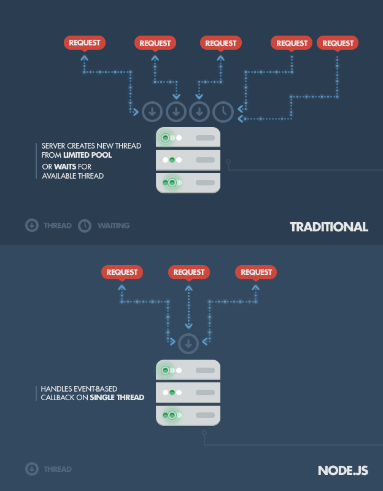
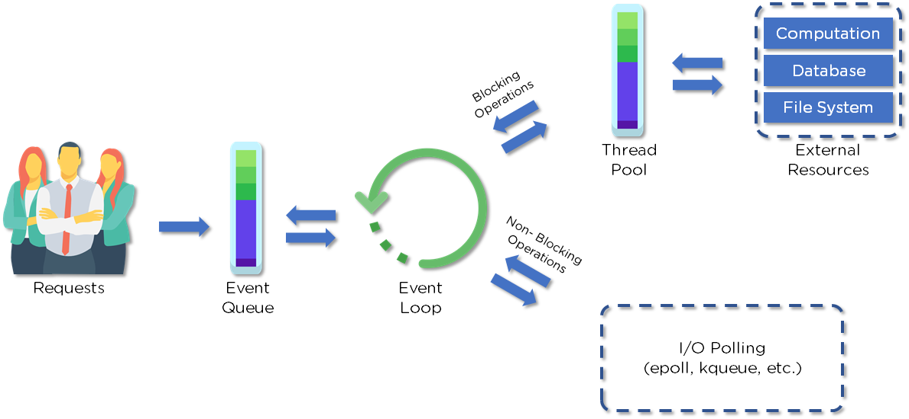

# Session 1 - Getting Started

- Giới thiệu Nodejs
- Cài đặt môi trường
- Review Javascript ESNext, TypeScript
- Dynamic Application web với Node.Js
- Tìm hiểu khái niệm Module trong Nodejs

## 💛 Giới thiệu Nodejs

## NodeJS là gì

Node.js là một môi trường thực thi mã JavaScript phía máy chủ (server-side) được xây dựng dựa trên JavaScript Engine V8 của Google. Nó cho phép bạn chạy mã JavaScript bên ngoài trình duyệt, trên máy chủ, và xử lý các yêu cầu từ các máy khách (client) và phản hồi lại chúng.


Node.js đã trở thành một trong những công nghệ nổi bật nhất trong lĩnh vực phát triển web và được sử dụng rộng rãi để xây dựng các ứng dụng web như các trang web động (dynamic web pages), các ứng dụng real-time và các ứng dụng web theo mô hình client-server.

Sau khi được phát hành lần đầu tiên vào năm 2009, Node.js nhanh chóng thu hút sự quan tâm và phát triển đáng kể. Các cập nhật liên tục đã được phát hành, bao gồm việc thêm các tính năng mới và cải tiến hiệu suất. Hiện nay, Node.js được sử dụng rộng rãi trên toàn cầu và là một trong những công nghệ phổ biến nhất trong lĩnh vực phát triển web.

### Node.js hoạt động như thế nào?

Ý tưởng chính của Node js là sử dụng non-blocking, hướng sự vào ra dữ liệu thông qua các tác vụ thời gian thực một cách nhanh chóng. Bởi vì, Node js có khả năng mở rộng nhanh chóng, khả năng xử lý một số lượng lớn các kết nối đồng thời bằng thông lượng cao. 

Nếu như các ứng dụng web truyền thống, các request tạo ra một luồng xử lý yêu cầu mới và chiếm RAM của hệ thống thì việc tài nguyên của hệ thống sẽ được sử dụng không hiệu quả. Chính vì lẽ đó giải pháp mà Node js đưa ra là sử dụng luồng đơn (Single-Threaded), kết hợp với non-blocking I/O để thực thi các request, cho phép hỗ trợ hàng chục ngàn kết nối đồng thời.




### Giới thiệu về Event Loop

Event loop trong Node.js là một thành phần quan trọng trong kiến trúc single-threaded (đơn luồng) của nó. Nó cho phép Node.js xử lý nhiều yêu cầu đồng thời mà không cần tạo ra các luồng bổ sung.

Trong Node.js, mã JavaScript chạy trong một luồng duy nhất, còn được gọi là luồng chính (main thread). Tuy nhiên, để xử lý các yêu cầu I/O không đồng bộ, như đọc và ghi vào tệp, gọi API mạng hoặc truy vấn cơ sở dữ liệu, Node.js sử dụng mô hình sự kiện và non-blocking I/O.


Client gửi các REQUEST đến SERVER để tương tác với ứng dụng web. Các REQUESTs này có thể là Blocking hoặc Non-Blocking

- Truy vấn dữ liệu
- Xóa dữ liệu
- Cập nhật dữ liệu

Node.JS tiếp nhận các Request gửi đến và thêm chúng vào hàng đợi `Event Queue`

Sau đó các yêu cầu `Request` này được xử lý lần lượt thông qua `Event Loop`.





Cơ chế hoạt động của **Event Loop**:

1. **Requests (Yêu cầu)**: Các yêu cầu từ người dùng được đưa vào **Hàng đợi sự kiện (Event Queue)**. Đây là nơi lưu trữ các sự kiện cần được xử lý.

2. **Event Loop (Vòng lặp sự kiện)**: Event Loop liên tục kiểm tra hàng đợi sự kiện để xem có sự kiện nào cần được xử lý hay không. Nếu có, nó sẽ lấy sự kiện ra khỏi hàng đợi và chuyển nó tới **Thread Pool** để xử lý. Các hoạt động không chặn (non-blocking operations) sẽ được xử lý trực tiếp, trong khi các hoạt động chặn (blocking operations) sẽ được gửi tới các nguồn tài nguyên bên ngoài như cơ sở dữ liệu, hệ thống tệp, v.v.

3. **Thread Pool (Nhóm luồng)**: Thread Pool xử lý các hoạt động chặn. Nó sẽ tạo ra các luồng riêng biệt để xử lý các tác vụ này.

4. **I/O Polling (Kiểm tra I/O)**: Có một hộp "I/O Polling" kết nối với Thread Pool, đại diện cho các cơ chế kiểm tra I/O như epoll, kqueue, v.v.

5. **External Resources (Nguồn tài nguyên bên ngoài)**: Khi công việc đã được hoàn thành, kết quả sau cùng sẽ được trả lại thông qua Event Loop và gửi lại cho người dùng.


Cơ chế này giúp Node.js xử lý nhiều yêu cầu một cách hiệu quả, đồng thời duy trì tính không chặn của ứng dụng. 


### Những ứng dụng nên viết bằng Node.JS ?

NodeJS được sử dụng để xây dựng rất nhiều loại ứng dụng khác nhau, trong đó phổ biến nhất gồm có:

- Ứng dụng trò chuyện trong thời gian thực: Nhờ vào cấu trúc không đồng bộ đơn luồng, Node.JS rất thích hợp cho mục đích xử lý giao tiếp trong thời gian thực. Nền tảng này có thể dễ dàng mở rộng quy mô và thường dùng để tạo ra các chatbot. Bên cạnh đó, các tính năng liên quan đến ứng dụng trò chuyện như: chat nhiều người, thông báo đẩy,… cũng có thể dễ dàng được bổ sung nhờ NodeJS.

- Internet of Things (IoT): Các ứng dụng IoT thường bao gồm nhiều bộ cảm biến phức tạp để gửi những phần dữ liệu nhỏ. Node.JS là một lựa chọn lý tưởng để xử lý các yêu cầu đồng thời này với tốc độ cực nhanh.

- Truyền dữ liệu: Netflix là một trong số những công ty lớn trên thế giới chuyên sử dụng Node.JS cho mục đích truyền dữ liệu. Sở dĩ vì đây là một nền tảng nhẹ và cực nhanh, đồng thời còn cung cấp một API chuyên dùng để stream.

- Các SPA (Single-page application) phức tạp: Trong SPA, toàn bộ ứng dụng được load vào trong một trang duy nhất, do đó sẽ có một số request được thực hiện trong nền. Vòng lặp sự kiện (event loop) của Node.JS cho phép xử lý các request theo hướng non-blocking.

- Các ứng dụng REST dựa trên API: JavaScript được sử dụng trong cả frontend lẫn backend của trang. Do đó một server có thể dễ dàng giao tiếp với frontend qua REST API bằng Node.js. Bên cạnh đó, Node.JS còn cung cấp nhiều package như Express.js hay Koa để việc xây dựng ứng dụng web trở nên dễ dàng hơn bao giờ hết.

### Ưu điểm NodeJS

- IO hướng sự kiện không đồng bộ, cho phép xử lý nhiều yêu cầu đồng thời.
- Sử dụng JavaScript – một ngôn ngữ lập trình dễ học.
- Chia sẻ cùng code ở cả phía client và server.
- NPM(Node Package Manager) và module Node đang ngày càng phát triển mạnh mẽ.
- Cộng đồng hỗ trợ tích cực.
- Cho phép stream các file có kích thước lớn.

### Nhược điểm NodeJS

- Không có khả năng mở rộng, vì vậy không thể tận dụng lợi thế mô hình đa lõi trong các phần cứng cấp server hiện nay.
- Khó thao tác với cơ sử dữ liệu quan hệ.
- Mỗi callback sẽ đi kèm với rất nhiều callback lồng nhau khác.
- Cần có kiến thức tốt về JavaScript.
- Không phù hợp với các tác vụ đòi hỏi nhiều CPU.

### Một số lý do nên sử dụng NodeJS là gì?

Node.JS là một trong những nền tảng phổ biến nhất hiện nay cho mục đích phát triển ứng dụng mạng phía server. Vậy lý do nên sử dụng NodeJS là gì? Hãy cùng tìm hiểu những đặc điểm khiến Node.JS là lựa chọn hàng đầu cho các developer hiện nay:

- Tốc độ cực nhanh: Được xây dựng dựa trên engine JavaScript V8 của Google Chrome, do đó các thư viện của nó có khả năng thực thi code chỉ rất nhanh.
- NPM: Với hơn 50,000 package khác nhau, các developer có thể dễ dàng lựa chọn bất kỳ tính năng nào để xây dựng cho ứng dụng của mình.
- Lập trình không đồng bộ: Mọi API của Node.JS đều có tính không đồng bộ (non-blocking), do đó một server dựa trên Node.JS không cần phải đợi API trả về dữ liệu.
- Không có buffering: Node.JS giúp tiết kiệm thời gian xử lý file khi cần upload âm thanh hoặc video vì các ứng dụng này không bao giờ buffer dữ liệu mà chỉ xuất dữ liệu theo từng phần (chunk).
- Đơn luồng: Node.JS sử dụng mô hình đơn luồng với vòng lặp sự kiện. Do đó các ứng dụng có thể xử lý số lượng request lớn hơn rất nhiều so với các server truyền thống như Apache HTTP Server.

### Những công ty lớn nào đang sử dụng NodeJS

NodeJS hiện đang được sử dụng bởi rất nhiều gã khổng lồ trên khắp thế giới, nhanh chóng vượt ngưỡng 1 tỉ lượt download từ năm 2018 và hỗ trợ đến khoảng 1.2% tổng số website trên Internet, tương đương với 20 triệu trang.

Một số công ty lớn sử dụng nền tảng này gồm có:

- Netflix: Netflix là một trong những nền tảng giải trí trực tuyến lớn nhất thế giới với hơn 167 triệu người dùng. Nhờ vào khả năng mở rộng và cho phép xây dựng các ứng dụng có yêu cầu sử dụng dữ liệu cao, NodeJS luôn là lựa chọn hàng đầu cho nền tảng này.
- Walmart: Đây là công ty có doanh thu lớn nhất thế giới với tổng 559 tỷ USD vào năm 2020 (theo Forbest). Walmart lựa chọn NodeJS bởi tính năng I/O không đồng bộ và khả năng xử lý nhiều request đồng thời.
- Uber: Là một công ty đặt xe có quy mô đa quốc gia, Uber lựa chọn NodeJS làm nền tảng xây dựng ứng dụng bởi I/O không đồng bộ và cộng đồng lớn mạnh.
- NASA: Đây là một cơ quan độc lập của Chính phủ Liên bang Hoa Kỳ, chịu trách nhiệm về chương trình không gian dân sự và nghiên cứu hàng không, vũ trụ. NASA lựa chọn nền tảng này để hạn chế thời gian truy cập và xử lý các tác vụ có yêu cầu dữ liệu cao để giữ cho server hoạt động 24/7.
- Paypal: Với thời gian xây dựng cực nhanh và khả năng xử lý dữ liệu lớn, NodeJS là một nền tảng lý tưởng cho một hệ thống thanh toán trực tuyến toàn cầu như PayPal.
- Medium: Medium là một nền tảng xuất bản trực tuyến vô cùng phổ biến, đồng thời cũng lựa chọn NodeJS để xây dựng ứng dụng hướng dữ liệu và đơn giản hoá quá trình bảo trì server.
  Ngoài ra còn rất nhiều nền tảng lớn khác như: Twitter, Spotify, eBay, Reddit, Linkedin,…


## 💛 Cài đặt Môi trường

Getting Started: <https://nodejs.org/en/>

Installing Node on Linux / MacOS: <https://nodejs.org/en/download/>

Installing Node on Windows: <https://nodejs.org/en/download/>

### Tìm hiểu công cụ NPM (Node Package Manager)

NMP là viết tắt của Node package manager là một công cụ tạo và quản lý các thư viện lập trình Javascript cho Node.js


Các lệnh thông dụng

```bash
npm init #Khởi tạo dự án, tạo ra file package.json
npm install package_name #Cài đặt package vào dependency
npm install -D package_name #Cài đặt package vào Devdependency
npm install --global package #Cài đặt package ở chế độ Global
npm uninstall package_name #Gở cài đặt
```
Ngoài ra chúng ta còn có một công cụ khác tương tự, nhưng cho tốc độ xử lý nhanh hơn là `yarn`

Sau khi bạn cài xong NodeJs, mở cửa sổ lệnh Terminal (hoặc Command Line ở chế độ Administration)

```bash
npm install --global yarn
```

Các lệnh thông dụng với công cụ `yarn`

Xem tất cả lệnh: https://classic.yarnpkg.com/en/docs/cli/add

```bash
yarn init #Khởi tạo dự án, tạo ra file package.json
yarn add package_name #Cài đặt package vào dependency
yarn add -D package_name #Cài đặt package vào Devdependency
yarn add -g package #Cài đặt package ở chế độ Global
yarn remove package_name #Gở cài đặt
```


## 💛 Review Javascript ESNext, TypeScript

Trong môn học này cần kiến thức cả javascript lẫn TypeScript nên hãy cùng ôn lại một số kiến thức cơ bản

Chi tiết [prerequisites.md](prerequisites.md)

## 💛  Dynamic Web Applications

Node.js cho phép bạn xây dựng các ứng dụng web phía máy chủ. Nghĩa là bạn có thể tạo ra một ứng dụng web với Node.js

Trong thư mục dự án, bạn tạo file `main.js` với nội dung sau:

```js
const http = require('http');

const server = http.createServer((req, res) => {
  // Xử lý yêu cầu
  if (req.url === '/') {
    res.writeHead(200, { 'Content-Type': 'text/html' });
    res.write('<h1>Hello, World!</h1>');
    res.end();
  } else if (req.url === '/about') {
    res.writeHead(200, { 'Content-Type': 'text/html' });
    res.write('<h1>About Page</h1>');
    res.end();
  } else {
    res.writeHead(404, { 'Content-Type': 'text/html' });
    res.write('<h1>404 Not Found</h1>');
    res.end();
  }
});

server.listen(3000, () => {
  console.log('Server is running on port 3000');
});

```

Sau đó trong terminal đứng tại vị trí thư mục dự án bạn gỏ lệnh

```bash
node main.js
```

Khi đó NodeJs sẽ khởi tạo một server chạy ở port `3000` , server này sẽ lắng nghe và phản hồi lại thông tin tương ứng.

## 💛 Node Modules

### **Built-in modules (Các modules sẵn có)**

- assert: Provides a set of assertion tests
- buffer: To handle binary data
- child_process: To run a child process
- cluster: To split a single Node process into multiple processes
- crypto: To handle OpenSSL cryptographic functions
- dns: To do DNS lookups and name resolution functions
- events: To handle events ❤️
- fs: To handle the file system ❤️
- http: To make Node.js act as an HTTP server ❤️
- https: To make Node.js act as an HTTPS server ❤️
- net: To create servers and clients
- os: Provides information about the operation system
- path: To handle file paths ❤️
- querystring: To handle URL query strings ❤️
- readline: To handle readable streams one line at the time
- stream: To handle streaming data
- string_decoder: To decode buffer objects into strings
- timers: To execute a function after a given number of milliseconds
- url: To parse URL strings ❤️
- util: To access utility functions
- zlib To compress or decompress files

Chủ yếu đi tìm hiểu các Module có đánh dấu ❤️


## 💛 Sharing functions between files

Ngoài những module có sẳn của Node.js bạn có thể tự tạo cho mình một module với cách làm như sau:

Trong thư mục dự án bạn tạo một file ví dụ: `myModule.js`

```js
function hello() {
  console.log('Hello Nodejs');
}
//Xuất hàm hello ra, để chia sẽ cho các file khác
module.exports = hello;
```

Khi đó trong file khác ví dụ `index.js` bạn có thể sử dụng `require` để nạp module đó vào sử dụng:


```js
//index.js
const hello = require('./myModule');
hello();
```

Cú pháp `require` là một tính năng của CommonJS, một chuẩn module của JavaScript được sử dụng trong Node.js và một số môi trường khác trước khi ECMAScript 2015 (ES6) được ra mắt. Nó cho phép bạn nhập các module từ các tệp tin khác và sử dụng chúng trong mã của bạn.

Bạn có thể xuất ra một object khi có nhiều biến, function cần chia sẽ như bên dưới:

```js
//file math.js
const add = (a, b) => {
  return a + b;
};

const subtract = (a, b) => {
  return a - b;
};

module.exports = {
  add,
  subtract,
};

module.exports.add = (a, b) => {
  return a + b;
};

module.exports.subtract = (a, b) => {
  return a - b;
};

// Method 1
const math = require('./math');

// Method 2
const { add, subtract } = require('./math');
```

Ngoài ra, bạn cũng có thể sử dụng cú pháp `import/export` trong Node.js bằng cách sử dụng các phiên bản JavaScript gần mới hơn (như ECMAScript modules - ES modules) và cấu hình tùy chọn. 

Để sử dụng cú pháp `import/export` trong Node.js, bạn cần tạo một tệp tin cấu hình (ví dụ: package.json) và thiết lập thuộc tính "type": "module" trong tệp tin cấu hình đó.

```bash
yarn init -y
```

Mở tệp tin package.json và thêm thuộc tính "type": "module" vào nội dung của tệp tin

```json
{
  "name": "my-project",
  "version": "1.0.0",
  "type": "module",
  "main": "index.js"
}
```

Ví dụ: Bạn tại 2 file với nội dung như sau

```javascript
// File: myModuleEsNext.js
export function myFunction() {
  console.log('Hello from myModule!');
}

// File: app.js
import { myFunction } from './myModuleEsNext.js';

myFunction();
```


Dưới đây là một ví dụ về cách sử dụng export default:

```javascript
// File: myModuleEsNextDefault.js
const myFunctionV2 = () => {
  console.log('This is a default function.');
};

export default myFunctionV2;


// File: app.js
import myFunctionV2 from './myModuleEsNextDefault.js';

myFunctionV2();
```

Lưu ý rằng mỗi module chỉ được xuất một giá trị mặc định duy nhất. Nếu bạn muốn xuất nhiều giá trị, bạn có thể sử dụng export default kết hợp với các xuất bổ sung bằng export thông thường.

Ví dụ:

```javascript
// File: myModuleEsNext.js
const myFunction = () => {
  console.log('This is a default function.');
};

const myVariable = 42;

export { myVariable };
export default myFunction;


//Sử dụng
// File: app.js
import myFunction, { myVariable } from './myModuleEsNext.js';

myFunction(); // Xuất giá trị mặc định
console.log(myVariable); // Xuất giá trị thông thường
```

## 💛 Tìm hiểu các Module thường sử dụng

### ❤️ Events

[Xem chi tiết](events.md)
### ❤️ File Module

[Xem chi tiết](fs.md)

### ❤️ URL Module

[Xem chi tiết](url.md)

### ❤️ Http Module

[Xem chi tiết](http.md)

### ❤️ Path Module

[Xem chi tiết](path.md)

