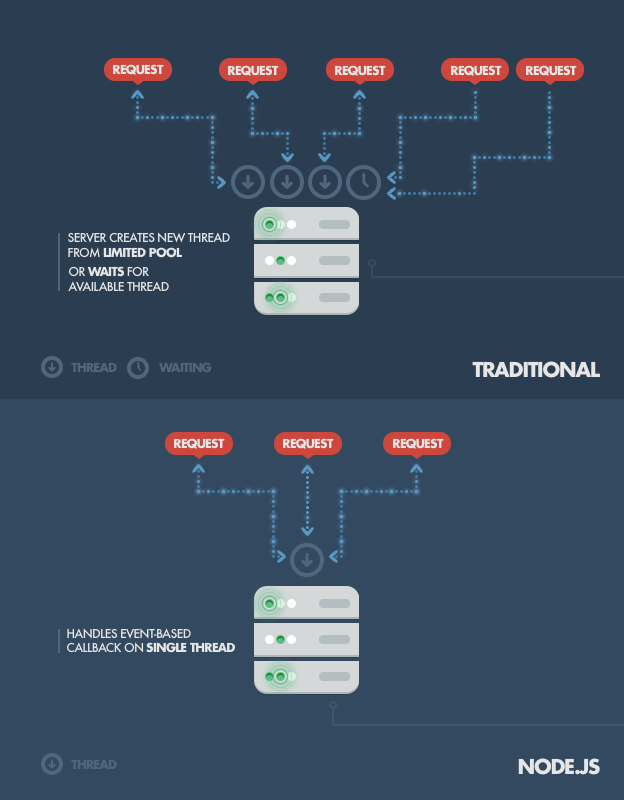
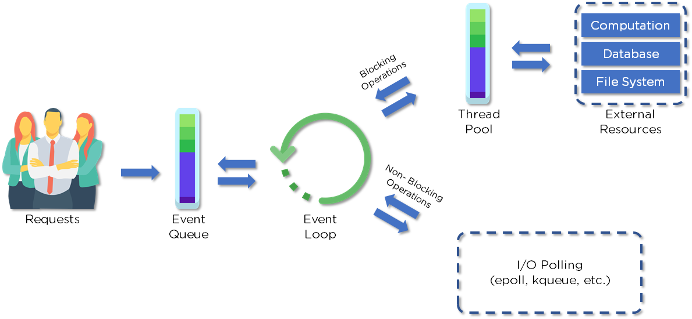

# Session 1 - Getting Started

- Giới thiệu Nodejs
- Cài đặt môi trường
- Review Javascript ESNext, TypeScript
- Dynamic Application web với Node.Js
- Tìm hiểu khái niệm Module trong Nodejs

## 💛 Giới thiệu Nodejs

## 🔥 NodeJS là gì

Node.js là một môi trường thực thi mã JavaScript phía máy chủ (server-side) được xây dựng dựa trên JavaScript Engine V8 của Google. Nó cho phép bạn chạy mã JavaScript bên ngoài trình duyệt, trên máy chủ, và xử lý các yêu cầu từ các máy khách (client) và phản hồi lại chúng.


Node.js đã trở thành một trong những công nghệ nổi bật nhất trong lĩnh vực phát triển web và được sử dụng rộng rãi để xây dựng các ứng dụng web như các trang web động (dynamic web pages), các ứng dụng real-time và các ứng dụng web theo mô hình client-server.

Sau khi được phát hành lần đầu tiên vào năm 2009, Node.js nhanh chóng thu hút sự quan tâm và phát triển đáng kể. Các cập nhật liên tục đã được phát hành, bao gồm việc thêm các tính năng mới và cải tiến hiệu suất. Hiện nay, Node.js được sử dụng rộng rãi trên toàn cầu và là một trong những công nghệ phổ biến nhất trong lĩnh vực phát triển web.

### 🔶 Node.js hoạt động như thế nào?

Ý tưởng chính của Node js là sử dụng non-blocking, hướng sự vào ra dữ liệu thông qua các tác vụ thời gian thực một cách nhanh chóng. Bởi vì, Node js có khả năng mở rộng nhanh chóng, khả năng xử lý một số lượng lớn các kết nối đồng thời bằng thông lượng cao.

Nếu như các ứng dụng web truyền thống, các request tạo ra một luồng xử lý yêu cầu mới và chiếm RAM của hệ thống thì việc tài nguyên của hệ thống sẽ được sử dụng không hiệu quả. Chính vì lẽ đó giải pháp mà Node js đưa ra là sử dụng luồng đơn (Single-Threaded), kết hợp với non-blocking I/O để thực thi các request, cho phép hỗ trợ hàng chục ngàn kết nối đồng thời.



### 🔶 Giới thiệu về Event Loop

**Event Loop** là một trong những khái niệm quan trọng nhất trong Node.js, vì nó giải thích cách Node.js xử lý các tác vụ đồng thời mặc dù nó chỉ chạy trên một luồng duy nhất (single-threaded). Node.js sử dụng event loop để quản lý các tác vụ bất đồng bộ như đọc/ghi file, yêu cầu HTTP, hoặc truy vấn cơ sở dữ liệu mà không chặn (blocking) luồng chính.

Trong Node.js, mã JavaScript chạy trong một luồng duy nhất, còn được gọi là luồng chính (main thread). Tuy nhiên, để xử lý các yêu cầu I/O không đồng bộ, như đọc và ghi vào tệp, gọi API mạng hoặc truy vấn cơ sở dữ liệu, Node.js sử dụng mô hình sự kiện và non-blocking I/O.

Client gửi các REQUEST đến SERVER để tương tác với ứng dụng web. Các REQUESTs này có thể là Blocking hoặc Non-Blocking

- Truy vấn dữ liệu
- Xóa dữ liệu
- Cập nhật dữ liệu

Node.JS tiếp nhận các Request gửi đến và thêm chúng vào hàng đợi `Event Queue`

Sau đó các yêu cầu `Request` này được xử lý lần lượt thông qua `Event Loop`.



Cơ chế hoạt động của **Event Loop**:

1. **Requests (Yêu cầu)**: Các yêu cầu từ người dùng được đưa vào **Hàng đợi sự kiện (Event Queue)**. Đây là nơi lưu trữ các sự kiện cần được xử lý.

2. **Event Loop (Vòng lặp sự kiện)**: Event Loop liên tục kiểm tra hàng đợi sự kiện để xem có sự kiện nào cần được xử lý hay không. Nếu có, nó sẽ lấy sự kiện ra khỏi hàng đợi và chuyển nó tới **Thread Pool** để xử lý. Các hoạt động không chặn (non-blocking operations) sẽ được xử lý trực tiếp, trong khi các hoạt động chặn (blocking operations) sẽ được gửi tới các nguồn tài nguyên bên ngoài như cơ sở dữ liệu, hệ thống tệp, v.v.

3. **Thread Pool (Nhóm luồng)**: Thread Pool xử lý các hoạt động chặn. Nó sẽ tạo ra các luồng riêng biệt để xử lý các tác vụ này.

4. **I/O Polling (Kiểm tra I/O)**: Có một hộp "I/O Polling" kết nối với Thread Pool, đại diện cho các cơ chế kiểm tra I/O như epoll, kqueue, v.v.

5. **External Resources (Nguồn tài nguyên bên ngoài)**: Khi công việc đã được hoàn thành, kết quả sau cùng sẽ được trả lại thông qua Event Loop và gửi lại cho người dùng.

Cơ chế này giúp Node.js xử lý nhiều yêu cầu một cách hiệu quả, đồng thời duy trì tính không chặn của ứng dụng.

### 🔶 Cách hoạt động của Event Loop

Node.js hoạt động dựa trên một vòng lặp sự kiện (event loop) để xử lý tất cả các tác vụ bất đồng bộ. Khi một tác vụ (như đọc file) được yêu cầu, nó được đưa vào hàng đợi của event loop. Node.js tiếp tục xử lý các yêu cầu khác trong khi chờ tác vụ đó hoàn thành. Khi tác vụ hoàn thành, callback tương ứng sẽ được đưa vào hàng đợi và thực thi trong lần lặp tiếp theo của event loop.

Event loop có 6 giai đoạn chính:

- **Timers**: Xử lý các callback từ `setTimeout()` và `setInterval()`.
- **I/O Callbacks**: Xử lý các callback từ các hoạt động I/O như đọc file hoặc gửi HTTP request.
- **Idle, prepare**: Sử dụng nội bộ, ít khi được quan tâm.
- **Poll**: Chờ và xử lý các sự kiện I/O mới.
- **Check**: Xử lý các callback từ `setImmediate()`.
- **Close Callbacks**: Xử lý các callback từ sự kiện `close()` của các kết nối I/O.

Dưới đây là ví dụ đơn giản về cách event loop hoạt động trong Node.js:

```javascript
console.log("Start"); // Bước 1

setTimeout(() => {
  console.log("Timeout callback"); // Bước 5 (thực thi sau 2 giây)
}, 2000);

setImmediate(() => {
  console.log("Immediate callback"); // Bước 4 (chạy ngay sau poll phase)
});

console.log("End"); // Bước 2
```

**Kết quả khi chạy chương trình:**

```
Start
End
Immediate callback
Timeout callback
```

**Giải thích chi tiết:**

- Bước 1 và 2: `console.log('Start')` và `console.log('End')` được thực thi ngay lập tức vì đây là mã đồng bộ.
- Bước 3: Lệnh `setTimeout` được đưa vào hàng đợi Timer và callback của nó sẽ được thực hiện sau ít nhất 2 giây.
- Bước 4: `setImmediate` được thêm vào giai đoạn Check của event loop, vì vậy callback này được thực hiện ngay sau khi các tác vụ đồng bộ kết thúc.
- Bước 5: Khi 2 giây trôi qua, callback của `setTimeout` được thực hiện.

**Ví dụ phức tạp hơn với I/O bất đồng bộ**

```javascript
const fs = require("fs");

console.log("Start"); // Bước 1

fs.readFile("file.txt", "utf8", (err, data) => {
  if (err) throw err;
  console.log("File read callback"); // Bước 5 (sau khi file được đọc)
});

setTimeout(() => {
  console.log("Timeout callback"); // Bước 6 (chạy sau 1 giây)
}, 1000);

setImmediate(() => {
  console.log("Immediate callback"); // Bước 4 (ngay sau poll phase)
});

console.log("End"); // Bước 2
```

**Kết quả khi chạy chương trình:**

```
Start
End
Immediate callback
File read callback
Timeout callback
```

**Giải thích chi tiết:**

- Bước 1 và 2: `console.log('Start')` và `console.log('End')` là mã đồng bộ nên chúng được thực hiện ngay lập tức.
- Bước 3: `fs.readFile` là một hoạt động bất đồng bộ, vì vậy Node.js sẽ không đợi nó hoàn thành. Nó được đưa vào hàng đợi trong giai đoạn Poll.
- Bước 4: `setImmediate` chạy ngay sau khi event loop hoàn thành các tác vụ đồng bộ.
- Bước 5: Sau khi file được đọc xong, callback của `fs.readFile` được thực hiện.
- Bước 6: Sau 1 giây, callback của `setTimeout` được thực hiện.

  **So sánh `setTimeout()` và `setImmediate()`**

Mặc dù cả hai đều được sử dụng để thực thi mã bất đồng bộ, nhưng có sự khác biệt nhỏ:

- `setTimeout()` với thời gian là 0 vẫn sẽ phải chờ ít nhất một chu kỳ event loop trước khi thực thi.
- `setImmediate()` được thực hiện ngay sau khi poll phase của event loop hoàn thành, ưu tiên nó hơn khi không có tác vụ nào khác.

Ví dụ:

```javascript
setTimeout(() => {
  console.log("Timeout");
}, 0);

setImmediate(() => {
  console.log("Immediate");
});
```

**Kết quả có thể là:**

```
Immediate
Timeout
```

---

### 🔶 Blocking (Chặn)

Một tác vụ **blocking** là tác vụ đồng bộ, nghĩa là Node.js phải **đợi** tác vụ đó hoàn thành trước khi tiếp tục xử lý các tác vụ khác. Trong khoảng thời gian này, **luồng chính bị chặn**, và không thể xử lý các yêu cầu khác.

Ví dụ, một tác vụ blocking trong Node.js có thể là **đọc file đồng bộ**. Khi bạn yêu cầu Node.js đọc một file theo cách blocking, nó phải hoàn thành tác vụ đó trước khi có thể thực hiện các công việc khác.

**Ví dụ về Blocking:**

```javascript
const fs = require("fs");

console.log("Start");

const data = fs.readFileSync("file.txt", "utf8"); // Blocking - Node.js phải chờ file đọc xong.
console.log(data); // Chỉ thực hiện sau khi đọc file xong.

console.log("End");
```

**Kết quả:**

```
Start
<nội dung file.txt>
End
```

**Giải thích**: Trong ví dụ này, `fs.readFileSync` là một tác vụ **blocking**. Node.js sẽ phải đợi file được đọc xong trước khi tiếp tục chạy các dòng mã sau đó. Do đó, `console.log('End')` chỉ được in ra sau khi file đã được đọc.

### 🔶 Non-blocking (Không chặn)

**Non-blocking** là cách Node.js xử lý các tác vụ bất đồng bộ. Khi một tác vụ non-blocking được gọi, Node.js không đợi tác vụ đó hoàn thành mà ngay lập tức tiếp tục xử lý các công việc khác. Khi tác vụ hoàn thành, nó sẽ sử dụng một callback để xử lý kết quả.

Ví dụ, khi bạn đọc file theo cách non-blocking, Node.js sẽ bắt đầu đọc file, nhưng sẽ tiếp tục thực hiện các công việc khác trong khi chờ file được đọc xong. Khi hoàn thành, một callback sẽ được gọi để xử lý dữ liệu của file.

**Ví dụ về Non-blocking:**

```javascript
const fs = require("fs");

console.log("Start");

fs.readFile("file.txt", "utf8", (err, data) => {
  if (err) throw err;
  console.log(data); // Chỉ in ra sau khi file đọc xong (callback).
});

console.log("End");
```

**Kết quả:**

```
Start
End
<nội dung file.txt>
```

**Giải thích**: Ở đây, `fs.readFile` là một tác vụ **non-blocking**. Node.js không đợi file được đọc xong để chạy `console.log('End')`. Thay vào đó, nó tiếp tục thực thi mã, và sau khi file được đọc xong, callback sẽ được gọi để in nội dung file ra. Do đó, bạn thấy `End` được in trước khi nội dung file xuất hiện.

### 🔶 Sự khác biệt chính giữa Blocking và Non-blocking

- **Blocking**: Node.js **đợi** tác vụ hoàn thành trước khi xử lý tiếp. Điều này làm gián đoạn event loop và chặn các tác vụ khác.
  - Ví dụ: `fs.readFileSync`, `http.requestSync`.
- **Non-blocking**: Node.js **không đợi** mà tiếp tục xử lý các tác vụ khác. Sau khi tác vụ hoàn thành, nó sẽ thực thi một callback.
  - Ví dụ: `fs.readFile`, `http.request`.

### 🔶 Khi nào nên dùng Blocking và Non-blocking

- **Blocking**: Thường không được khuyến khích sử dụng khi cần xử lý nhiều yêu cầu cùng lúc. Tuy nhiên, có thể dùng trong các kịch bản chỉ xử lý một tác vụ đơn giản mà không yêu cầu hiệu năng cao hoặc khi bạn cần mã dễ hiểu và dễ kiểm soát trình tự xử lý.
- **Non-blocking**: Thích hợp trong các trường hợp cần hiệu năng cao, như xây dựng ứng dụng server để xử lý nhiều yêu cầu từ người dùng. Điều này giúp Node.js tiếp tục hoạt động mượt mà mà không bị chặn bởi các tác vụ I/O (đọc ghi file, truy vấn cơ sở dữ liệu, gọi API…).

### 🔶 Những ứng dụng nên viết bằng Node.JS ?

NodeJS được sử dụng để xây dựng rất nhiều loại ứng dụng khác nhau, trong đó phổ biến nhất gồm có:

- Ứng dụng trò chuyện trong thời gian thực: Nhờ vào cấu trúc không đồng bộ đơn luồng, Node.JS rất thích hợp cho mục đích xử lý giao tiếp trong thời gian thực. Nền tảng này có thể dễ dàng mở rộng quy mô và thường dùng để tạo ra các chatbot. Bên cạnh đó, các tính năng liên quan đến ứng dụng trò chuyện như: chat nhiều người, thông báo đẩy,… cũng có thể dễ dàng được bổ sung nhờ NodeJS.

- Internet of Things (IoT): Các ứng dụng IoT thường bao gồm nhiều bộ cảm biến phức tạp để gửi những phần dữ liệu nhỏ. Node.JS là một lựa chọn lý tưởng để xử lý các yêu cầu đồng thời này với tốc độ cực nhanh.

- Truyền dữ liệu: Netflix là một trong số những công ty lớn trên thế giới chuyên sử dụng Node.JS cho mục đích truyền dữ liệu. Sở dĩ vì đây là một nền tảng nhẹ và cực nhanh, đồng thời còn cung cấp một API chuyên dùng để stream.

- Các SPA (Single-page application) phức tạp: Trong SPA, toàn bộ ứng dụng được load vào trong một trang duy nhất, do đó sẽ có một số request được thực hiện trong nền. Vòng lặp sự kiện (event loop) của Node.JS cho phép xử lý các request theo hướng non-blocking.

- Các ứng dụng REST dựa trên API: JavaScript được sử dụng trong cả frontend lẫn backend của trang. Do đó một server có thể dễ dàng giao tiếp với frontend qua REST API bằng Node.js. Bên cạnh đó, Node.JS còn cung cấp nhiều package như Express.js hay Koa để việc xây dựng ứng dụng web trở nên dễ dàng hơn bao giờ hết.

### 🔶 Ưu điểm NodeJS

- IO hướng sự kiện không đồng bộ, cho phép xử lý nhiều yêu cầu đồng thời.
- Sử dụng JavaScript – một ngôn ngữ lập trình dễ học.
- Chia sẻ cùng code ở cả phía client và server.
- NPM(Node Package Manager) và module Node đang ngày càng phát triển mạnh mẽ.
- Cộng đồng hỗ trợ tích cực.
- Cho phép stream các file có kích thước lớn.

### 🔶 Nhược điểm NodeJS

- Không có khả năng mở rộng, vì vậy không thể tận dụng lợi thế mô hình đa lõi trong các phần cứng cấp server hiện nay.
- Khó thao tác với cơ sử dữ liệu quan hệ.
- Mỗi callback sẽ đi kèm với rất nhiều callback lồng nhau khác.
- Cần có kiến thức tốt về JavaScript.
- Không phù hợp với các tác vụ đòi hỏi nhiều CPU.

### 🔶 Một số lý do nên sử dụng NodeJS là gì?

Node.JS là một trong những nền tảng phổ biến nhất hiện nay cho mục đích phát triển ứng dụng mạng phía server. Vậy lý do nên sử dụng NodeJS là gì? Hãy cùng tìm hiểu những đặc điểm khiến Node.JS là lựa chọn hàng đầu cho các developer hiện nay:

- Tốc độ cực nhanh: Được xây dựng dựa trên engine JavaScript V8 của Google Chrome, do đó các thư viện của nó có khả năng thực thi code chỉ rất nhanh.
- NPM: Với hơn 50,000 package khác nhau, các developer có thể dễ dàng lựa chọn bất kỳ tính năng nào để xây dựng cho ứng dụng của mình.
- Lập trình không đồng bộ: Mọi API của Node.JS đều có tính không đồng bộ (non-blocking), do đó một server dựa trên Node.JS không cần phải đợi API trả về dữ liệu.
- Không có buffering: Node.JS giúp tiết kiệm thời gian xử lý file khi cần upload âm thanh hoặc video vì các ứng dụng này không bao giờ buffer dữ liệu mà chỉ xuất dữ liệu theo từng phần (chunk).
- Đơn luồng: Node.JS sử dụng mô hình đơn luồng với vòng lặp sự kiện. Do đó các ứng dụng có thể xử lý số lượng request lớn hơn rất nhiều so với các server truyền thống như Apache HTTP Server.

### 🔶 Những công ty lớn nào đang sử dụng NodeJS

NodeJS hiện đang được sử dụng bởi rất nhiều gã khổng lồ trên khắp thế giới, nhanh chóng vượt ngưỡng 1 tỉ lượt download từ năm 2018 và hỗ trợ đến khoảng 1.2% tổng số website trên Internet, tương đương với 20 triệu trang.

Một số công ty lớn sử dụng nền tảng này gồm có:

- Netflix: Netflix là một trong những nền tảng giải trí trực tuyến lớn nhất thế giới với hơn 167 triệu người dùng. Nhờ vào khả năng mở rộng và cho phép xây dựng các ứng dụng có yêu cầu sử dụng dữ liệu cao, NodeJS luôn là lựa chọn hàng đầu cho nền tảng này.
- Walmart: Đây là công ty có doanh thu lớn nhất thế giới với tổng 559 tỷ USD vào năm 2020 (theo Forbest). Walmart lựa chọn NodeJS bởi tính năng I/O không đồng bộ và khả năng xử lý nhiều request đồng thời.
- Uber: Là một công ty đặt xe có quy mô đa quốc gia, Uber lựa chọn NodeJS làm nền tảng xây dựng ứng dụng bởi I/O không đồng bộ và cộng đồng lớn mạnh.
- NASA: Đây là một cơ quan độc lập của Chính phủ Liên bang Hoa Kỳ, chịu trách nhiệm về chương trình không gian dân sự và nghiên cứu hàng không, vũ trụ. NASA lựa chọn nền tảng này để hạn chế thời gian truy cập và xử lý các tác vụ có yêu cầu dữ liệu cao để giữ cho server hoạt động 24/7.
- Paypal: Với thời gian xây dựng cực nhanh và khả năng xử lý dữ liệu lớn, NodeJS là một nền tảng lý tưởng cho một hệ thống thanh toán trực tuyến toàn cầu như PayPal.
- Medium: Medium là một nền tảng xuất bản trực tuyến vô cùng phổ biến, đồng thời cũng lựa chọn NodeJS để xây dựng ứng dụng hướng dữ liệu và đơn giản hoá quá trình bảo trì server.
  Ngoài ra còn rất nhiều nền tảng lớn khác như: Twitter, Spotify, eBay, Reddit, Linkedin,…


## 💛 Cài đặt Môi trường

Getting Started: <https://nodejs.org/en/>

Installing Node on Linux / MacOS: <https://nodejs.org/en/download/>

Installing Node on Windows: <https://nodejs.org/en/download/>

### 🔶 Tìm hiểu công cụ NPM (Node Package Manager)

NMP là viết tắt của Node package manager là một công cụ tạo và quản lý các thư viện lập trình Javascript cho Node.js


Các lệnh thông dụng

```bash
npm init #Khởi tạo dự án, tạo ra file package.json
npm install package_name #Cài đặt package vào dependency
npm install -D package_name #Cài đặt package vào Devdependency
npm install --global package #Cài đặt package ở chế độ Global
npm uninstall package_name #Gở cài đặt
```

Ngoài ra chúng ta còn có một công cụ khác tương tự, nhưng cho tốc độ xử lý nhanh hơn là `yarn`

Sau khi bạn cài xong NodeJs, mở cửa sổ lệnh Terminal (hoặc Command Line ở chế độ Administration)

```bash
npm install --global yarn
```

Các lệnh thông dụng với công cụ `yarn`

Xem tất cả lệnh: https://classic.yarnpkg.com/en/docs/cli/add

```bash
yarn init #Khởi tạo dự án, tạo ra file package.json
yarn add package_name #Cài đặt package vào dependency
yarn add -D package_name #Cài đặt package vào Devdependency
yarn add -g package #Cài đặt package ở chế độ Global
yarn remove package_name #Gở cài đặt
```

## 💛 Review Javascript ESNext, TypeScript

Trong môn học này cần kiến thức cả javascript lẫn TypeScript nên hãy cùng ôn lại một số kiến thức cơ bản

Chi tiết [prerequisites.md](prerequisites.md)

## 💛 Chạy ứng dụng NodeJs

Node.js cho phép bạn xây dựng các ứng dụng web phía máy chủ. Nghĩa là bạn có thể tạo ra một ứng dụng web với Node.js

Trước hết ta chùng `Hello world` xem cách mà Node.js tạo một server như thế nào !

Tạo một file `main.js` với nội dung sau:

```js
const http = require("node:http");

const hostname = "127.0.0.1";
const port = 3000;
//Hàm tạo server: createServer
const server = http.createServer((req, res) => {
  //Phản hồi lại client Hello world
  res.statusCode = 200;
  res.setHeader("Content-Type", "text/plain");
  res.end("Hello, World!\n");
});
//Lắng nghe request ở cổng 3000
server.listen(port, hostname, () => {
  console.log(`Server running at http://${hostname}:${port}/`);
});
```

Sau đó trong terminal đứng tại vị trí thư mục dự án bạn gỏ lệnh

```bash
node main.js
```

Khi đó NodeJs sẽ khởi tạo một server chạy ở port `3000` , server này sẽ lắng nghe và phản hồi lại thông tin tương ứng.

Và với Nodejs bạn hoàn toàn có thể tạo một ứng dụng web với nhiều pages. Mỗi page có nội dung khác nhau.

Trong thư mục dự án, bạn tạo file `main.js` với nội dung sau:

```js
const http = require("node:http");

const server = http.createServer((req, res) => {
  // Xử lý yêu cầu
  if (req.url === "/") {
    res.writeHead(200, { "Content-Type": "text/html" });
    res.write("<h1>Hello, World!</h1>");
    res.end();
  } else if (req.url === "/about") {
    res.writeHead(200, { "Content-Type": "text/html" });
    res.write("<h1>About Page</h1>");
    res.end();
  } else {
    res.writeHead(404, { "Content-Type": "text/html" });
    res.write("<h1>404 Not Found</h1>");
    res.end();
  }
});

server.listen(3000, () => {
  console.log("Server is running on port 3000");
});
```

## 💛 Node Modules

Trong phần ví dụ Helloworl trên bạn thấy NodeJs đang sử dụng cú pháp `require` để nhúng các logic xử lý từ ngoài vào. Cách thức triển khai này trong Nodejs gọi là module

Trong Node.js, các module đóng vai trò quan trọng trong việc tổ chức và tái sử dụng mã nguồn. Mỗi file trong Node.js được coi là một module và có thể nhập (import) hoặc xuất (export) các chức năng, đối tượng, hay giá trị từ module này sang module khác. Điều này giúp mã nguồn trở nên dễ quản lý, bảo trì và tái sử dụng.

### 🔶 Các loại Module

Node.js hỗ trợ ba loại module chính:

#### **Core Modules**

Các module có sẵn trong Node.js (hay còn gọi là Built-in Module), chẳng hạn như http, fs, path, và os.

Danh sách đầy đủ:

- https://www.w3schools.com/nodejs/ref_modules.asp

**❤️ Http Module**

[Xem chi tiết](http.md)

**❤️ File Module**

[Xem chi tiết](fs.md)

**❤️ URL Module**

[Xem chi tiết](url.md)

**❤️ Path Module**

[Xem chi tiết](path.md)

---

#### **Local Modules**

Các module do người dùng tự định nghĩa, được lưu trữ trong các file riêng.

Trong thư mục dự án bạn tạo một file ví dụ: `myModule.js`

```js
function hello() {
  console.log("Hello Nodejs");
}
//Xuất hàm hello ra, để chia sẽ cho các file khác
module.exports = hello;
```

Khi đó trong file khác ví dụ `index.js` bạn có thể sử dụng `require` để nạp module đó vào sử dụng:

```js
//index.js
const hello = require("./myModule");
hello();
```

Cú pháp `require` là một tính năng của CommonJS, một chuẩn module của JavaScript được sử dụng trong Node.js và một số môi trường khác trước khi ECMAScript 2015 (ES6) được ra mắt. Nó cho phép bạn nhập các module từ các tệp tin khác và sử dụng chúng trong mã của bạn.

Bạn có thể xuất ra một object khi có nhiều biến, function cần chia sẽ như bên dưới:

```js
//file math.js
const add = (a, b) => {
  return a + b;
};

const subtract = (a, b) => {
  return a - b;
};

module.exports = {
  add,
  subtract,
};

module.exports.add = (a, b) => {
  return a + b;
};

module.exports.subtract = (a, b) => {
  return a - b;
};

// Method 1
const math = require("./math");

// Method 2
const { add, subtract } = require("./math");
```

Ngoài ra, bạn cũng có thể sử dụng cú pháp `import/export` trong Node.js bằng cách sử dụng các phiên bản JavaScript gần mới hơn (như ECMAScript modules - ES modules) và cấu hình tùy chọn.

Để sử dụng cú pháp `import/export` trong Node.js, bạn cần tạo một tệp tin cấu hình (ví dụ: package.json) và thiết lập thuộc tính "type": "module" trong tệp tin cấu hình đó.

```bash
yarn init -y
```

Mở tệp tin package.json và thêm thuộc tính "type": "module" vào nội dung của tệp tin

```json
{
  "name": "my-project",
  "version": "1.0.0",
  "type": "module",
  "main": "index.js"
}
```

Ví dụ: Bạn tại 2 file với nội dung như sau

```javascript
// File: myModuleEsNext.js
export function myFunction() {
  console.log("Hello from myModule!");
}

// File: app.js
import { myFunction } from "./myModuleEsNext.js";

myFunction();
```

Dưới đây là một ví dụ về cách sử dụng export default:

```javascript
// File: myModuleEsNextDefault.js
const myFunctionV2 = () => {
  console.log("This is a default function.");
};

export default myFunctionV2;

// File: app.js
import myFunctionV2 from "./myModuleEsNextDefault.js";

myFunctionV2();
```

Lưu ý rằng mỗi module chỉ được xuất một giá trị mặc định duy nhất. Nếu bạn muốn xuất nhiều giá trị, bạn có thể sử dụng export default kết hợp với các xuất bổ sung bằng export thông thường.

Ví dụ:

```javascript
// File: myModuleEsNext.js
const myFunction = () => {
  console.log("This is a default function.");
};

const myVariable = 42;

export { myVariable };
export default myFunction;

//Sử dụng
// File: app.js
import myFunction, { myVariable } from "./myModuleEsNext.js";

myFunction(); // Xuất giá trị mặc định
console.log(myVariable); // Xuất giá trị thông thường
```

---

Còn với TypeScript, Để định nghĩa và sử dụng module trong Node.js, bạn cần làm theo các bước sau:

**Bước 1: Cài Đặt TypeScript và Các Phụ Thuộc**

Trước tiên, bạn cần phải cài đặt TypeScript và các phụ thuộc cần thiết. Mở terminal và chạy lệnh sau:

```bash
pnpm init
pnpm add -D typescript @types/node tsx
```

**Bước 2: Cấu Hình TypeScript**

Tạo file `tsconfig.json` để cấu hình TypeScript. Chạy lệnh sau trong terminal:

```bash
npx tsc --init
```

Nội dung mặc định của file `tsconfig.json` sẽ trông như sau, bạn có thể tuỳ chỉnh theo nhu cầu của mình:

```json
{
  "compilerOptions": {
    "target": "ES2022",
    "module": "NodeNext",
    "moduleResolution": "NodeNext",
    "outDir": "./dist",
    "rootDir": "./src",
    "strict": true,
    "esModuleInterop": true,
    "skipLibCheck": true
  },
  "include": ["src/**/*"]
}
```

Mở tệp `package.json`, thêm dòng "type": "module" và cập nhật mục scripts:

```json
{
  "name": "my-project",
  "version": "1.0.0",
  "type": "module",
  "main": "index.js",
  "scripts": {
    "dev": "tsx watch src/index.ts",
    "build": "tsc",
    "start": "node dist/index.js"
  }
}
```

**Bước 3: Viết Mã TypeScript**

Tạo thư mục `src` và viết mã TypeScript của bạn trong đó. Giả sử bạn muốn tạo một module đơn giản để tính toán.

**Tạo Module**

Tạo file `src/mathUtils.ts` với nội dung sau:

```typescript
// src/mathUtils.ts

export function add(a: number, b: number): number {
  return a + b;
}

export function subtract(a: number, b: number): number {
  return a - b;
}
```

**Sử Dụng Module**

Tạo file `src/index.ts` để sử dụng module `mathUtils`:

```typescript
// src/index.ts

import { add, subtract } from "./mathUtils";

const a = 5;
const b = 3;

console.log(`Add: ${add(a, b)}`); // Output: Add: 8
console.log(`Subtract: ${subtract(a, b)}`); // Output: Subtract: 2
```

**Bước 4: Biên Dịch TypeScript Thành JavaScript**

Biên dịch mã TypeScript thành JavaScript bằng cách chạy lệnh sau:

```bash
npx tsc
```

Lệnh này sẽ tạo thư mục `dist` chứa các file JavaScript tương ứng với các file TypeScript trong thư mục `src`.

**Bước 5: Chạy Mã JavaScript Trong Node.js**

Chạy file `dist/index.js` bằng Node.js:

```bash
node dist/index.js
```

**Chạy Mã TypeScript Với với lệnh**

```bash
pnpm run dev
```


**Chạy Trực Tiếp Mã TypeScript với Phiên bản Node.js 22.6+**

Thay vì biên dịch mã TypeScript rồi mới chạy, bạn có thể sử dụng `ts-node` để chạy trực tiếp mã TypeScript:

```bash
node --experimental-strip-types src/index.ts
```

**\*Kết Quả**

Kết quả khi chạy `node dist/index.js` hoặc `node --experimental-strip-types src/index.ts` sẽ là:

```
Add: 8
Subtract: 2
```

---

#### **Third-Party Modules**

Các module từ bên thứ ba, thường được cài đặt qua npm (Node Package Manager).

Ví dụ: Sử Dụng Module lodash

Cài đặt lodash:

```bash
npm install lodash
yarn add lodash
```

Sử dụng lodash trong mã nguồn:

```javascript
const _ = require("lodash");

const array = [1, 2, 3, 4, 5];
console.log(_.reverse(array)); // Output: [5, 4, 3, 2, 1]
```
