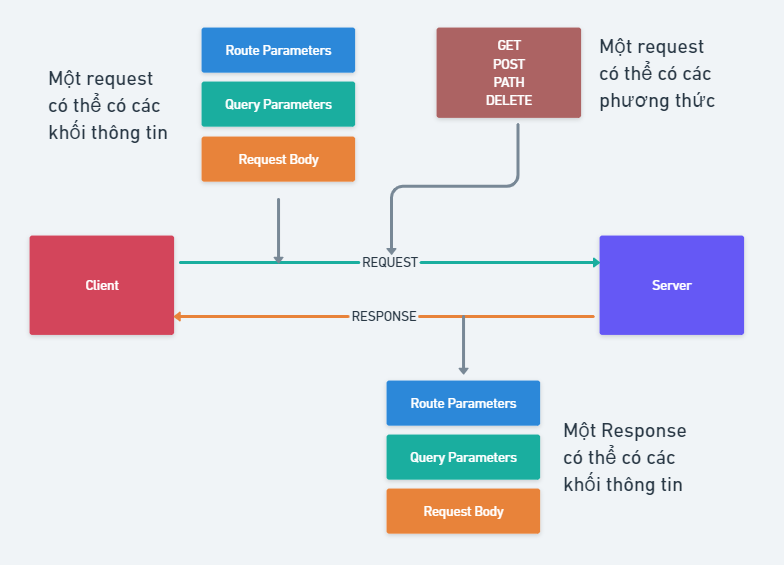

# Tạo web động sử dụng NodeJs - ExpressJs

Trong bài học này chúng ta tìm hiểu: 

> 1. ExpressJs Framework
> 2. Route và HTTP Methods
> 3. Route paths
> 4. Requests and Handling Parameters
> 5. Response methods
> 6. Serving static files
> 7. Template Engine

==============================

## 💛 1. ExpressJs Framework

ExpressJS là một framework ứng dụng web có mã nguồn mở và miễn phí được xây dựng trên nền tảng Node.js. ExpressJS được sử dụng để thiết kế và phát triển các ứng dụng web một cách nhanh chóng.


Nói đến framework là nói đến nó có thể vừa đảm nhận vai trò làm client vừa làm server được.

ExpressJS Rất dễ học, chỉ cần bạn biết JavaScript, bạn sẽ không cần phải học một ngôn ngữ mới, giúp cho việc phát triển back-end dễ dàng hơn nhiều.

### Cài đặt

#### Bước 1 - Khởi tạo dự án


```bash
npm init
#hoặc
yarn init
```
Để khởi tạo file package.json

#### Bước 2 - Tích hợp ExpressJs

```bash
npm install express  --save
#hoặc
yarn add express 
```

Với TypeScript cần Cài thêm

```bash
npm i -D typescript  @types/express @types/node ts-node-dev
#or
yarn add -D typescript  @types/express @types/node ts-node-dev
```

#### Bước 3 - Cấu hình Typescript

Tạo file tsconfig.json

```bash
npx tsc --init
```
Sau đó mở file tsconfig.json và tìm sửa lại những thông tin sau:

```json
{
  "compilerOptions": {
    "target": "es2016",
    "module": "commonjs",
    "outDir": "dist/",
    "strict": true,
    "sourceMap": true,
    "esModuleInterop": true,
    "skipLibCheck": true,
    "forceConsistentCasingInFileNames": true
  }
}

```

#### Bước 4 - Tạo ứng dụng


Tạo File app.ts

```ts
import express, { Express, Request, Response } from 'express';
const app: Express = express();

const PORT = process.env.PORT || 9000;

// app.use(express.json());
// app.use(express.urlencoded({ extended: false }));

app.get('/', (req: Request, res: Response) => {
  res.status(200).json({message: 'Express + TypeScript Server'});
});


app.listen(PORT, () => {
    console.log(`⚡️[server]: Server is running at http://localhost:${PORT}`);
});
```


#### Bước 5 - Cấu hình lại package.json

```json
 "scripts": {
    "build": "npx tsc -p",
    "start": "node app.ts",
    "dev": "ts-node-dev --respawn --transpile-only app.ts"
  },
```


#### Bước 6 - Khởi chạy dự án


```bash
yarn dev
# hoặc
npm run dev
```

Hoặc bạn Sử dụng gói cài đặt có sẵn express-generator (javascript)

Tại thư mục gốc dự án bạn mở cửa sổ Terminal và nhập lệnh

```bash
npx express-generator
```

Xem chi tiết: https://expressjs.com/en/starter/generator.html

## 💛 2. Route và HTTP Methods

Route là một thành phần cực kỳ quan trọng của một website, nó giúp website biết được người dùng truy cập đến nơi nào của trang web, từ đó phản hồi lại một cách thích hợp.

Cú pháp định nghĩa một Route

```js
app.METHOD(PATH, HANDLER);
```

- app is an instance of express.
- METHOD is an HTTP request method, in lowercase.
- PATH is a path on the server.
- HANDLER is the function executed when the route is matched.

Ví dụ:

Phản hồi khi có một truy cập đến trang chủ với phương thức GET

```js
app.get('/', (req, res) => {
  res.send('Hello World!. I\'m a Home Page');
});
```

Phản hồi khi có một truy cập đến trang chủ với phương thức POST

```js
app.post('/', (req, res) => {
  res.send('Got a POST request');
});
```

Phản hồi khi có một truy cập đến trang user với phương thức PUT

```js
app.put('/user', (req, res) => {
  res.send('Got a PUT request at /user');
});
```

Phản hồi khi có một truy cập đến trang user với phương thức DELETE

```js
app.delete('/user', (req, res) => {
  res.send('Got a DELETE request at /user');
});
```

Đọc thêm: [So sánh GET với POST](https://timoday.edu.vn/cac-phuong-thuc-request-trong-giao-thuc-http/#So_sanh_GET_voi_POST)

## 💛 Route paths

Ngoài cách bạn định nghĩa path một cách cụ thể như ví dụ trên thì bạn có thể tạo ra các `path` với một `string patterns`


route path sẽ khớp với: acd, abcd.

```js
app.get('/ab?cd', (req, res) => {
  res.send('ab?cd');
});
```

route path khớp với abcd, abbcd, abbbcd, và nhiều hơn

```js
app.get('/ab+cd', (req, res) => {
  res.send('ab+cd');
});
```

route path khớp với abcd, abxcd, abRANDOMcd, ab123cd, và nhiều hơn

```js
app.get('/ab*cd', (req, res) => {
  res.send('ab*cd');
});
```

route path khớp với /abe and /abcde.

```js
app.get('/ab(cd)?e', (req, res) => {
  res.send('ab(cd)?e');
});
```

Hoặc khớp với một biểu thức chính quy `regular expressions`:

route path khớp khi url có chứa ký tự `a`

```js
app.get(/a/, (req, res) => {
  res.send('/a/');
});
```

route path khớp khi url như butterfly, dragonfly, và không khớp khi butterflyman, dragonflyman. $ là đánh dấu là kết thúc.

```js
app.get(/.*fly$/, (req, res) => {
  res.send('/.*fly$/');
});
```

Regex rule trong trường hợp sử dụng  route parameter

```js
// Ví dụ: /user/1
app.get('^/users/:userId([0-9]{6})', function (req, res) {
  res.send('Route match for User ID: ' + req.params.userId);
});
```

```js
// Ví dụ: /user/aptech
app.get('^/users/:username([0-9a-zA-Z]{6,12})', function (req, res) {
  res.send('Route match for User Name: ' + req.params.username);
});
```

## 💛 Requests and Handling Parameters

### 🚩 HTTP Request là gì ?

📌 **HTTP** (Hypertext Transfer Protocol) Là một giao thức cơ bản mà World Wide Web sử dụng. HTTP xác định cách mà các thông điệp (như các file văn bản, hình ảnh đồ hoạ, âm thanh, video, và các file multimedia ...) được định dạng và truyền tải ra sao, và những hành động nào mà các Webserver và các trình duyệt web (browser) phải làm để đáp ứng lại



📌 **HTTP Request** hiểu một cách đơn giản là các thông tin sẽ được gửi từ người dùng (client) lên server. Server sẽ có nhiệm vụ tìm và xử lý các loại dữ liệu, thông tin, client mong muốn

Có nhiều phương thức khác nhau để gửi một request đến server trong đó các phương thức phổ biến: GET,POST,PUT,DELETE,PATCH

### 🚩Cấu trúc của một Request

HTTP Request có cấu tạo gồm ba phần chính. Đó là request line, header và massage body

1. Request Line: Methods, Path (URL), HTTP version

2. Request Header: thông tin mở rộng cho request: cookie, thông tin về ủy quyền, tác nhân người dùng…

3. Request Body: nội dung mà request mang theo để gửi lên server


### 🚩Mapping requests

Mapping requests (định tuyến yêu cầu) là quá trình xác định cách xử lý các yêu cầu HTTP đến các địa chỉ URL cụ thể trong một ứng dụng web. Trong ngữ cảnh của một ứng dụng web, "mapping" ám chỉ việc liên kết (mapping) các yêu cầu từ người dùng đến các tác vụ xử lý tương ứng.

Khi một yêu cầu HTTP được gửi đến máy chủ, máy chủ cần biết xử lý yêu cầu đó bằng cách nào. Mapping requests giúp xác định điểm cuối (endpoints) trong ứng dụng web mà yêu cầu sẽ được chuyển đến để xử lý.

Trong các framework phát triển ứng dụng web, như Node.js với Express, Django trong Python, ASP.NET trong C#, hay Ruby on Rails, việc mapping requests thường được thực hiện thông qua các route (đường dẫn) và các hàm xử lý tương ứng.

Ví dụ, trong Express framework của Node.js, bạn có thể định nghĩa các route và các hàm xử lý tương ứng như sau:


Ví dụ khi người dùng (CLIENT)  nhập địa chỉ này lên URL trình duyệt ==> đồng nghĩa là đang gửi một request lên SERVER

Và người Code Backend muốn CLIENT nhận lại được thông tin gì thì SERVER sẽ tạo ra một Route để phản hồi (Response) lại thông tin cho CLIENT tương ứng, ví dụ:

```javascript
const express = require('express');
const app = express();

app.get('/users', (req, res) => {
  res.send('get All Users');
});
```

Route này bạn định nghĩa đường dẫn tương tứng với request mà CLIENT gửi lên là `/users`

Cuối cùng 2 đường dẫn này khớp nhau: `/users` <==> `/users` thì gọi đó là mapping một request.

Ngoài khớp URL ra thì còn cần khớp thêm METHOD: GET, POST, PUT, DELETE...


### 🚩 Handling Parameters

Trong Express, "handling parameters" (xử lý tham số) đề cập đến cách lấy và sử dụng các tham số được truyền trong các yêu cầu HTTP. 

Khi Client gửi một REQUEST lên Server thì nó mang theo 3 khối thông tin sau:

1. Route Parameters: Được sử dụng để trích xuất thông tin từ URL. Chúng được xác định trong một tuyến đường (route) bằng cách sử dụng một mẫu (pattern) theo định dạng `/:parameter`. Ví dụ, `/:id` là một route parameter có tên là "id". Để truy cập giá trị của route parameter trong xử lý yêu cầu, bạn có thể sử dụng thuộc tính `req.params`.

2. Query Parameters: Được truyền dưới dạng chuỗi truy vấn (query string) trong URL sau dấu "?" và có thể chứa nhiều cặp key-value. Ví dụ: `/users?name=john&age=25`. Để truy cập các query parameter trong xử lý yêu cầu, bạn có thể sử dụng thuộc tính `req.query`.

3. Request Body: Được sử dụng để truyền dữ liệu phức tạp hoặc lớn hơn thông qua yêu cầu HTTP POST hoặc PUT. Dữ liệu này thường được gửi dưới dạng JSON hoặc form data. Để truy cập body parameters, bạn cần sử dụng các middleware như `body-parser` hoặc `express.json()`. Sau đó, bạn có thể truy cập dữ liệu bằng cách sử dụng thuộc tính `req.body`.

Ví dụ:

```javascript

// Route parameter
app.get('/users/:id', (req, res) => {
  const userId = req.params.id;
  // Xử lý tham số "id"
  res.send(`User ID: ${userId}`);
});

// Query parameters
app.get('/users', (req, res) => {
  const name = req.query.name;
  const age = req.query.age;
  // Xử lý các query parameter
  res.send(`Name: ${name}, Age: ${age}`);
});

// Request body
app.use(express.json()); // Middleware để xử lý JSON body

app.post('/users', (req, res) => {
  const user = req.body;
  // Xử lý dữ liệu từ request body
  res.send(`Created user: ${JSON.stringify(user)}`);
});


```

Trong ví dụ trên, chúng ta đã sử dụng Express để định nghĩa ba tuyến đường khác nhau để xử lý các tham số theo các cách khác nhau.


## 💛 HTTP Response

Response có nghĩa là phản hồi. Đây là kết quả server trả về cho client.


HTTP Response có cấu tạo gồm ba phần chính. Đó là status line, header và massage body

1. Request Line: Http Status Code, Reason-Phrase, HTTP version

2. Request Header: thông tin mở rộng cho request: cookie, thông tin về ủy quyền, tác nhân người dùng…

3. Message Body

ExpressJs hỗ trợ các phương thức response như sau:

| Method           | Description                                                                           |
| ---------------- | ------------------------------------------------------------------------------------- |
| res.download()   | Tải file.                                                       |
| res.end()        | Kết thúc xử lý reponse                                                            |
| res.json()       | Gửi một Json                                                                 |
| res.jsonp()      | Send a JSON response with JSONP support.                                              |
| res.redirect()   | Chuyển hướng request                                                                   |
| res.render()     | Render một giao diện                                                               |
| res.send()       | Send a response of various types.                                                     |
| res.sendFile()   | Send a file as an octet stream.                                                       |
| res.sendStatus() | Set the response status code and send its string representation as the response body. |

---

Dưới đây là ví dụ về một số phương thức trả về (response methods) trong Express.js:

1. **`res.send(data)`**: Gửi dữ liệu về cho client. Phương thức này tự động xác định kiểu nội dung và chuyển đổi tham số thành một chuỗi JSON bằng cách sử dụng `JSON.stringify()`. Tham số có thể là bất kỳ kiểu dữ liệu JSON nào, bao gồm object, array, string, Boolean, number hoặc null. Bạn cũng có thể sử dụng nó để chuyển đổi các giá trị khác thành JSON.

    ```javascript
    app.get('/', (req, res) => {
      res.send('Hello, Express!');
    });
    ```

2. **`res.json(data)`**: Trả về dữ liệu dưới dạng JSON. Phương thức này tương tự như `res.send()`, nhưng chỉ chuyển đổi tham số thành chuỗi JSON mà không cần xác định kiểu nội dung.

    ```javascript
    app.get('/user', (req, res) => {
      res.json({ name: 'John', age: 30 });
    });
    ```

3. **`res.status(code)`**: Xác định mã trạng thái HTTP cho phản hồi. Ví dụ, bạn có thể sử dụng nó để trả về mã 404 (Not Found) hoặc 500 (Internal Server Error).

    ```javascript
    app.get('/not-found', (req, res) => {
      res.status(404).send('Page not found');
    });
    ```

4. **`res.redirect(path)`**: Chuyển hướng đến một đường dẫn cụ thể.

    ```javascript
    app.get('/old-page', (req, res) => {
      res.redirect('/new-page');
    });
    ```

5. **`res.render(view, locals)`**: Trả về một view template. Bạn cần cài đặt một template engine như Pug, EJS hoặc Handlebars để sử dụng phương thức này.

    ```javascript
    app.get('/profile', (req, res) => {
      res.render('profile', { username: 'john_doe' });
    });
    ```


6. **`Gửi tệp tin để tải về (Download File)`**:
    - Sử dụng phương thức `res.download(file)` để gửi tệp tin đến client và cho phép người dùng tải về.
    - Đảm bảo rằng bạn đã cài đặt Express và có một tệp tin để thử nghiệm.

    ```javascript
    app.get('/download', (req, res) => {
      const file = `${__dirname}/path/to/your/file.txt`;
      res.download(file); // Gửi tệp tin đến client
    });
    ```

7. **`Gửi tệp tin (Send File)`**:
    - Sử dụng phương thức `res.sendFile()` để gửi tệp tin HTML hoặc tệp tin khác đến client.
    - Đảm bảo rằng bạn đã có tệp tin `test.html` trong thư mục của bạn.

    ```javascript
    app.get('/myendpoint', (req, res) => {
      res.sendFile(`${__dirname}/test.html`);
    });
    ```


---

## 💛 Tìm hiểu về HTTP Status Code

Khi nhận và phiên dịch một HTTP Request, Server sẽ gửi tín hiệu phản hồi là một HTTP Response, trong đó có một thành phần là Status code.

Status code (Mã hóa trạng thái thường được gọi là mã trạng thái) là một số nguyên 3 ký tự, trong đó ký tự đầu tiên của Status-Code định nghĩa loại Response và hai ký tự cuối không có bất cứ vai trò phân loại nào. Có 5 giá trị của ký tự đầu tiên:

- 1xx: Information (Thông tin): Khi nhận được những mã như vậy tức là request đã được server tiếp nhận và quá trình xử lý request đang được tiếp tục.
- 2xx: Success (Thành công): Khi nhận được những mã như vậy tức là request đã được server tiếp nhận, hiểu và xử lý thành công
- 3xx: Redirection (Chuyển hướng): Mã trạng thái này cho biết client cần có thêm action để hoàn thành request
- 4xx: Client Error (Lỗi Client): Nó nghĩa là request chứa cú pháp không chính xác hoặc không được thực hiện.
- 5xx: Server Error (Lỗi Server): Nó nghĩa là Server thất bại với việc thực hiện một request nhìn như có vẻ khả thi

Xem chi tiết [link sau](http-status-code.md)

---

## 💛 Serving static files in Express

Khi bạn upload images, CSS files, and JavaScript files lên server thì bạn cần public đường dẫn đến các tài nguyên tĩnh này thì mình sẽ khai báo:

```js
//Tại app.ts
const path = require('path');
app.use(express.static(path.join(__dirname, 'public')));
```

Cấu trúc thư mực

```code
public/
  ├─ css/
  ├─ files/
  ├─ images/
  ├─ uploads/
  ├─ js/
  app.ts/
```

Khi đó bạn có thể truy cập đến các tài nguyên tĩnh

```code
http://localhost:3000/images/kitten.jpg
http://localhost:3000/css/style.css
http://localhost:3000/js/app.js
http://localhost:3000/images/bg.png
http://localhost:3000/hello.html
```

Ngoài ra bạn có thể tạo ra một tiền tố đường dẫn ảo

```js
app.use('/static', express.static(path.join(__dirname, 'public')));
```
`path.join(__dirname, 'public')` là bạn đang xác định đường dẫn đến thư mục public khi bạn đang đứng ở app.js

Bạn truy cập tới các tài nguyên tĩnh bằng tiền tố `/static`

```code

http://localhost:3000/static/images/kitten.jpg
http://localhost:3000/static/css/style.css
http://localhost:3000/static/js/app.js
http://localhost:3000/static/images/bg.png
http://localhost:3000/static/hello.html
```

Thực tế không tồn tại thư mục /static trên server, thư mục ảo

---

## 💛 Sử dụng template engines với Express

Chúng ta biết rằng Express là một framework nên nó có thể đảm nhận công việc client side, có thể dùng để làm một ứng dụng, một website bình thường.

Bằng cách sử dụng `template engines` phổ biến làm việc với Express như Pug, Mustache, and EJS.

Xem ví dụ về sử dụng `ejs engines` ở thư mục Examples/express-ejs-template

Tạo một trang web có 5 trang sử dụng ExpressJs

* Trang chủ  với đường dẫn : /
* Trang About với đường dẫn: /about
* Trang Product với đường dẫn: /products
* Trang Blog với đường dẫn: /blog
* Trang Login với đường dẫn: /login

Cài đặt:

```bash
npm install ejs
yarn add ejs
```

Thêm 2 dòng này vào app.js

```js
// cấu hình kiểu tập tin template
app.engine('.html', require('ejs').__express);
// Cấu hình thư mục template views
app.set('views', path.join(__dirname, 'views'));
// Without this you would need to
// supply the extension to res.render()
// ex: res.render('users.html').
app.set('view engine', 'html');

```

Đọc thêm: Mô hình MVC là gì ?

Tạo các template cho 5 trang nói trên

```code
views/
  ├─ index.html
  ├─ about.html
  ├─ products.html
  ├─ blog.html
  ├─ login.html
app.js
```


Nội dung trang chủ

```js
app.get('/', function (req, res) {
  //render kết quả ra template views/index.html
  res.render('index', {
    title: 'EJS example',
    heading: 'Hello HomePage'
  });
});

```

Tương tự cho các trang còn lại

Bạn có thể nhúng Tailwind Css, Bootstrap, jQuery vào các templates trên một cách bình thường như bên HTML

---


### 💛 Đọc thêm

###  So sánh GET với POST

Xem: https://timoday.edu.vn/cac-phuong-thuc-request-trong-giao-thuc-http/#So_sanh_GET_voi_POST


###  PUT and PATH

Trong RESTful API, PUT và PATCH là hai phương thức HTTP khác nhau được sử dụng để cập nhật tài nguyên. 

Có rất nhiều tranh luận nên dùng PUT hay PATH

|                    | PUT | PATCH |
|--------------------|-----|-------|
| Partial Updates    | ❌   | ✔️     |
| Bandwidth          | ⬆️   | ⬇️     |
| Creates a resource | ✔️   | ❌     |
| Idempotent         | ✔️   | ❌     |
| Safe               | ❌   | ❌     |

Tham khảo: <https://josipmisko.com/posts/patch-vs-put-rest-api>


Dưới đây là sự khác biệt giữa PUT và PATCH:

1. PUT (Cập nhật toàn bộ tài nguyên):
   - Phương thức PUT được sử dụng để cập nhật toàn bộ tài nguyên hoặc tạo mới nếu tài nguyên chưa tồn tại.
   - Khi sử dụng PUT, bạn gửi một yêu cầu cập nhật hoàn toàn và ghi đè lên tài nguyên hiện có. Điều này có nghĩa là tất cả các trường dữ liệu của tài nguyên sẽ được thay thế bằng dữ liệu mới được gửi.
   - Nếu bạn chỉ gửi một phần của tài nguyên trong yêu cầu PUT, những phần không được gửi sẽ bị xóa hoặc trở thành giá trị mặc định (nếu có) tuỳ thuộc vào ứng dụng.

Ví dụ có một record với thông tin sau:

```json

{
    "id": 1,
    "name": "John Smith",
    "age": 25,
    "skill": "Java, PHP"
}

```
Bây giờ muốn bổ sung thêm skill cho id : 1

Request: PUT /users/1

Request payload:

```json
"skill": "Java, PHP, Python, JavaScript"
```

Bây giờ mình kiểm tra lại xem thông tin John đã được cập nhật chưa.

Request: GET /user/1
Response:

```json
"skill": "Java, PHP, Python, JavaScript"
```

Cập nhật rồi, nhưng trường name, và age đã biến mất

2. PATCH (Cập nhật một phần tài nguyên):
   - Phương thức PATCH được sử dụng để cập nhật một phần của tài nguyên.
   - Khi sử dụng PATCH, bạn chỉ cần gửi các trường dữ liệu cần cập nhật trong yêu cầu. Các trường dữ liệu khác của tài nguyên sẽ không bị thay đổi.
   - Phương thức PATCH cho phép bạn thực hiện các thay đổi nhỏ mà không cần gửi lại toàn bộ tài nguyên. Điều này hữu ích khi bạn chỉ muốn cập nhật một số trường dữ liệu mà không ảnh hưởng đến các trường khác.


Cũng với ví dụ trên thực hiện với PATH thì sau khi cập nhật bạn nhật được response

```json

{
    "id": 1,
    "name": "John Smith",
    "age": 25,
    "skill": "Java, PHP, Python, JavaScript"
}

```

==> PATCH chỉ cập nhật những field được yêu cầu thay vì cập nhật toàn bộ.

