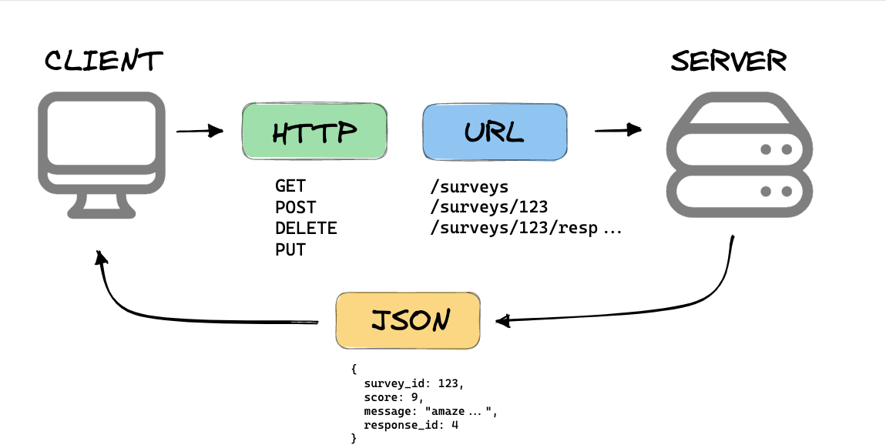

# 💛 Xây dựng cấu trúc RESTFul-APIs

## 🔶 RESTful API là gì ?

RESTful API là một loại giao diện lập trình ứng dụng (API) được thiết kế theo các nguyên tắc của kiến trúc REST (Representational State Transfer). REST là một kiểu kiến trúc phần mềm dựa trên giao thức HTTP và các tiêu chuẩn web liên quan khác.



RESTful API cho phép các ứng dụng giao tiếp và trao đổi dữ liệu với nhau qua mạng. Nó sử dụng các phương thức HTTP như GET, POST, PUT và DELETE để thực hiện các hoạt động CRUD (Create, Read, Update, Delete) trên dữ liệu.

RESTful API đã trở thành một phương pháp phổ biến để xây dựng các dịch vụ web và ứng dụng di động, vì nó đơn giản, linh hoạt và dễ dùng.

## 🔶 Nguyên tắc thiết kế RESTful API

#### 1. Sử dụng đúng HTTP methods:

- `GET /users` → lấy danh sách user
- `POST /users` → tạo user mới
- `GET /users/123` → lấy thông tin user có id=123
- `PUT /users/123` → cập nhật user
- `DELETE /users/123` → Xóa user

#### 2. URL biểu diễn tài nguyên (resource), không chứa động từ:

❌ /getAllUsers → sai
✅ /users → đúng

#### 3. Không lưu trạng thái (stateless):
Mỗi request phải tự đầy đủ thông tin xác thực (vd: token), không phụ thuộc vào phiên làm việc trước đó.
#### 4. Sử dụng định dạng dữ liệu phổ biến (thường là JSON)

### 🔶 API hoạt động như thế nào ?


### 🔶 Lợi ích của API là gì ?


Từng bước xây dựng dự án theo mô hình

### 🔶 1: Cấu trúc dự án

Phát triển dự án theo cấu trúc saum sử dụng TypeScript:

```plaintext
project-restful-apis/
├── node_modules/
├── public/             # Tệp tĩnh như hình ảnh, CSS, JavaScript, v.v.
├── src/
│   ├── controllers/    # Xử lý các request và gọi các service tương ứng
│   ├── middleware/     # Các middleware như xác thực, logging, v.v.
│   ├── models/         # Các model đại diện cho dữ liệu (ORM/ODM models)
│   ├── services/       # Business logic chính của ứng dụng
│   ├── helpers/        # Các hàm tiện ích được dùng trong nhiều nơi
│   ├── validations/    # Xác thực dữ liệu request
│   ├── configs/        # Các file cấu hình (config.js, database.js, v.v.)
│   ├── routes/         # Định nghĩa các route của API
│   │   ├── v1/         # API v1 routes
│   │   ├── v2/         # API v2 routes (nếu có)
│   ├── app.ts          # Cấu hình Express và middleware chính
│   ├── server.ts       # Tệp khởi động server (kết nối DB và chạy server)
├── .env                # Biến môi trường cho project
├── .gitignore          # Các tệp và thư mục không cần đưa vào git
├── package.json        # Thông tin dự án và các dependencies
├── README.md           # Tài liệu hướng dẫn về dự án

```

Cài đặt xem lại ở bài học trước với TypeScript

**/Controllers** - Thư mục này sẽ chứa tất cả các chức năng dể viết các API của bạn. Cách đặt tên: xxxxx.controller.ts trong đó xxx là nhiệm vụ thôi, ví dụ: login.controller.ts

**/Routes** - Thư mục này sẽ chứa tất cả các tuyến đường mà bạn đã tạo bằng cách sử dụng Express Router và kết hợp với Controllers. Cách đặt tên cũng như trên xxxxx.routes.ts

**/Models** - Thư mục này sẽ chứa tất cả các files như schema của bạn và và các chức năng cần thiết cho schema cũng sẽ nằm ở đây. Đặt tên xxxxx.model.ts

**/Middleware** - Thư mục này sẽ chứa tất cả phần mềm trung gian mà bạn đã tạo, ví dụ như là xác thực chẳng hạn... Cách đặt tên: xxxxx.middleware.ts /

**Helpers** - Các chức năng phổ biến mà bạn sẽ yêu cầu nhiều lần trong suốt mã của mình ví dụ như check missing params trước khi xử lý dữ liệu chẳng hạn. Rất cần thiết.

**/Configs** - File này dùng cấu hình cho các API / dịch vụ của bên thứ ba như passport / S3, v.v. Những thông số như keyAPI các kiểu.

Đó là những folders rất quan trọng, có thể nói là không thể thiếu. Ngoài ra còn những files trong root như là:

**server.ts** - Tập tin khởi chạy ứng dụng Express

**app.ts** - Tệp này về cơ bản sẽ là khai báo của ứng dụng Express

**package.json** - File này chứa tất cả các chi tiết npm của dự án, các lệnh chạy như scripts và các phần dependencies

**.gitignore** - Những file mà bạn không muốn đẩy sang git

### 🔶Cài đặt dự án với TypeScript

```bash
npm init
#hoặc
yarn init
```

Để khởi tạo file package.json

```bash
npm install express dotenv --save
#hoặc
yarn add express dotenv
```

Cài thêm để code với Typescript

```bash
npm i -D typescript  @types/express @types/node ts-node-dev
#or
yarn add -D typescript  @types/express @types/node ts-node-dev
```

Tạo file `tsconfig.json` để cấu hình biên dịch cho typescript

```bash
npx tsc --init
```

Sau đó mở file tsconfig.json và tìm sửa lại những thông tin sau:

```json
{
  "compilerOptions": {
    "target": "es2016",
    "module": "commonjs",
    "outDir": "dist/",
    "strict": true,
    "sourceMap": true,
    "esModuleInterop": true,
    "skipLibCheck": true,
    "forceConsistentCasingInFileNames": true
  },
  "include": ["src/**/*", "server.ts", "index.d.ts"],
  "exclude": ["node_modules", "**/*.spec.ts"]
}
```

Tạo File app.ts

```ts
import dotenv from "dotenv";
import express, { Express, Request, Response } from "express";
const app: Express = express();
dotenv.config();

const PORT = process.env.PORT || 9000;

app.use(express.json());
app.use(express.urlencoded({ extended: false }));

app.get("/", (req: Request, res: Response) => {
  res.status(200).json({ message: "Express + TypeScript Server" });
});

app.listen(PORT, () => {
  console.log(`⚡️[server]: Server is running at http://localhost:${PORT}`);
});
```

Cấu hình lại package.json

```json
 "scripts": {
    "build": "npx tsc -p",
    "start": "node app.ts",
    "dev": "ts-node-dev --respawn --transpile-only app.ts"
  },
```

Tạo file .env ở thư mục gốc dự án, dùng để chứa các thông số bảo mật, biến môi trường

```env
NODE_ENV= development
PORT= 8080
```

> Tìm hiểu: Tạo sai phải tạo file .env trong ứng dụng NodeJs ?

Khởi chạy dự án

```bash
yarn dev
# hoặc
npm run dev
```

---

Nhưng theo đề xuất thì nên tách server ra riêng và app ra riêng như sau:

Sửa File src/App.ts

```ts
import express, { Express, Request, Response } from "express";
const app: Express = express();

app.use(express.json());
app.use(express.urlencoded({ extended: false }));

app.get("/", (req: Request, res: Response) => {
  res.status(200).json({ message: "Express + TypeScript Server" });
});

export default app;
```

Tạo file server.ts ở thư mục gốc dự án

```ts
import dotenv from "dotenv";
import app from "./src/app";

dotenv.config();

const PORT = process.env.PORT || 9000;

app.listen(PORT, () => {
  console.log(`⚡️[server]: Server is running at http://localhost:${PORT}`);
});
```

Cấu hình lại package.json

```json
 "scripts": {
    "build": "npx tsc -p",
    "start": "node server.ts",
    "dev": "ts-node-dev --respawn --transpile-only server.ts"
  },
```

### 🔶 Follow cách hoạt động của mô hình cấu trúc dự án


### 🔶 Tạo một API đầu tiên

Thông tường trong thực tế một API sẽ có địa chỉ

```html
https://domain.com/api/v1/end-points
```

Dựa vào đó người ta nhận ra ngay được đó là hệ thống RestFul API có phiên bản.

Bây giờ chúng ta tạo một end-point có cấu trúc đường dẫn tương tự trên.

```html
https://localhost:9000/api/v1/categories
```

Trả về danh sách Danh mục

Tại src/routes/v1 tạo file categories.route.ts

```js
import express, {Request, Response } from 'express';
const router = express.Router();

// Get all categories
router.get('/', async (req: Request, res: Response) => {
  res.status(200).json(categories);
});

export default = router;
```

Gắn router vào app.ts

```js
import categoriesRouter from "./routes/categories.route";
//API sẽ bắt đầu bằng api/v1/categories
app.use("/api/v1/categories", categoriesRouter);
```

Tạo tiếp các enpoints khác

Resources Category

| HTTP Method | Endpoint              | Description                  |
| ----------- | --------------------- | ---------------------------- |
| GET         | api/v1/categories     | Retrieve all categories      |
| GET         | api/v1/categories/:id | Retrieve a specific category |
| POST        | api/v1/categories/:id | Create a new category        |
| PUT         | api/v1/categories/:id | Update a specific category   |
| DELETE      | api/v1/categories/:id | Delete a specific category   |

## 💛 Errors Handling App

Sử dụng thư viện `http-errors` để bắt các lỗi từ request, hệ thống

```bash
npm i http-errors
yarn add http-errors

npm i @types/http-errors --save-dev
yarn add @types/http-errors --save-dev
```

Tại App.ts import vào

```js
import express, { Express, NextFunction, Request, Response } from "express";
import createError from "http-errors";
```

Add đoạn này nằm NGAY TRƯỚC phần export app

```js
// catch 404 and forward to error handler
app.use(function (req: Request, res: Response, next: NextFunction) {
  next(createError(404));
});

// error handler
app.use(function (err: any, req: Request, res: Response, next: NextFunction) {
  // set locals, only providing error in development
  res.locals.message = err.message;
  res.locals.error = req.app.get("env") === "development" ? err : {};

  const statusCode = err.status || 500;
  res.status(statusCode).json({ statusCode: statusCode, message: err.message });
});
```

## 💛 Tìm hiểu `gitignore`

`.gitignore` là một tệp văn bản đặc biệt được sử dụng trong hệ thống kiểm soát phiên bản Git để chỉ định các tệp hoặc thư mục mà bạn muốn Git bỏ qua. Điều này có nghĩa là các tệp hoặc thư mục được liệt kê trong tệp `.gitignore` sẽ không được Git theo dõi, thêm vào kho lưu trữ, hoặc hiển thị trong các thay đổi chưa được cam kết.

### Lợi ích của `.gitignore`

- **Loại bỏ các tệp không cần thiết**: Giúp giữ cho kho lưu trữ Git gọn gàng bằng cách không theo dõi các tệp không cần thiết như tệp tạm thời, tệp biên dịch hoặc tệp nhị phân.
- **Bảo mật**: Ngăn chặn việc vô tình thêm các tệp nhạy cảm như thông tin cấu hình cá nhân, khóa API hoặc mật khẩu vào kho lưu trữ.
- **Hiệu suất**: Cải thiện hiệu suất của Git bằng cách giảm số lượng tệp mà nó cần phải theo dõi và quản lý.

### Cách tạo tệp `.gitignore`

1. **Tạo tệp `.gitignore`**: Tạo một tệp mới trong thư mục gốc của dự án và đặt tên là `.gitignore`.

2. **Thêm các quy tắc bỏ qua**: Thêm các mẫu (patterns) của tệp hoặc thư mục mà bạn muốn Git bỏ qua vào tệp này. Mỗi dòng trong `.gitignore` thường chứa một mẫu.

Ngoài cách tạo thủ công, bạn có thể sử dụng extention trên VS Code để tạo `.gitignore` phù hợp với từng loại ngôn ngữ dự án.

### Ví dụ về tệp `.gitignore`

Dưới đây là một ví dụ về nội dung của tệp `.gitignore`:

```plaintext
# Bỏ qua các tệp biên dịch
*.class
*.o
*.so

# Bỏ qua các tệp nhật ký
*.log

# Bỏ qua các tệp tạm thời
*.tmp
*.swp

# Bỏ qua thư mục build và dist
/build/
/dist/

# Bỏ qua thư mục node_modules (dự án Node.js)
node_modules/

# Bỏ qua tệp cấu hình cá nhân
config.json
.env

# Bỏ qua thư mục .vscode (cấu hình Visual Studio Code)
.vscode/

# Bỏ qua các tệp hệ điều hành
.DS_Store
Thumbs.db
```

### Một số quy tắc và cú pháp cơ bản

- **Dấu sao (\*)**: Đại diện cho bất kỳ chuỗi ký tự nào.

  ```plaintext
  *.log  # Bỏ qua tất cả các tệp có phần mở rộng .log
  ```

- **Dấu chấm hỏi (?)**: Đại diện cho bất kỳ ký tự đơn nào.

  ```plaintext
  file?.txt  # Bỏ qua file1.txt, file2.txt, ... nhưng không phải file10.txt
  ```

- **Dấu gạch chéo (/)**: Chỉ định đường dẫn thư mục.

  ```plaintext
  /build/  # Bỏ qua toàn bộ thư mục build ở thư mục gốc
  ```

- **Dấu chấm than (!)**: Lưu ý rằng ngoại lệ cho mẫu trước đó.
  ```plaintext
  *.log
  !important.log  # Bỏ qua tất cả các tệp .log, ngoại trừ important.log
  ```

### Cách áp dụng và kiểm tra `.gitignore`

- **Thêm `.gitignore` vào Git**: Khi bạn đã tạo hoặc chỉnh sửa `.gitignore`, hãy thêm nó vào kho lưu trữ Git và cam kết thay đổi.

  ```sh
  git add .gitignore
  git commit -m "Thêm tệp .gitignore"
  ```

- **Kiểm tra trạng thái**: Để kiểm tra xem các tệp đã bị bỏ qua hay chưa, bạn có thể sử dụng lệnh `git status`.

## 💛 Đọc thêm - Biến môi trường

### Giải thích khái niệm

**Biến môi trường (Environment Variables)** trong Node.js là một cách để **định cấu hình ứng dụng** của bạn dựa trên môi trường nó đang chạy. Điều này cho phép bạn **thiết lập các giá trị khác nhau** cho từng môi trường, chẳng hạn như **development**, **staging**, **test**, hoặc **production**.

Dưới đây là một số bước để làm việc với biến môi trường trong Node.js:

1. **Tạo file .env**: Đầu tiên, bạn cần tạo một tệp `.env` trong thư mục dự án của bạn. Trong tệp này, bạn sẽ định nghĩa các biến môi trường mà ứng dụng cần sử dụng. Ví dụ:

   ```
   NODE_ENV=development
   MONGODB_URI=mongodb://localhost/demodatabase
   SECRETKEY=SecretGarden
   PORT=3000
   ```

2. **Đọc tệp .env**: Để đọc các biến môi trường từ tệp `.env`, bạn cần thực hiện các bước sau:

   - Tạo một tệp `package.json` (nếu chưa có) bằng cách chạy lệnh `yarn init -y`.
   - Cài đặt gói `dotenv` bằng lệnh `yarn add  dotenv`.
   - Trong mã nguồn của ứng dụng, import `dotenv`:

     ```javascript
     require("dotenv").config();
     import "dotenv/config"; //ES6
     ```

   - Bây giờ bạn có thể sử dụng các biến từ tệp `.env` trong mã nguồn của mình:

     ```javascript
     let server = app.listen(process.env.PORT || 3000, function () {
       console.log(`Server listening on port ${server.address().port}`);
     });
     ```

3. **Lưu ý**: Để tránh việc nội dung của tệp `.env` bị thay đổi giữa các môi trường khi cập nhật, bạn nên thêm tệp `.env` vào danh sách ignore trong tệp `.gitignore`.

### Tại sao lại cần biến môi trường ?

**Biến môi trường (Environment Variables)** là một phần quan trọng của việc phát triển ứng dụng. Dưới đây là một số lý do tại sao chúng ta cần sử dụng biến môi trường:

1. **Bảo mật thông tin nhạy cảm**: Biến môi trường cho phép bạn lưu trữ các thông tin nhạy cảm như **khóa bí mật**, **mật khẩu**, hoặc **các thông tin kết nối đến cơ sở dữ liệu** mà không cần lưu trực tiếp trong mã nguồn. Điều này giúp tránh việc rò rỉ thông tin quan trọng khi mã nguồn được chia sẻ hoặc lưu trữ trên các hệ thống khác nhau.

2. **Định cấu hình ứng dụng**: Biến môi trường cho phép bạn **định cấu hình ứng dụng** dựa trên môi trường nó đang chạy. Bạn có thể thiết lập các giá trị khác nhau cho từng môi trường như **development**, **staging**, **test**, hoặc **production**. Ví dụ, bạn có thể sử dụng một cơ sở dữ liệu khác nhau cho môi trường phát triển và môi trường sản xuất.

3. **Dễ dàng thay đổi cấu hình**: Khi bạn cần thay đổi cấu hình ứng dụng, bạn chỉ cần sửa tệp `.env` thay vì phải sửa trực tiếp trong mã nguồn. Điều này giúp quản lý cấu hình dễ dàng hơn và tránh việc phải triển khai lại toàn bộ ứng dụng.

4. **Tách biệt logic và cấu hình**: Sử dụng biến môi trường giúp tách biệt logic ứng dụng và cấu hình. Bạn có thể tập trung vào viết mã logic mà không phải lo lắng về việc cấu hình.

5. **Hỗ trợ việc triển khai**: Khi bạn triển khai ứng dụng lên các môi trường khác nhau (như máy chủ thực tế, máy chủ thử nghiệm, máy chủ phát triển), việc sử dụng biến môi trường giúp đảm bảo rằng ứng dụng hoạt động đúng cách với cấu hình tương ứng.

Tóm lại, sử dụng biến môi trường giúp bạn quản lý cấu hình ứng dụng một cách an toàn, linh hoạt và dễ dàng. 🌟

## 💛  Cách sử dụng Biome.js cho Node.js TypeScript

Biome.js là một công cụ hiện đại thay thế ESLint và Prettier, nhanh hơn và dễ cấu hình hơn.

### 1. Cài đặt Biome

```bash
npm install --save-dev --save-exact @biomejs/biome
```

### 2. Khởi tạo cấu hình

```bash
npx @biomejs/biome init
```

Lệnh này sẽ tạo file `biome.json` với cấu hình mặc định.

### 3. Cấu hình `biome.json`

Đây là cấu hình đầy đủ cho dự án Node.js TypeScript:

```json
{
  "$schema": "https://biomejs.dev/schemas/1.9.4/schema.json",
  "vcs": {
    "enabled": true,
    "clientKind": "git",
    "useIgnoreFile": true
  },
  "files": {
    "ignoreUnknown": false,
    "ignore": [
      "node_modules",
      "dist",
      "build",
      "coverage",
      "*.config.js"
    ]
  },
  "formatter": {
    "enabled": true,
    "formatWithErrors": false,
    "indentStyle": "space",
    "indentWidth": 2,
    "lineEnding": "lf",
    "lineWidth": 100,
    "attributePosition": "auto"
  },
  "organizeImports": {
    "enabled": true
  },
  "linter": {
    "enabled": true,
    "rules": {
      "recommended": true,
      "complexity": {
        "noExtraBooleanCast": "error",
        "noMultipleSpacesInRegularExpressionLiterals": "error",
        "noUselessCatch": "error",
        "noUselessTypeConstraint": "error"
      },
      "correctness": {
        "noUnusedVariables": "error",
        "noUnusedImports": "error",
        "useExhaustiveDependencies": "warn"
      },
      "style": {
        "noNonNullAssertion": "warn",
        "useConsistentArrayType": {
          "level": "error",
          "options": {
            "syntax": "shorthand"
          }
        },
        "useImportType": "error"
      },
      "suspicious": {
        "noExplicitAny": "warn",
        "noExtraNonNullAssertion": "error",
        "noMisleadingInstantiator": "error",
        "noUnsafeDeclarationMerging": "error"
      }
    }
  },
  "javascript": {
    "formatter": {
      "jsxQuoteStyle": "double",
      "quoteProperties": "asNeeded",
      "trailingCommas": "es5",
      "semicolons": "always",
      "arrowParentheses": "asNeeded",
      "bracketSpacing": true,
      "bracketSameLine": false,
      "quoteStyle": "single",
      "attributePosition": "auto"
    }
  },
  "overrides": [
    {
      "include": ["*.ts", "*.tsx"],
      "linter": {
        "rules": {
          "correctness": {
            "noUnusedVariables": "error"
          }
        }
      }
    }
  ]
}
```

### 4. Thêm scripts vào `package.json`

```json
{
  "scripts": {
    "check": "biome check .",
    "check:fix": "biome check --write .",
    "format": "biome format --write .",
    "lint": "biome lint .",
    "lint:fix": "biome lint --write .",
    "ci": "biome ci ."
  }
}
```

**Giải thích scripts:**
- `check`: Kiểm tra cả linting và formatting
- `check:fix`: Tự động fix cả linting và formatting
- `format`: Chỉ format code
- `lint`: Chỉ kiểm tra linting
- `lint:fix`: Chỉ fix linting issues
- `ci`: Chạy trong CI/CD (không fix, chỉ báo lỗi)

### 5. Cấu hình VS Code

Cài đặt extension **Biome** từ VS Code Marketplace.

Tạo file `.vscode/settings.json`:

```json
{
  "editor.formatOnSave": true,
  "editor.defaultFormatter": "biomejs.biome",
  "editor.codeActionsOnSave": {
    "quickfix.biome": "explicit",
    "source.organizeImports.biome": "explicit"
  },
  "[javascript]": {
    "editor.defaultFormatter": "biomejs.biome"
  },
  "[typescript]": {
    "editor.defaultFormatter": "biomejs.biome"
  },
  "[json]": {
    "editor.defaultFormatter": "biomejs.biome"
  },
  "[jsonc]": {
    "editor.defaultFormatter": "biomejs.biome"
  }
}
```

### 6. Migration từ ESLint/Prettier

Nếu bạn đang chuyển từ ESLint/Prettier:

```bash
# Gỡ cài đặt ESLint và Prettier
npm uninstall eslint prettier eslint-config-prettier eslint-plugin-prettier @typescript-eslint/parser @typescript-eslint/eslint-plugin

# Xóa các file cấu hình cũ
rm .eslintrc.json .prettierrc .eslintignore .prettierignore
```

Biome có thể migrate cấu hình tự động:

```bash
npx @biomejs/biome migrate eslint --write
npx @biomejs/biome migrate prettier --write
```

### 7. Sử dụng

```bash
# Kiểm tra toàn bộ (lint + format)
npm run check

# Tự động fix toàn bộ
npm run check:fix

# Chỉ format
npm run format

# Chỉ lint
npm run lint

# Chạy trong CI
npm run ci
```

### 8. Cấu hình nâng cao

#### Ignore specific files

Trong `biome.json`:

```json
{
  "files": {
    "ignore": [
      "node_modules",
      "dist",
      "**/*.test.ts",
      "**/__tests__/**"
    ]
  }
}
```

#### Tắt rules cụ thể cho file

Thêm comment trong file:

```typescript
// biome-ignore lint/suspicious/noExplicitAny: legacy code
function oldFunction(data: any) {
  // ...
}
```

#### Override rules cho thư mục cụ thể

```json
{
  "overrides": [
    {
      "include": ["tests/**/*.ts"],
      "linter": {
        "rules": {
          "suspicious": {
            "noExplicitAny": "off"
          }
        }
      }
    }
  ]
}
```

### 9. So sánh với ESLint + Prettier

**Ưu điểm của Biome:**
- ⚡ Nhanh hơn 25-50 lần (viết bằng Rust)
- 🎯 Một công cụ cho cả linting và formatting
- 🚀 Cấu hình đơn giản hơn nhiều
- 📦 Không cần nhiều dependencies
- 🔄 Organize imports tự động
- 💾 File cấu hình nhỏ gọn

**Nhược điểm:**
- Ít plugins hơn ESLint (nhưng đang phát triển nhanh)
- Cộng đồng nhỏ hơn

### 10. Pre-commit hook (tùy chọn)

Cài đặt husky và lint-staged:

```bash
npm install --save-dev husky lint-staged
npx husky init
```

Thêm vào `package.json`:

```json
{
  "lint-staged": {
    "*.{js,ts,json}": ["biome check --write --no-errors-on-unmatched"]
  }
}
```

Tạo `.husky/pre-commit`:

```bash
npx lint-staged
```

Với Biome, bạn có một công cụ hiện đại, nhanh chóng và dễ sử dụng cho dự án Node.js TypeScript! 🚀
