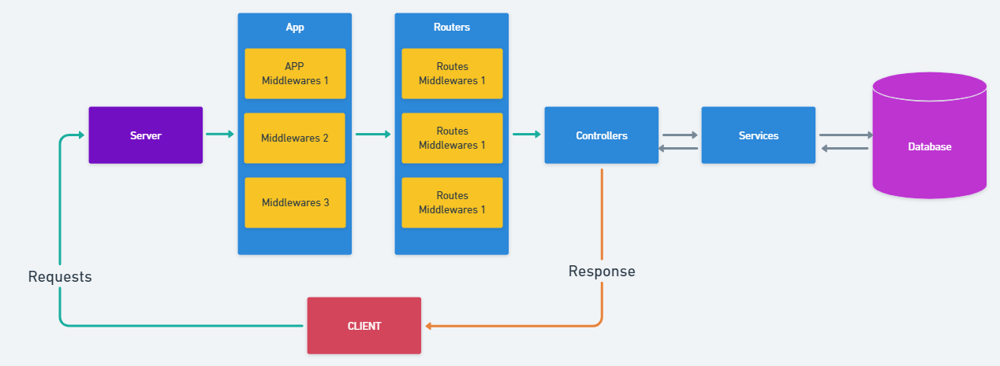

# Asynchronous programming and API server

Nội dung chính trong bài:

- Callback and Error-First Pattern
- Promises and Async/Await
- Xây dựng cấu trúc RESTFul-APIs
- Error handling
- Middleware trong Express
- Express middleware phổ biến
- Logging Requests
- Chuẩn hóa Response API

=====================

## 💛 Callback and Error-First Pattern

Xem ở đây [Callbacks](2.Async-Await/callback-deep.md)

## 💛 Promises and Async/Await

Xem ở đây [Promises](2.Async-Await/Promises.md)

Xem ở đây [Async/Await](2.Async-Await/async-await.md)

## 💛 Xây dựng cấu trúc RESTFul-APIs

RESTful API là một loại giao diện lập trình ứng dụng (API) được thiết kế theo các nguyên tắc của kiến trúc REST (Representational State Transfer). REST là một kiểu kiến trúc phần mềm dựa trên giao thức HTTP và các tiêu chuẩn web liên quan khác.

RESTful API cho phép các ứng dụng giao tiếp và trao đổi dữ liệu với nhau qua mạng. Nó sử dụng các phương thức HTTP như GET, POST, PUT và DELETE để thực hiện các hoạt động CRUD (Create, Read, Update, Delete) trên dữ liệu.

| Method    | Semantics     |
|-----------|---------------|
| POST      | Create        |
| GET       | Read/Retrieve |
| PUT/PATCH | Update        |
| DELETE    | Delete        |
| --------  | --------      |

Các RESTful API được thiết kế để hoạt động dựa trên nguyên tắc "stateless" (không lưu trạng thái). Điều này có nghĩa là mỗi yêu cầu từ client đến server phải chứa tất cả thông tin cần thiết để server hiểu và xử lý yêu cầu, không phụ thuộc vào bất kỳ trạng thái trước đó nào. Server không lưu trạng thái của client giữa các yêu cầu.

Một RESTful API thường sử dụng các đường dẫn URL để xác định tài nguyên và các phương thức HTTP để xác định hành động trên tài nguyên đó. Các dữ liệu thường được truyền qua các định dạng như JSON hoặc XML.

RESTful API đã trở thành một phương pháp phổ biến để xây dựng các dịch vụ web và ứng dụng di động, vì nó đơn giản, linh hoạt và dễ dùng.

Từng bước xây dựng dự án theo mô hình


### 🔶 1: Cấu trúc dự án

Phát triển dự án theo cấu trúc saum sử dụng TypeScript:

```html
project-restful-apis/
├─ node_modules/
├─ public/
├─ src/
│  ├─ controllers/
│  ├─ middleware/
│  ├─ models/
│  ├─ services/
│  ├─ helpers/
│  ├─ validations/
│  ├─ configs/
│  ├─ routes/
│  │  ├─ v1/
│  │  ├─ v2/
│  ├─ app.ts
├─ .env
├─ server.ts
├─ .gitignore
├─ package.json
├─ README.md

```

Cài đặt xem lại ở bài học trước với TypeScript


**/Controllers** - Thư mục này sẽ chứa tất cả các chức năng dể viết các API của bạn. Cách đặt tên: xxxxx.controller.ts trong đó xxx là nhiệm vụ thôi, ví dụ: login.controller.ts

**/Routes** - Thư mục này sẽ chứa tất cả các tuyến đường mà bạn đã tạo bằng cách sử dụng Express Router và kết hợp với Controllers. Cách đặt tên cũng như trên xxxxx.routes.ts

**/Models** - Thư mục này sẽ chứa tất cả các files như schema của bạn và và các chức năng cần thiết cho schema cũng sẽ nằm ở đây. Đặt tên xxxxx.model.ts

**/Middleware** - Thư mục này sẽ chứa tất cả phần mềm trung gian mà bạn đã tạo, ví dụ như là xác thực chẳng hạn... Cách đặt tên: xxxxx.middleware.ts /

**Helpers** - Các chức năng phổ biến mà bạn sẽ yêu cầu nhiều lần trong suốt mã của mình ví dụ như check missing params trước khi xử lý dữ liệu chẳng hạn. Rất cần thiết.

**/Configs** - File này dùng cấu hình cho các API / dịch vụ của bên thứ ba như passport / S3, v.v. Những thông số như keyAPI các kiểu.

Đó là những folders rất quan trọng, có thể nói là không thể thiếu. Ngoài ra còn những files trong root như là:

**server.ts** - Tập tin khởi chạy ứng dụng Express

**app.ts** - Tệp này về cơ bản sẽ là khai báo của ứng dụng Express

**package.json** - File này chứa tất cả các chi tiết npm của dự án, các lệnh chạy như scripts và các phần dependencies

**.gitignore** - Những file mà bạn không muốn đẩy sang git


### 🔶Cài đặt dự án với TypeScript


```bash
npm init
#hoặc
yarn init
```
Để khởi tạo file package.json

```bash
npm install express dotenv --save
#hoặc
yarn add express dotenv 
```

Cài thêm

```bash
npm i -D typescript  @types/express @types/node ts-node-dev
#or
yarn add -D typescript  @types/express @types/node ts-node-dev
```

Tạo file tsconfig.json

```bash
npx tsc --init
```
Sau đó mở file tsconfig.json và tìm sửa lại những thông tin sau:

```json
{
  "compilerOptions": {
    "target": "es2016",
    "module": "commonjs",
    "outDir": "dist/",
    "strict": true,
    "sourceMap": true,
    "esModuleInterop": true,
    "skipLibCheck": true,
    "forceConsistentCasingInFileNames": true
  },
  "include": ["src/**/*"],
  "exclude": ["node_modules"]
}

```

Tạo File app.ts

```ts
import dotenv from 'dotenv';
import express, { Express, Request, Response } from 'express';
const app: Express = express();
dotenv.config();

const PORT = process.env.PORT || 9000;

app.use(express.json());
app.use(express.urlencoded({ extended: false }));

app.get('/', (req: Request, res: Response) => {
  res.status(200).json({message: 'Express + TypeScript Server'});
});


app.listen(PORT, () => {
    console.log(`⚡️[server]: Server is running at http://localhost:${PORT}`);
});
```

Cấu hình lại package.json

```json
 "scripts": {
    "build": "npx tsc -p",
    "start": "node app.ts",
    "dev": "ts-node-dev --respawn --transpile-only app.ts"
  },
```
Tạo file .env ở thư mục gốc dự án, dùng để chứa các thông số bảo mật, biến môi trường

```env
NODE_ENV= development
PORT= 8080
```

Khởi chạy dự án


```bash
yarn dev
# hoặc
npm run dev
```

Nhưng theo đề xuất thì nên tách server ra riêng và app ra riêng như sau:


Sửa File src/App.ts

```ts
import express, { Express, Request, Response } from 'express';
const app: Express = express();

app.use(express.json());
app.use(express.urlencoded({ extended: false }));

app.get('/', (req: Request, res: Response) => {
  res.status(200).json({message: 'Express + TypeScript Server'});
});

export default app;

```
Tạo file server.ts ở thư mục gốc dự án

```ts
import dotenv from 'dotenv';
import app from './src/app';

dotenv.config();

const PORT = process.env.PORT || 9000;

app.listen(PORT, () => {
    console.log(`⚡️[server]: Server is running at http://localhost:${PORT}`);
});
```

Cấu hình lại package.json

```json
 "scripts": {
    "build": "npx tsc -p",
    "start": "node server.ts",
    "dev": "ts-node-dev --respawn --transpile-only server.ts"
  },
```

### 🔶 Follow cách hoạt động của mô hình cấu trúc dự án



### 🔶 Tạo một API đầu tiên

Thông tường trong thực tế một API sẽ có địa chỉ

```html
https://domain.com/api/v1/end-points
```
Dựa vào đó người ta nhận ra ngay được đó là hệ thống RestFul API có phiên bản.

Bây giờ chúng ta tạo một end-point có cấu trúc đường dẫn tương tự trên.


```html
https://localhost:9000/api/v1/categories
```

Trả về danh sách Danh mục


Tại src/routes/v1 tạo file categories.route.ts

```js
import express, {Request, Response } from 'express';
const router = express.Router();

// Get all categories
router.get('/', async (req: Request, res: Response) => {
  res.status(200).json(categories);
});

export default = router;
```

Gắn router vào app.ts

```js
import categoriesRouter from './routes/categories.route'
//API sẽ bắt đầu bằng api/v1/categories
app.use('/api/v1/categories', categoriesRouter);
```

Tạo tiếp các enpoints khác

Resources Category

| HTTP Method | Endpoint              | Description                     |
|-------------|-----------------------|---------------------------------|
| GET         | api/v1/categories          | Retrieve all categories               |
| GET         | api/v1/categories/:id      | Retrieve a specific category         |
| POST        | api/v1/categories/:id      | Create a new category                |
| PUT         | api/v1/categories/:id      | Update a specific category           |
| DELETE      | api/v1/categories/:id      | Delete a specific category           |


## 💛 Errors Handling App


Sử dụng thư viện `http-errors` để bắt các lỗi từ request, hệ thống

```bash
yarn add http-errors 
```
Tại App.ts import vào

```js
import express, { Express, NextFunction, Request, Response } from 'express';
import createError from 'http-errors';
```

Add đoạn này nằm NGAY TRƯỚC phần export app

```js
// catch 404 and forward to error handler
app.use(function (req: Request, res: Response, next: NextFunction) {
  next(createError(404));
});

// error handler
app.use(function (err: any, req: Request, res: Response, next: NextFunction) {
  // set locals, only providing error in development
  res.locals.message = err.message;
  res.locals.error = req.app.get('env') === 'development' ? err : {};

  const statusCode = err.status || 500;
  res.status(statusCode).json({ statusCode: statusCode, message: err.message });
});
```

## 💛 Homework Guides

