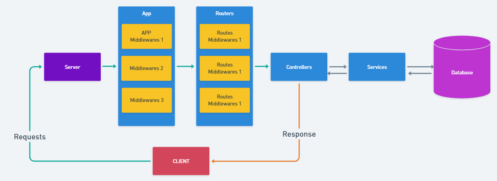

# Folder Structure Express and Node.Js

Tiếp tục maintenance project theo Follow

>* Tạo Routes theo phiên bản
>* Tạo Controllers
>* Tạo Services
>* Handle Errors inside routes, controllers, services
>


## 💛 Tạo RESTFul-APIs theo phiên bản

Trong thực tế mỗi khi API đã được phát hành và chạy trên môi trường production thực tế. Bạn không thể đi sửa code các API trừ trường hợp bất khả kháng và phải có kế hoạch thông báo đến người dùng.

Tạo ra các phiên bản mới hơn như là để nâng cấp code cho phiên bản cũ.

- Trong thư mục src/routes tạo thêm một thư mục v1

- Maintenance các routes demo phần trước, đưa vào v1

- Resources Categories

| HTTP Method | Endpoint              | Description                     |
|-------------|-----------------------|---------------------------------|
| GET         | api/v1/categories          | Retrieve all categories               |
| GET         | api/v1/categories/:id      | Retrieve a specific category         |
| POST        | api/v1/categories/:id      | Create a new category                |
| PUT         | api/v1/categories/:id      | Update a specific category           |
| DELETE      | api/v1/categories/:id      | Delete a specific category           |


Tại src/routes/v1 tạo file category.route.ts

```js
import express from 'express';
import createError from 'http-errors';
const router = express.Router();

/* tách thành file json */
const categories = [
  { id: 1, name: 'Road' },
  { id: 2, name: 'Mountain'},
  { id: 3, name: 'Hybrid'},
];

// Get all categories
// localhost:8686/api/v1/categories
router.get('/categories', async (req: Request, res: Response) => {
  res.status(200).json(categories);
});

// Create a new category
// localhost:8686/api/v1/categories
router.post('/categories', async (req: Request, res: Response) => {
  //Thêm một phần tử vào mảng
  const newCategories = {...categories,{id: 4: name: 'Cruiser'}}

  //trả lại mảng mới
  res.status(200).json(categories);
});

// Get a category by ID
// localhost:8686/api/v1/categories/1
router.get('/categories/:id', async (req: Request, res: Response,next) => {
  try {
    const { id } = req.params;

   
    const category = categories.find((category) => category.id === id);

    if (!category) {
      throw createError(404, 'Category not found');
    }

    res.status(200).json(category);
  } catch (err) {
    next(err);
  }

});

// Update a category
// localhost:8686/api/v1/categories/1
router.patch('/categories/:id', async (req: Request,  res: Response, next: NextFunction) => {
  // ...
});

// Delete a category
// localhost:8686/api/v1/categories/1
router.delete('/categories/:id', async (req: Request,  res: Response, next: NextFunction) => {
  // ...
});

export default  router;
```

Gắn router vào app.ts

```js
import categoriesRoute from './routes/v1/categories.route';

//Response version API
app.get('/', async (req: Request, res: Response) => {
  res.status(200).json({ message: 'Hello World !' });
});

//Response version API
app.get('/api', async (req: Request, res: Response) => {
  res.status(200).json({ version: 'API 1.0' });
});

//Các API sẽ bắt đầu bằng api
app.use('/api/v1', categoriesRoute);
```

## 💛 TEST API

- REST Client (Huachao Mao) Extension
- PostMan: <https://www.postman.com/downloads/>

## 💛 Tạo Controller

Tiếp tục refactor các routes, chuyển thành các controllers

### Tại sao phải cần đến `Controller` ?

**Trong mô hình API với Express.js và Node.js**, ba thành phần quan trọng là **Routes**, **Controllers**, và **Services** đóng vai trò quan trọng trong việc phát triển ứng dụng. Mỗi khái niệm nó có vai trò riêng:

**Routes (Định tuyến)**:

- Routes xác định các **tuyến API** và xử lý các yêu cầu HTTP từ client.
- Chúng định nghĩa các **đường dẫn URL** và liên kết chúng với các **controllers** tương ứng.

- Routes có thể xử lý các phương thức HTTP như **GET**, **POST**, **PUT**, và **DELETE**.
- Ví dụ: Đường dẫn `/users` có thể liên kết với controller để xử lý việc lấy thông tin người dùng.

**Controllers**:
- Controllers là nơi **xử lý logic kinh doanh** của ứng dụng.
- Khi một request đã đi qua Middleware, nó sẽ được chuyển đến Controller để xử lý.
- Controllers thực hiện các nhiệm vụ như:
  - **Gọi services** để truy vấn cơ sở dữ liệu.
  - **Xử lý dữ liệu** từ request và chuẩn bị dữ liệu để trả về cho client.
  - **Quản lý luồng logic** của ứng dụng.
- Ví dụ: Controller xử lý việc lấy thông tin người dùng từ cơ sở dữ liệu.


---

### Refactor Code

Tách dữ liệu fake categories thành file json

Tạo file `src/data/categories.json`

```json
[
  { "id": 1, "name": "Road" },
  { "id": 2, "name": "Mountain"},
  { "id": 3, "name": "Hybrid"}
]
```

Tạo file `src/controllers/categories.controller.ts`

```js
import createError from 'http-errors';
import fs from 'node:fs'

const fileName = './src/data/categories.json'
interface ICategory = {
  id?: number, 
  name: string, 
  description: string
}

// Get all categories
const getAll = async (req: Request, res: Response) => {
  //Doc noi dung cua file, co chua tieng viet
  const data = fs.readFileSync(fileName, { encoding: 'utf-8', flag: 'r' });
  //const data = fs.readFile(fileName, 'utf-8');
  const categories: ICategory[] = JSON.parse(data);
  res.status(200).json(categories);
};

// Get a category by ID
const getCategoryById = async (req: Request,  res: Response, next: NextFunction) => {
  try {
    const { id } = req.params;

    //Doc noi dung cua file, co chua tieng viet
    const data = fs.readFileSync(fileName, { encoding: 'utf-8', flag: 'r' });
    //const data = fs.readFile(fileName, 'utf-8');
    const categories: ICategory[] = JSON.parse(data);

    const category = await categories.find((category) => category.id === id);

    if (!category) {
      throw createError(404, 'Category not found');
    }

    res.status(200).json(category);
  } catch (err) {
    next(err);
  }
};

// Create a new category
const createCategory = async (req: Request, res: Response) => {
    const payload = req.body;
    //doc file lay noi dung json
    const data = fs.readFileSync(fileName, { encoding: 'utf-8', flag: 'r' });
    const categories: ICategory[] = JSON.parse(data);
    //Bo sung phan tu moi vao mang cu
    const newCategories = [...categories,payload];

    //ghi file
    fs.writeFile(fileName, JSON.stringify(newCategories), function (err) {
        if (err) throw err;
        console.log('Saved!');
    });
    res.status(200).json(payload);
};

// Update a category by ID
const updateCategoryById = async (req: Request, res: Response) => {
    const payload = req.body;
    //doc file lay noi dung json
    const data = fs.readFileSync(fileName, { encoding: 'utf-8', flag: 'r' });
    const categories: ICategory[] = JSON.parse(data);
    //check xem id co ton tai khong
    const category = categories.find(c=>c.id === id);
    if(!category){
        throw createError(404,'Category not found');
    }

    //Tim item co id va thay doi cac gia tri
    categories.map((c)=>{
       if(c.id ===  id){
            c.name = payload.name;
            c.description = payload.description;
       }
    })

    //ghi file

    fs.writeFile(fileName, JSON.stringify(categories), function (err) {
        if (err) throw err;
        console.log('Saved!');
    });

    res.status(200).json(payload);
};

// Delete a category by ID
const deleteCategoryById = async (req: Request, res: Response) => {
  //doc file lay noi dung json
    const data = fs.readFileSync(fileName, { encoding: 'utf-8', flag: 'r' });
    const categories: ICategory[] = JSON.parse(data);
    //check xem id co ton tai khong
    const category = categories.find(c=>c.id === id)
    if(!category){
        throw createError(404,'Category not found')
    }
    console.log(id,categories);
    
    //Loc ra nhung item khong phai la item co ID dang xoa
    const newCategories =  categories.filter(c=>c.id !== category?.id)
    //Ghi file
    fs.writeFile(fileName, JSON.stringify(newCategories), function (err) {
        if (err) throw err;
        console.log('Saved!');
    });

    res.status(200).json(category);
};

export default {
  getAll,
  getCategoryById,
  createCategory,
  updateCategoryById,
  deleteCategoryById
}
```

refactor lại phần categories Route `src/routes/v1/categories.route.ts`

```js
import express  from "express";
const router = express.Router();
import categoriesController from '../../controllers/categories.controller';

router.get('/', categoriesController.getAll);

router.get('/:id', categoriesController.getCategoryById);

router.post('/', categoriesController.createCategory);

router.put('/:id', categoriesController.updateCategoryById);

router.delete('/:id', categoriesController.deleteCategoryById);

export default  router;
```

Sử dòng này ở app.ts

```js
//app.use('/api/v1', categoriesRoute);
app.use('/api/v1/categories', categoriesRoute);
```

## 💛 Tạo Service

**Services**:
- Services là lớp **quản lý dữ liệu** trong ứng dụng.
- Chúng thực hiện các tác vụ như:
    - **Truy vấn cơ sở dữ liệu** (sử dụng Model).
    - **Xử lý logic kinh doanh** phức tạp.
    - **Định nghĩa các quan hệ giữa các đối tượng** (nếu sử dụng cơ sở dữ liệu liên quan).
- Services giúp tách biệt logic kinh doanh và cơ sở dữ liệu.
- Ví dụ: Service thực hiện truy vấn thông tin người dùng từ cơ sở dữ liệu.

---

Tạo file `src/services/categories.service.ts`

Lưu ý: nó trả về Data cho Controller nên sử dụng return

```js
import fs from 'node:fs'
import createError from 'http-errors';
const fileName = './src/data/categories.json';


type ICategory = {id?: number, name: string, description: string}


//Tra lai ket qua
const getAll = ()=>{
    //doc file lay noi dung json
    //Doc noi dung cua file, co chua tieng viet
    const data = fs.readFileSync(fileName, { encoding: 'utf-8', flag: 'r' });
    //const data = fs.readFile(fileName, 'utf-8');
    const categories: ICategory[] = JSON.parse(data);

    return categories
}

const getCategoryById  = (id:number)=>{
    //doc file lay noi dung json
    const data = fs.readFileSync(fileName, { encoding: 'utf-8', flag: 'r' });
    const categories: ICategory[] = JSON.parse(data);
    //lay thong tin
    const category = categories.find(c => c.id === id)

    if(!category){
        throw createError(404,'Category not found')
    }
    return category;
}

const createCategory = (payload: ICategory)=>{
    //doc file lay noi dung json
    const data = fs.readFileSync(fileName, { encoding: 'utf-8', flag: 'r' });
    const categories: ICategory[] = JSON.parse(data);
    //Bo sung phan tu moi vao mang cu
    const newCategories = [...categories,payload]

    //ghi file
    fs.writeFile(fileName, JSON.stringify(newCategories), function (err) {
        if (err) throw err;
        console.log('Saved!');
    });
    return payload;
}

const updateCategory = (id: number,payload: ICategory)=>{
    //doc file lay noi dung json
    const data = fs.readFileSync(fileName, { encoding: 'utf-8', flag: 'r' });
    const categories: ICategory[] = JSON.parse(data);
    //check xem id co ton tai khong
    const category = categories.find(c=>c.id === id)
    if(!category){
        throw createError(404,'Category not found')
    }

    //Tim item co id va thay doi cac gia tri
    categories.map((c)=>{
       if(c.id ===  id){
            c.name = payload.name;
            c.description = payload.description
       }
    })

    //ghi file

    fs.writeFile(fileName, JSON.stringify(categories), function (err) {
        if (err) throw err;
        console.log('Saved!');
    });

    return payload
}

const deleteCategory = (id:number)=>{
    //doc file lay noi dung json
    const data = fs.readFileSync(fileName, { encoding: 'utf-8', flag: 'r' });
    const categories: ICategory[] = JSON.parse(data);
    //check xem id co ton tai khong
    const category = categories.find(c=>c.id === id)
    if(!category){
        throw createError(404,'Category not found')
    }
    console.log(id,categories);
    
    //Loc ra nhung item khong phai la item co ID dang xoa
    const newCategories =  categories.filter(c=>c.id !== category?.id)
    //Ghi file
    fs.writeFile(fileName, JSON.stringify(newCategories), function (err) {
        if (err) throw err;
        console.log('Saved!');
    });


    return category
}

export default {
    getAll,
    getCategoryById,
    createCategory,
    updateCategory,
    deleteCategory
}
```

Khi đó category Controller bạn refactor lại như sau:

chuyển hết phần hander error sang service

```js
import {Request,Response, NextFunction} from 'express'
import categoriesService from '../services/categories.service';


const getAll = (req: Request, res: Response)=>{
    const result = categoriesService.getAll();
    console.log('result',result);
    res.status(200).json(result)
}

const getCategoryById = (req: Request, res: Response, next: NextFunction)=>{
    try {
        const {id} = req.params; //return id = string

        const category = categoriesService.getCategoryById(parseInt(id))

        res.status(200).json(category)
    }
    catch(err){
        next(err)
    }
}

const createCategory = (req: Request, res: Response) => {
    const data = req.body;

    const category= categoriesService.createCategory(data)

    res.status(201).json({
        message: `Create Category`,
        category: category
    })
}

const updateCategory = (req: Request, res: Response)=>{
    const {id} = req.params;
    const data = req.body;

    
    const category = categoriesService.updateCategory(parseInt(id),data)

    res.status(200).json({
        message: `Update Category by ID ${id}`,
        category: category
    })
}

const deleteCategory = (req: Request, res: Response,next: NextFunction)=>{
    try {
        const {id} = req.params;
        const category = categoriesService.deleteCategory(parseInt(id))
        res.status(200).json({
            message: `Delete Category by ID ${id}`,
            category: category
        })
    }
    catch(err){
        next(err)
    }
}

export default {
    getAll,
    getCategoryById,
    createCategory,
    updateCategory,
    deleteCategory
}
```

Còn không bạn có thể dừng lại ở mức cơ bản là controller, fetch Data và trả
lại response.

## 💛 Kết luận

Luồng xử lý sát với dự án thực tế




## 💛 Chuẩn hóa định dạng JSON API trả về

Không có bất kỳ quy tắc nào để ràng buộc cách bạn trả về một chuổi JSON có cấu trúc như thế nào cả.

Tuy nhiên dưới đây là một số cách định dạng mà bạn có thể tham khảo:

[JSON API](http://jsonapi.org/) - JSON API covers creating and updating resources as well, not just responses.

[JSend](https://github.com/omniti-labs/jsend) - Simple and probably what you are already doing.

Bạn phải thể hiện được khi có lỗi thì cần trả về gì, khi thành công thì cần trả về cái gì ? Và tất cả các Endpoint API phải có cùng cấu trúc.

Ví dụ: Thành công

```json
{
  "statusCode": "0",
  "message": "Successfully"
}
```

Ví dụ: Thành công có gửi kèm data

```json
{
  "statusCode": "0",
  "message": "Successfully",
  "data": {
    "posts": [
      { "id": 1, "title": "A blog post", "body": "Some useful content" },
      { "id": 2, "title": "Another blog post", "body": "More content" }
    ]
  }
}
```

Trong đó:
- statusCode: là mã code mà bạn tự quy định cho việc xử lý tác vụ (không phải là HTTP Status Code)
- message: là lời nhắn trả lại cho client
- data: là thông trả lại cho client nếu có

Ví dụ: Thất bại (không có lỗi, chỉ là nó chưa tuân thủ một quy tắc nào đó như là validations)

```json
{
  "statusCode": "400",
  "message": "A title is required"
}
```

Ví dụ: Lỗi (khiến code không thể xử lý)

```json
{
  "statusCode": "500",
  "message": "Can not connect to Datatabase"
}
```

Thông thường người ta tạo ra một bảng danh mục mã lỗi kèm message để đối chiếu khi làm một hệ thống lớn.

| Status Code |    Description     |
| :--------: | :----------------: |
|     0      |    Successfull     |
|     1      |      Pending       |
|    201     | Create new success |
|    404     |   API Not Found    |
|    500     |    Error Server    |

Tạo một file `src\helpers\responseHandler.ts` để handle việc đó

```js
import {Request, Response} from 'express';
const sendJsonSuccess = (res: Response, message = 'Success', code = 200) => {
    return (data: any = null) => {
      const resData = data ? { statusCode: code, message, data} : { statusCode: code, message};
      res.status(code).json(resData);
    };
  };
  
  const sendJsonErrors = (req: Request, res: Response, error: any) => {
    console.log(error);
    return res.status(error.status || 500).json({
      statusCode: error.status || 500,
      message: error.message || 'Unhandled Error',
      error,
    });
  };
  
export {
    sendJsonSuccess,
    sendJsonErrors,
  };


```

## 💛 Homeworks Guide