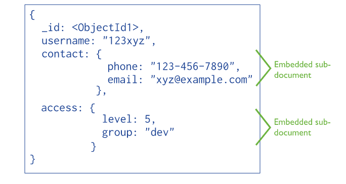
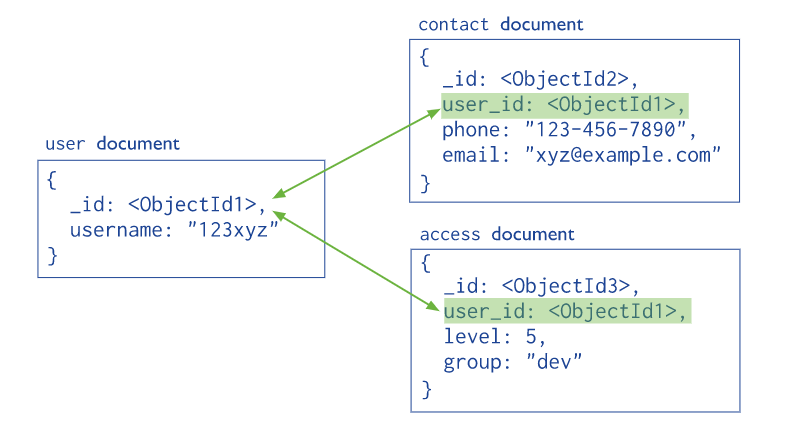

# MongoDB and Mongoose


## 💛 MongoDB là gì ?

- MongoDB là một hệ quản trị cơ sở dữ liệu mã nguồn mở, là CSDL thuộc NoSql và được hàng triệu người sử dụng.
- MongoDB là một database hướng tài liệu (document), các dữ liệu được lưu trữ trong document kiểu JSON thay vì dạng bảng như CSDL quan hệ nên truy vấn sẽ rất nhanh.
- Với CSDL quan hệ chúng ta có khái niệm bảng, các cơ sở dữ liệu quan hệ (như MySQL hay SQL Server...) sử dụng các bảng để lưu dữ liệu thì với MongoDB chúng ta sẽ dùng khái niệm là collection thay vì bảng
- So với RDBMS thì trong MongoDB collection ứng với table, còn document sẽ ứng với row , MongoDB sẽ dùng các document thay cho row trong RDBMS.
- Các collection trong MongoDB được cấu trúc rất linh hoạt, cho phép các dữ liệu lưu trữ không cần tuân theo một cấu trúc nhất định.
- Thông tin liên quan được lưu trữ cùng nhau để truy cập truy vấn nhanh thông qua ngôn ngữ truy vấn MongoDB

## 💛 Ưu điểm của mongoDB

- Dữ liệu lưu trữ phi cấu trúc, không có tính ràng buộc, toàn vẹn nên tính sẵn sàng cao, hiệu suất lớn và dễ dàng mở rộng lưu trữ.
- Dữ liệu được caching (ghi đệm) lên RAM, hạn chế truy cập vào ổ cứng nên tốc độ đọc và ghi cao

## 💛 Nhược điểm của MongoDB

- Không ứng dụng được cho các mô hình giao dịch nào có yêu cầu độ chính xác cao do không có ràng buộc.
- Không có cơ chế transaction (giao dịch) để phục vụ các ứng dụng ngân hàng.
- Dữ liệu lấy RAM làm trọng tâm hoạt động vì vậy khi hoạt động yêu cầu một bộ nhớ RAM lớn.
- Mọi thay đổi về dữ liệu mặc định đều chưa được ghi xuống ổ cứng ngay lập tức vì vậy khả năng bị mất dữ liệu từ nguyên nhân mất điện đột xuất là rất cao.

---
## 💛 Khi nào sử dụng MongoDB?

- Quản lý và truyền tải content – Quản lý đa dạng nhiều product của content chỉ trong một kho lưu trữ data cho phép thay đổi và phản hồi nhanh chóng mà không chịu thêm phức tạp thêm từ hệ thống content.
- Cấu trúc Mobile và Social – MongoDB cung cấp một platform có sẵn, phản xạ nhanh, và dễ mở rộng cho phép rất nhiều khả năng đột phá, phân tích real-time, và hỗ trợ toàn cầu.
- Quản lý data khách hàng – Tận dụng khả năng query nhanh chóng cho phân tích real-time trên cơ sở dữ liệu người dùng cực lớn vớ các mô hình data phức tạp bằng các schema linh hoạt và tự động sharding cho mở rộng chiều ngang.

---

## 💛 Cài đặt MongoDB

To be able to experiment with the code examples, you will need access to a MongoDB database.

You can download a free MongoDB database at https://www.mongodb.com.

> <https://www.mongodb.com/try/download/community>

Compass Tool: Công cụ để quản lý MoogoDB bằng giao diện đồ họa

> <https://www.mongodb.com/products/compass>

Extension for VS Code:

> <https://www.mongodb.com/products/vs-code>

PaaS: Get started right away with a MongoDB cloud service at https://www.mongodb.com/cloud/atlas.

---
## 💛 Install MongoDB driver and Mongoose

Sử dụng MongoDB qua thư viện Mongoose giúp thao tác dễ hơn về mặt cú pháp

```bash
npm install mongoose --save
yarn add mongoose --save
```
---
## 💛 Kết nối với Database

Đưa đoạn code này vào server.ts

```js
/// Start the server
const mongooseDbOptions = {
  autoIndex: true, // Don't build indexes
  maxPoolSize: 10, // Maintain up to 10 socket connections
  serverSelectionTimeoutMS: 5000, // Keep trying to send operations for 5 seconds
  socketTimeoutMS: 45000, // Close sockets after 45 seconds of inactivity
  family: 4, // Use IPv4, skip trying IPv6
  useNewUrlParser: true,
  useUnifiedTopology: true,
};
mongoose
  .connect('mongodb://127.0.0.1:27017/myapp', mongooseDbOptions)
  .then(() => {
    console.log('Connected to MongoDB');
    //should listen app here
  })
  .catch((err) => {
    console.error('Failed to Connect to MongoDB', err);
  });
```

Tips: Bạn có thể đưa đoạn code khởi tạo server của Express vào chổ `//should listen app here` để đảm bảo rằng. Phải kết nối server Mongoo thành công thì mới khởi tạo server NodeJs.

---
## 💛 Mongoose SchemaTypes

Tham khảo: <https://mongoosejs.com/docs/schematypes.html>

- String
- Number
- Date
- Buffer
- Boolean
- Mixed
- ObjectId
- Array
- Decimal128
- Map
- Schema

---
## 💛Tạo một Model Schema với Mongoose

Doc: <https://mongoosejs.com/docs/guide.html#definition>

Tạo thư mục models, trong thư mục này tạo file user.model.ts

Cú pháp

```js
new Schema({..}, options);

// or
const schema = new Schema({..});
schema.set(option, value);

```

Xem các options ở link sau: <https://mongoosejs.com/docs/guide.html#options>

Sử dụng với TypeScript

```ts
import { Schema, model } from 'mongoose';

// 1. Tạo type
interface IUser {
  name: string;
  email: string;
  password: string;
  role: string;
  isEmailVerified: bolean;
}
//2.Tạo Schema
const userSchema = new Schema<IUser>(
  {
    name: {
        type: String,
        required: true
    },
    email: {
        type: String,
        required: true
    },
    password: {
        type: String,
        required: true
    },
    role: {
        type: String,
    },
    isEmailVerified: {
        type: Boolean
    }
  }
);
//3. Tạo Model User
const User = model<IUser>('User', userSchema);
export default User;
```


## 💛 Data Model Design

Trong NoSQL, khái niệm bảng được thay thế bằng khái niệm collection (tập hợp). Một collection trong NoSQL tương đương với một bảng trong hệ quản trị cơ sở dữ liệu quan hệ (RDBMS).

Trong NoSQL, document là một đối tượng cơ bản trong cơ sở dữ liệu, tương đương với một bản ghi trong hệ quản trị cơ sở dữ liệu quan hệ (RDBMS). Một document thường được biểu diễn dưới dạng các cặp trường (field) và giá trị tương ứng, và được lưu trữ trong các collection.

Dựa trên mối quan hệ giữa CSDL, Cấu trúc của một Document sẽ được quyết định bởi 2 kiểu:

- embed



Mô hình này có tốc độ truy vấn nhanh hơn. Nhưng nhược điểm là Data đúng chất NoSQL nó không có mối tương quan dữ liệu gì với các collection

Dùng khi: Quan hệ MỘT - NHIỀU . 

Nếu bạn có một quan hệ một-nhiều giữa các đối tượng và quan hệ này không thay đổi thường xuyên, embedding có thể là lựa chọn tốt


- use references



Mặc dù mongoo được biết đến là NoSQL nhưng với mô hình này thì nó có quan hệ.
Tốc độ truy vấn trong mô hình này chậm hơn kiểu `embed` vì phải tham chiếu nhiều collection để lấy dữ liệu.

Dùng khi: Quan hệ NHIỀU - NHIỀU

Nếu bạn có một quan hệ nhiều-nhiều giữa các đối tượng, Dữ liệu có tính nhất quán và thay đổi thường xuyên, sử dụng tham chiếu có thể là lựa chọn tốt

Data Model Design: <https://www.mongodb.com/docs/manual/core/data-model-design/#data-model-design>

Data Model: <https://www.mongodb.com/docs/manual/applications/data-models/>

Khi nào thì dùng loại nào ? [Tham khảo bài viết](DesignModel.md)

---
## 💛 Database Relationships

Trước khi đi tìm hiểu **Data Model Design** chúng ta cần biết mối quan hệ trong CSDL

### 🔶 One to One - Một một

Kiểu quan hệ một một (one-to-one relationship) là một kiểu quan hệ giữa hai thực thể (entities) trong cơ sở dữ liệu, trong đó `mỗi` thực thể của một bảng dữ liệu chỉ liên kết với `MỘT` thực thể duy nhất của bảng dữ liệu khác. Nói cách khác, mỗi thực thể của bảng A chỉ được liên kết với `MỘT` thực thể duy nhất của bảng B, và ngược lại.

Ví dụ, trong một cơ sở dữ liệu quản lý nhân viên, mỗi nhân viên chỉ có một tài khoản lương duy nhất và mỗi tài khoản lương chỉ thuộc về một nhân viên duy nhất. Đây là một mối quan hệ một-một giữa bảng "Employees" và bảng "SalaryAccounts".

```js
const mongoose = require('mongoose');
const Schema = mongoose.Schema;

const SalaryAccountSchema = new Schema({
  salary: Number,
  // các trường khác
});

const EmployeeSchema = new Schema({
  firstName: String,
  lastName: String,
  salaryAccount: SalaryAccountSchema,
  // các trường khác
});

const Employee = mongoose.model('Employee', EmployeeSchema);
```

Ví dụ QL Sinh viên: Mỗi sinh viên chỉ có một hồ sơ sinh viên duy nhất và mỗi hồ sơ sinh viên chỉ thuộc về một sinh viên duy nhất. Đây là một mối quan hệ một-một giữa bảng "Students" và bảng "StudentProfiles".

```js
const mongoose = require('mongoose');
const Schema = mongoose.Schema;

const StudentProfileSchema = new Schema({
  dateOfBirth: Date,
  hometown: String,
  // các trường khác
});

const StudentSchema = new Schema({
  firstName: String,
  lastName: String,
  studentProfile: StudentProfileSchema,
  // các trường khác
});

const Student = mongoose.model('Student', StudentSchema);
```

### 🔶 One to Many - Một nhiều

Kiểu quan hệ một nhiều (one-to-many relationship) là một kiểu quan hệ giữa hai thực thể trong cơ sở dữ liệu, trong đó `MỘT` thực thể của bảng dữ liệu có thể được liên kết với `NHIỀU` thực thể của bảng dữ liệu khác, nhưng mỗi thực thể của bảng dữ liệu khác lại chỉ liên kết với một thực thể duy nhất của bảng dữ liệu đầu tiên.

Ví dụ, trong một cơ sở dữ liệu quản lý khách sạn, một khách sạn có thể có nhiều phòng, nhưng mỗi phòng chỉ thuộc về một khách sạn duy nhất. Đây là một mối quan hệ một nhiều giữa bảng "Hotels" và bảng "Rooms".

```js
const mongoose = require('mongoose');
const Schema = mongoose.Schema;

const RoomSchema = new Schema({
  roomNumber: Number,
  type: String,
  // các trường khác
});

const HotelSchema = new Schema({
  name: String,
  address: String,
  rooms: [RoomSchema], // Một khách sạn có thể có nhiều phòng
  // các trường khác
});

const Hotel = mongoose.model('Hotel', HotelSchema);
```

### 🔶 Many to Many - Nhiều nhiều

Kiểu quan hệ nhiều nhiều (many-to-many relationship) là một kiểu quan hệ giữa hai bảng dữ liệu trong cơ sở dữ liệu, trong đó mỗi thực thể của bảng dữ liệu A có thể liên kết với nhiều thực thể của bảng dữ liệu B, và mỗi thực thể của bảng dữ liệu B cũng có thể liên kết với nhiều thực thể của bảng dữ liệu A.

Ví dụ: Một ngôi nhà có nhiều chủ, và nhiều chủ cùng sở hữu một ngôi nhà. Đấy là quan hệ nhiều nhiều.


```js
const mongoose = require("mongoose")

const ownerSchema = new mongoose.Schema({
    name: String
})

const Owner = mongoose.model("Owner", ownerSchema)

const houseSchema = new mongoose.Schema({
    street: String,
    city: String,
    state: String,
    zip: String
})

const House = mongoose.model("House", houseSchema)

const houseOwnerSchema = {
    owner: {type: mongoose.Types.ObjectId, ref: "Owner"},
    house: {type: mongoose.Types.ObjectId, ref: "House"}
}

const HouseOwner = mongoose.model("HouseOwner", houseOwnerSchema)

// Create a Owner
const alex = await Owner.create({name: "Alex Merced"})

// Create a new house
const mapleStreet = await House.create({
    street: "100 Maple Street",
    city: "Fort Townville",
    state: "New West Virgota",
    zip: "77777"
    owner: alex
})

// Create record that the owner owns the house
HouseOwner.create({owner: alex, house: mapleStreet})

// QUery for all houses owned by alex
HouseOwner.find({owner: alex}).populate("house")

//Query for all owners of the Maple Street House
HoseOwner.find({house: mapleStreet}).populate("owner")
```

\> Tham khảo bài viết: https://dev.to/alexmercedcoder/mongodb-relationships-using-mongoose-in-nodejs-54cc

## 💛 Mongoose Basic Queries

Danh sách các phương thức truy vấn xem ở link sau
Doc: <https://mongoosejs.com/docs/queries.html>

### 🔶 Insert - Thêm mới

Bạn sửa funtion createUser trong services\users.service.ts
lại như sau:

```js
const User = reuiqre('../models/user.model');

exports.createUser = async (req) => {
  console.log('createUser');

  try {
    /* Lấy data từ request gửi lên */
    const payload = {
      name: req.body.name,
      email: req.body.email,
      role: req.body.role,
      password: req.body.password,
      isEmailVerifie: req.body.isEmailVerifie,
    };
    // Lưu xuống database
    const user = await User.create(payload);
    // Or User.save(payload);

    /* Trả lại thông tin cho response */
    return user;
  } catch (err) {
    throw createError(500, err.message);
  }
};
```

### 🔶 Select - Truy vấn dữ liệu

#### Select All

Lấy tất cả Users

```js
exports.getAllUsers = async () => {
  const users = User.find();
  return users;
};
```

#### Select by ID

Lấy thông tin một User theo ID

```js
exports.getUserById = async (req) => {
  try {
    const { id } = req.params;

    const user = User.findById(id);

    if (!user) {
      throw createError(404, 'User not found');
    }

    return user;
  } catch (err) {
    throw createError(500, err.message);
  }
};
```

#### Select with Condition

Lấy thông tin có điều kiện

```js
exports.getAllUsers = async () => {
  const users = User.find({
    role: 'user',
  });
  return users;
};
```


### 🔶 Update

```js
// Update a user by ID
exports.updateUserById = async (req) => {
  try {
    const { id } = req.params;

    const user = User.findByIdAndUpdate(id, req.body, {
      new: true,
    });

    return user;
  } catch (err) {
    throw createError(500, err.message);
  }
};
```

### 🔶 Delete

```js
exports.deleteUserById = async (req) => {
  console.log('deleteUserById');

  try {
    const { id } = req.params;

    const user = User.findByIdAndDelete(id);

    return user;
  } catch (err) {
    throw createError(500, err.message);
  }
};
```

## 💛 Mongoose Built-in Validators

Doc: <https://mongoosejs.com/docs/validation.html#built-in-validators>

Trước khi dữ liệu được ghi vào Database, Mongosee cho phép chúng ta validate một lần nữa.

Thực hiện ngay khi tạo Schema. Chúng ta sửa userShema lại có validation như sau:

```js
const userSchema = new Schema(
  {
    name: {
      type: String,
      required: true,
      trim: true,
      min: [6, 'Too few eggs'],
      max: [12, 'Only allow Max 12 characters'],
    },
    email: {
      type: String,
      required: true,
      trim: true,
      unique: true,
      lowercase: true,
    },
    password: {
      type: String,
      required: true,
      trim: true,
    },
    role: {
      type: String,
      required: true,
      enum: ['admin', 'booking', 'user'],
      default: 'user',
    },
    isEmailVerified: {
      type: Boolean,
      enum: [true, false],
      default: true,
    },
  },
  { timestamps: true }
);
```

### Custom Validators

Nếu bạn thấy các tính năng validate có sẵn không đáp ứng được yêu cầu thì bạn có thể tự tạo cho mình một phương thức validation riêng

Ví dụ: Check số điện thoại đúng định dạng yêu cầu không

```js

const userSchema = new Schema({
  phone: {
    type: String,
    validate: {
      validator: function (v) {
        return /\d{3}-\d{3}-\d{4}/.test(v);
      },
      message: (props) => `${props.value} is not a valid phone number!`,
    },
    required: [true, 'User phone number required'],
  },
});
```

