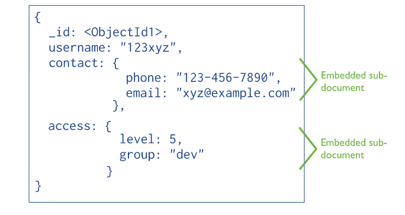
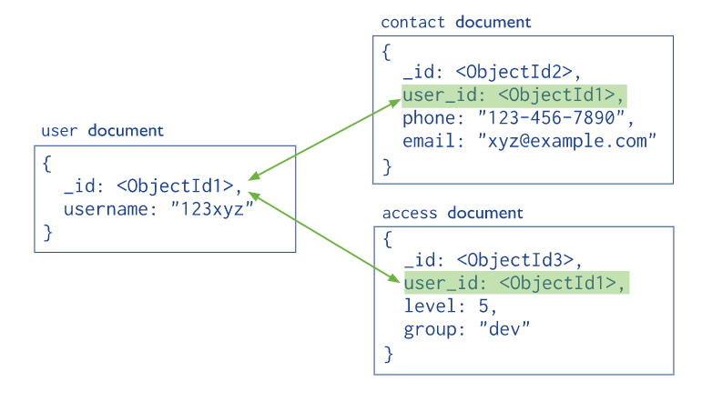

# Giới Thiệu Tổng Quan Về MongoDB

## 💛 1. MongoDB Là Gì?

**MongoDB** là một hệ quản trị cơ sở dữ liệu NoSQL (Not Only SQL) mã nguồn mở phổ biến, hoạt động theo mô hình **hướng tài liệu (Document-Oriented)**.

Thay vì lưu trữ dữ liệu dưới dạng các bảng (tables) và dòng (rows) có cấu trúc cố định như các hệ cơ sở dữ liệu quan hệ (RDBMS) truyền thống (MySQL, PostgreSQL, SQL Server), MongoDB lưu trữ dữ liệu dưới dạng các bản ghi gọi là **Document** theo định dạng **BSON** (Binary JSON).

### Các khái niệm cơ bản trong MongoDB:

* **Database:** Tương tự cơ sở dữ liệu trong SQL, chứa tập hợp các Collection.
* **Collection:** Tương đương với **Table** trong SQL, chứa tập hợp các Document.
* **Document:** Tương đương với **Row** trong SQL, lưu trữ theo bộ khóa - giá trị (key-value).
* **Field:** Tương đương với **Column** trong SQL, đại diện cho tên trường và giá trị tương ứng.

---

## 💛 2. Ưu Điểm Và Nhược Điểm Của MongoDB

### 🟢 Ưu Điểm (Pros)

| Ưu điểm | Chi tiết |
| --- | --- |
| **Schema linh hoạt (Dynamic Schema)** | Không bắt buộc khai báo cấu trúc cố định trước. Các document trong cùng collection có thể có các trường dữ liệu khác nhau, rất dễ mở rộng khi ứng dụng thay đổi tính năng. |
| **Khả năng mở rộng ngang (Horizontal Scaling)** | Hỗ trợ tính năng **Sharding** phân tán dữ liệu ra nhiều máy chủ khác nhau, giúp xử lý khối lượng dữ liệu khổng lồ mà không bị nghẽn hệ thống. |
| **Tính sẵn sàng cao (High Availability)** | Sử dụng cơ chế **Replica Sets** để tự động sao lưu dữ liệu. Khi máy chủ chính (Primary) gặp sự cố, hệ thống sẽ tự động thăng cấp máy chủ phụ (Secondary) lên thay thế. |
| **Tốc độ đọc/ghi cao** | Dữ liệu liên quan thường được nhúng trực tiếp trong cùng một document (Embedded Documents) giúp giảm thiểu các câu lệnh Join phức tạp, kết hợp với cơ chế tối ưu RAM giúp truy xuất nhanh. |
| **Gần gũi với lập trình viên** | Định dạng BSON/JSON tương thích tự nhiên với cấu trúc Đối tượng (Object) trong hầu hết các ngôn ngữ lập trình hiện đại (Node.js, Python, Java, Go...). |

### 🔴 Nhược Điểm (Cons)

* **Tiêu tốn bộ nhớ (RAM & Disk):** Tên trường (field name) được lặp lại trong từng document, kết hợp với việc phi chuẩn hóa dữ liệu (denormalization) khiến MongoDB ngốn nhiều RAM và dung lượng đĩa hơn so với cơ sở dữ liệu quan hệ.
* **Hạn chế với các truy vấn Join phức tạp:** Mặc dù cung cấp toán tử `$lookup` để nối dữ liệu giữa các collection, nhưng thao tác này chậm và tốn nhiều tài nguyên hơn so với phép `JOIN` trong RDBMS.
* **Giới hạn kích thước Document:** Mỗi document đơn lẻ bị giới hạn tối đa **16MB**. (Nếu cần lưu tập tin lớn hơn, phải sử dụng cơ chế GridFS).
* **Quản lý Transaction tốn tài nguyên:** Dù từ bản 4.0 MongoDB đã hỗ trợ ACID Multi-document Transactions, việc lạm dụng transaction sẽ làm giảm đáng kể hiệu năng hệ thống.

---

## 💛 3. Khi Nào Nên Và Không Nên Sử Dụng MongoDB?

### 🎯 Khi Nào Nên Sử Dụng MongoDB?

> **Quy tắc chung:** Chọn MongoDB khi bạn cần xử lý dữ liệu bán cấu trúc/không cấu trúc, thay đổi liên tục, hoặc hệ thống yêu cầu mở rộng linh hoạt theo quy mô lớn.

* **Hệ thống E-commerce / Quản lý sản phẩm:** Mỗi loại sản phẩm có vô số thuộc tính khác nhau (ví dụ: Quần áo có *Size, Màu sắc*; Điện thoại có *RAM, Bộ nhớ, Chip*). Sử dụng MongoDB giúp bạn thêm thuộc tính mới mà không cần sửa lại Schema.
* **Ứng dụng Big Data & Real-time Analytics:** Hệ thống cần ghi dữ liệu với tần suất cực lớn như log hệ thống, thông số cảm biến IoT, tracking hành vi người dùng theo thời gian thực.
* **Hệ thống Quản lý nội dung (CMS, Blog, Mạng xã hội):** Nơi thông tin bài viết có thể đi kèm comment, tag, media dạng mảng (array) nhúng trực tiếp trong một document.
* **Ứng dụng phát triển theo mô hình Agile / MVP:** Cấu trúc sản phẩm chưa cố định, thường xuyên cập nhật tính năng mới mà không muốn mất thời gian migrate dữ liệu.
* **Stack phát triển ứng dụng MERN / MEAN:** Sự kết hợp hoàn hảo giữa MongoDB, Express, React/Angular, và Node.js giúp đồng bộ dữ liệu dạng JSON từ Client đến Database.

### ⚠️ Khi Nào Không Nên Sử Dụng MongoDB?

* **Hệ thống Tài chính - Ngân hàng - Kế toán:** Nơi sự chính xác tuyệt đối của từng giao dịch (ACID) và toàn vẹn dữ liệu được đặt lên hàng đầu.
* **Ứng dụng có mô hình dữ liệu quan hệ phức tạp:** Các hệ thống cần liên kết nhiều-nhiều (Many-to-Many) liên tục và phụ thuộc nặng vào tính năng `JOIN` dữ liệu.
* **Hệ thống bị hạn chế tài nguyên phần cứng:** Nếu máy chủ giới hạn bộ nhớ RAM, MongoDB sẽ bị giảm hiệu năng rõ rệt.

---

## 💛 4. Bảng So Sánh Nhanh: MongoDB vs RDBMS (SQL)

| Tiêu chí | MongoDB (NoSQL) | RDBMS (MySQL, PostgreSQL, SQL Server) |
| --- | --- | --- |
| **Mô hình dữ liệu** | Hướng tài liệu (BSON / JSON) | Cấu trúc Bảng (Dòng & Cột) |
| **Schema (Cấu trúc)** | Linh hoạt, không cố định | Cố định, phải định nghĩa trước |
| **Mở rộng (Scalability)** | Mở rộng ngang (Sharding) | Mở rộng dọc (Nâng cấp RAM, CPU máy chủ) |
| **Phép nối (Join)** | Hạn chế (Dùng `$lookup`) | Hỗ trợ rất mạnh mẽ |
| **Toàn vẹn dữ liệu (ACID)** | Hỗ trợ tốt ở mức đơn document (Multi-document ở mức vừa phải) | Tuân thủ tuyệt đối chuẩn ACID |

---

## 💛 5. Cài đặt MongoDB

To be able to experiment with the code examples, you will need access to a MongoDB database.

You can download a free MongoDB database at:

> <https://www.mongodb.com/try/download/community>

- Chọn **Select Package**
- Chọn Phiên bản, Chọn Plaform theo hiệu điều hành
- Chọn **Download** để tải về

Để cài cho MacOS trên Terminal: <https://www.mongodb.com/docs/manual/tutorial/install-mongodb-on-os-x/>

---

Compass Tool: Công cụ để quản lý MoogoDB bằng giao diện đồ họa

> <https://www.mongodb.com/products/compass>

Extension for VS Code:

> <https://www.mongodb.com/products/vs-code>

PaaS: Get started right away with a MongoDB cloud service at <https://www.mongodb.com/cloud/atlas>.

---

## 💛  6. Hướng dẫn sử dụng MongoDB Compass và MongoDB for VsCode

### MongoDB Compass

- Kết nối server
- Tạo mới một Databse
- Tạo Collection
- Thêm mới một document (record)
- Chỉnh sửa, xóa một document

### MongoDB for VsCode

- Kết nối server
- Tạo mới một Databse
- Tạo Collection
- Thêm mới một document (record)
- Chỉnh sửa, xóa một document

---

## 💛 7. Tích hợp MongoDB vào NodeJs

Sử dụng MongoDB qua thư viện Mongoose (Database ORM) giúp thao tác dễ hơn về mặt cú pháp

```bash
npm install mongoose --save
yarn add mongoose --save
```

---

## 💛 8.  Kết nối với Database

Chi tiết xem: <https://mongoosejs.com/docs/connections.html>

Đưa đoạn code này vào server.ts

```js
/// Start the server
const mongooseDbOptions = {
  autoIndex: true, // Don't build indexes
  maxPoolSize: 10, // Maintain up to 10 socket connections
  serverSelectionTimeoutMS: 5000, // Keep trying to send operations for 5 seconds
  socketTimeoutMS: 45000, // Close sockets after 45 seconds of inactivity
  family: 4, // Use IPv4, skip trying IPv6
  useNewUrlParser: true,
  useUnifiedTopology: true,
};
mongoose
  .connect("mongodb://127.0.0.1:27017/yourDatabaseName", mongooseDbOptions)
  .then(() => {
    console.log("Connected to MongoDB");
    //should listen app here
  })
  .catch((err) => {
    console.error("Failed to Connect to MongoDB", err);
  });
```

Tips: Bạn có thể đưa đoạn code khởi tạo server của Express vào chổ `//should listen app here` để đảm bảo rằng. Phải kết nối server Mongoo thành công thì mới khởi tạo server NodeJs.

---

## 💛 9. Mongoose SchemaTypes

- String
- Number
- Date
- Buffer
- Boolean
- Mixed
- ObjectId
- Array
- Decimal128
- Map
- Schema

Chi tiết cách sử dụng các kiểu dữ liệu: <https://mongoosejs.com/docs/schematypes.html>

---

## 💛 10. Tạo một Model Schema với Mongoose

Doc: <https://mongoosejs.com/docs/models.html>

Tạo thư mục `models`, trong thư mục này tạo file `Test.model.ts`

Cú pháp

```js
import { Schema, model } from 'mongoose';

const schemaName new Schema({..}, options);
// or
const schemaName = new Schema({..});
schema.set(option, value);

const ModelName = model('ModelName', schemaName);
export default ModelName;
```

Xem các options ở link sau: <https://mongoosejs.com/docs/api/schema.html#options>

Ví dụ: Tạo `Model Test`

```ts
import { Schema, model } from 'mongoose';

const testSchema new Schema({
  firstName: {
    type: String
  },
  lastName: {
    type: String
  },
  //Các trường khác
},
{
  timestamps: true, //Tạo tự động thêm 2 trường createAt, updateAt
});

const Test = model('Test', testSchema);
export default Test;
```

Sử dụng với TypeScript

```ts
import { Schema, model } from 'mongoose';

interface ITest{
  firstName: string
  lastName?: string
}

const testSchema new Schema({
  firstName: {
    type: String
  },
  lastName: {
    type: String
  },
  //Các trường khác
},
{
  timestamps: true,
});

const Test = model<ITest>('Test', testSchema);
export default Test;
```

## 💛 11. Data Model Design

Trong NoSQL, khái niệm bảng được thay thế bằng khái niệm collection (tập hợp). Một collection trong NoSQL tương đương với một bảng trong hệ quản trị cơ sở dữ liệu quan hệ (RDBMS).

Trong NoSQL, document là một đối tượng cơ bản trong cơ sở dữ liệu, tương đương với một bản ghi trong hệ quản trị cơ sở dữ liệu quan hệ (RDBMS). Một document thường được biểu diễn dưới dạng các cặp trường (field) và giá trị tương ứng, và được lưu trữ trong các collection.

Dựa trên mối quan hệ giữa CSDL, Cấu trúc của một Document sẽ được quyết định bởi 2 kiểu:

### 🔶 Embed Model

#### Từ SQL đến MongoDB Embed Model

Ví dụ trong SQL:

- Bảng `Users`

```sql
CREATE TABLE Users (
    id INT PRIMARY KEY AUTO_INCREMENT,
    username VARCHAR(255) NOT NULL
);
```

| id  | username |
| --- | -------- |
| 1   | 123xyz   |

- Bảng `Contacts`

```sql
CREATE TABLE Contacts (
    id INT PRIMARY KEY AUTO_INCREMENT,
    user_id INT UNIQUE, -- Đảm bảo quan hệ một-một
    phone VARCHAR(20),
    email VARCHAR(255),
    FOREIGN KEY (user_id) REFERENCES Users(id)
);
```

| id  | user_id | phone        | email             |
| --- | ------- | ------------ | ----------------- |
| 1   | 1       | 123-456-7890 | <xyz@example.com> |

- Bảng `Access`

```sql
CREATE TABLE Access (
    id INT PRIMARY KEY AUTO_INCREMENT,
    user_id INT UNIQUE, -- Đảm bảo quan hệ một-một
    level INT,
    `group` VARCHAR(50),
    FOREIGN KEY (user_id) REFERENCES Users(id)
);
```

| id  | user_id | level | group |
| --- | ------- | ----- | ----- |
| 1   | 1       | 5     | dev   |

1 Record trong `Users` có quan hệ One-One với một `Contacts`, một `Access`

Để đạt hiệu suất truy vấn thì trong MongoDB chuyển thành dữ liệu phẳng như hình dưới đây.



Với kiểu cấu trúc dữ liệu trên thì Schema trong MongoDB sẽ thiết kế như sau:

```js
import { Schema } from "mongoose";

// Schema cho contact
const ContactSchema = new Schema({
  phone: { type: String, required: true },
  email: { type: String, required: true },
});

// Schema cho access
const AccessSchema = new Schema({
  level: { type: Number, required: true },
  group: { type: String, required: true },
});

// Schema cho user
const UserSchema = new Schema({
  username: { type: String, required: true },
  contact: { type: ContactSchema, required: true },
  access: { type: AccessSchema, required: true },
});

// Tạo model từ schema
const User = mongoose.model("User", UserSchema);
export default User;
/**
 * Chỉ export Schema CHA làm model
 */
```

LƯU Ý: Với mô hình `embed` khi export. Bạn chỉ export duy nhất Schema CHA.

Mô hình này có tốc độ truy vấn nhanh hơn. Nhưng nhược điểm là Data đúng chất NoSQL nó không có mối tương quan dữ liệu gì với các collection

Dùng khi: Có quan hệ `MỘT - MỘT` trong CSDL SQL

Ngoài ra, Nếu bạn có một quan hệ `MỘT - NHIỀU` giữa các đối tượng và quan hệ này **không thay đổi thường xuyên**, embedding có thể là lựa chọn tốt

#### Ưu nhược điểm của mô hình Embbed

**Lợi ích:**

Hiệu suất truy vấn nhanh hơn cho các truy vấn liên quan đến tất cả thông tin của một đối tượng.
Dễ dàng quản lý và cập nhật dữ liệu liên quan trong một tài liệu duy nhất.

**Hạn chế:**

Kích thước tài liệu có thể lớn, dẫn đến khó khăn trong việc quản lý và truy vấn.
Không phù hợp cho dữ liệu có mối quan hệ phức tạp hoặc dữ liệu có thể thay đổi độc lập.

---

### 🔶 Referenced Model

#### Từ SQL đến MongoDB Referenced Model

Ví dụ trong SQL có quan hệ `MỘT - NHIỀU`, và dữ liệu phụ THƯỜNG XUYÊN THAY ĐỔI.

- Bảng `Users`

```sql
CREATE TABLE Users (
    id INT PRIMARY KEY AUTO_INCREMENT,
    username VARCHAR(255) NOT NULL
);
```

| id  | username |
| --- | -------- |
| 1   | user1    |
| 2   | user2    |
| 3   | user3    |

- Bảng `Contacts`

```sql
CREATE TABLE Contacts (
    id INT PRIMARY KEY AUTO_INCREMENT,
    user_id INT, --Có thể trùng user_id
    phone VARCHAR(20),
    email VARCHAR(255),
    FOREIGN KEY (user_id) REFERENCES Users(id)
);
```

| id  | user_id | phone      | email               |
| --- | ------- | ---------- | ------------------- |
| 1   | 1       | 1234567890 | user1@example.com   |
| 2   | 1       | 0987654321 | user1_2@example.com |
| 3   | 2       | 1122334455 | user2@example.com   |
| 4   | 3       | 2233445566 | user3@example.com   |

- Bảng `Access`

```sql
CREATE TABLE Access (
    id INT PRIMARY KEY AUTO_INCREMENT,
    user_id INT, --Có thể trùng user_id
    level INT,
    `group` VARCHAR(50),
    FOREIGN KEY (user_id) REFERENCES Users(id)
);
```

| id  | user_id | level | group      |
| --- | ------- | ----- | ---------- |
| 1   | 1       | 1     | admin      |
| 2   | 1       | 2     | editor     |
| 3   | 2       | 1     | viewer     |
| 4   | 3       | 3     | superadmin |



Dưới đây là ví dụ về cách biểu diễn mô hình này bằng Mongoose Schema trong MongoDB và cách thực hiện tương tự trong SQL.

- User Schema

```javascript
import {Schema} = from 'mongoose';

const UserSchema = new Schema({
    username: { type: String, required: true }
});

const User = mongoose.model('User', UserSchema);
export default User
```

- Contact Schema

```javascript
import {Schema} = from 'mongoose';

const ContactSchema = new Schema({
    user_id: {
      type: Schema.Types.ObjectId,
      ref: 'User',  //Tham chiếu tới Model User
      required: true
    },
    phone: { type: String, required: true },
    email: { type: String, required: true }
});

const Contact = mongoose.model('Contact', ContactSchema);
export default Contact
```

- Access Schema

```javascript
import {Schema} = from 'mongoose';
const AccessSchema = new Schema({
    user_id: {
      type: Schema.Types.ObjectId,
      ref: 'User', //Tham chiếu tới Model User
      required: true
    },
    level: { type: Number, required: true },
    group: { type: String, required: true }
});

const Access = mongoose.model('Access', AccessSchema);
export default Access
```

LƯU Ý: Với mô hình này, mỗi Schema sẽ export thành một model riêng.

Dùng khi: Quan hệ `MỘT - NHIỀU` giữa các đối tượng, Dữ liệu có tính nhất quán và thay đổi thường xuyên, sử dụng tham chiếu có thể là lựa chọn tốt.

---

NÓI THÊM: Với kiểu quan hệ `MỘT - NHIỀU` trên, Dữ liệu không thay đổi, ít cần sự nhất quán. Bạn có thể chuyển thành `embed model`

```js
import mongoose from "mongoose";

const ContactSchema = new Schema({
  phone: { type: String, required: true },
  email: { type: String, required: true },
});

const AccessSchema = new Schema({
  level: { type: Number, required: true },
  group: { type: String, required: true },
});

const UserSchema = new Schema({
  username: { type: String, required: true },
  contacts: [ContactSchema], //Dữ liệu lưu thành Array
  accesses: [AccessSchema], //Dữ liệu lưu thành Array
});

const User = mongoose.model("User", UserSchema);
export default User;
```

#### Ưu nhược điểm của mô hình Referenced Model

Mô hình tham chiếu (referenced model) trong MongoDB có nhiều ưu và nhược điểm, tùy thuộc vào cách bạn sử dụng và yêu cầu cụ thể của ứng dụng. Dưới đây là một số ưu và nhược điểm của mô hình này:

**Ưu Điểm**

1. **Chuẩn Hóa Dữ Liệu (Normalization)**:

   - **Giảm Trùng Lặp Dữ Liệu**: Dữ liệu không bị trùng lặp trong nhiều tài liệu, giúp tiết kiệm không gian lưu trữ.
   - **Dễ Duy Trì Dữ Liệu**: Thay đổi dữ liệu ở một nơi sẽ tự động cập nhật cho tất cả các mối quan hệ, giúp dễ duy trì tính nhất quán.

2. **Quản Lý Dữ Liệu Phức Tạp**:

   - **Quan Hệ Nhiều-Nhiều**: Dễ dàng quản lý các quan hệ phức tạp như nhiều-nhiều mà không cần phải nhúng dữ liệu lặp lại.
   - **Tái Sử Dụng Dữ Liệu**: Một tài liệu có thể được tham chiếu bởi nhiều tài liệu khác mà không cần phải sao chép dữ liệu.

3. **Hiệu Quả Cập Nhật Dữ Liệu**:

   - **Cập Nhật Một Lần**: Khi cần cập nhật thông tin, chỉ cần cập nhật tài liệu gốc mà không cần phải cập nhật tất cả các bản sao trong các tài liệu nhúng.

4. **Kiểm Soát Truy Cập**:
   - **Tách Biệt Dữ Liệu**: Dữ liệu có thể được tách biệt rõ ràng và kiểm soát truy cập tốt hơn giữa các phần khác nhau của ứng dụng.

**Nhược Điểm**

1. **Hiệu Suất Truy Vấn**:

   - **Truy Vấn Nhiều Lần**: Các truy vấn thường yêu cầu nhiều lần truy vấn để lấy dữ liệu từ các tài liệu tham chiếu, điều này có thể làm giảm hiệu suất.
   - **Tốn Kém Truy Vấn**: Truy vấn có thể trở nên phức tạp và tốn kém hơn khi cần join dữ liệu từ nhiều tài liệu.

2. **Tính Phức Tạp**:

   - **Phức Tạp Hóa Cấu Trúc Dữ Liệu**: Mô hình tham chiếu có thể làm tăng độ phức tạp của cơ sở dữ liệu, đặc biệt là khi có nhiều quan hệ phức tạp.
   - **Khó Thiết Kế**: Thiết kế và duy trì các mối quan hệ tham chiếu có thể đòi hỏi nhiều công sức hơn so với mô hình nhúng.

3. **Giao Dịch và Tính Nhất Quán**:
   - **Khó Đảm Bảo Tính Nhất Quán**: Đảm bảo tính nhất quán giữa các tài liệu tham chiếu có thể khó khăn, đặc biệt là trong các hệ thống phân tán.
   - **Giao Dịch Phức Tạp**: Giao dịch giữa các tài liệu tham chiếu có thể phức tạp hơn và yêu cầu cơ chế quản lý giao dịch tốt.

**Khi Nào Nên Sử Dụng Mô Hình Tham Chiếu**

- **Dữ Liệu Lớn và Phức Tạp**: Khi bạn có dữ liệu lớn và phức tạp, việc sử dụng mô hình tham chiếu sẽ giúp giảm trùng lặp và dễ dàng quản lý dữ liệu.
- **Quan Hệ Nhiều-Nhiều**: Khi có nhiều quan hệ nhiều-nhiều, mô hình tham chiếu sẽ giúp quản lý các quan hệ này một cách hiệu quả hơn.
- **Cập Nhật Thường Xuyên**: Khi dữ liệu cần được cập nhật thường xuyên, mô hình tham chiếu sẽ giúp cập nhật một lần và duy trì tính nhất quán dễ dàng hơn.

---

Data Model Design: <https://www.mongodb.com/docs/manual/core/data-model-design/#data-model-design>

Data Model: <https://www.mongodb.com/docs/manual/applications/data-models/>

Khi nào thì dùng loại nào ? [Tham khảo bài viết](DesignModel.md)

---

## 💛 SubDocument

Khi mà một Schema lồng trong một Schema khác thì gọi nó là kiểu `SubDocument`.

Thường được dùng trong 3 loại quan hệ trên.

Xem chi tiết: <https://mongoosejs.com/docs/subdocs.html>

## 💛 Mongoose Basic Queries

Danh sách các phương thức truy vấn xem ở link sau
Doc: <https://mongoosejs.com/docs/queries.html>

Ví dụ có một model test đầy đủ các kiểu dữ liệu

```js
const testSchema = new Schema({
  stringField: String,
  numberField: Number,
  booleanField: Boolean,
  dateField: {
    type: Date,
    default: Date.now,
  },
  arrayField: [String], // Mảng các chuỗi
  mixedField: { type: Schema.Types.Mixed }, // Kiểu hỗn hợp
  decimalField: { type: Schema.Types.Decimal128 },
  nestedObject: {
    subField1: String,
    subField2: Number,
  },
});
```

### 🔶 Insert - Thêm mới

Bạn sửa funtion createTest trong services\Tests.service.ts
lại như sau:

```js
import Test  from '../models/Test.model';

export createTest = async (req) => {
  console.log('createTest');

  try {
    // Tạo một tài liệu mới
      const newTest = new TestModel({
        stringField: 'Example String',
        numberField: 42,
        booleanField: true,
        dateField: new Date(),
        arrayField: ['item1', 'item2', 'item3'],
        mixedField: { key: 'value', anotherKey: 123 },
        decimalField: mongoose.Types.Decimal128.fromString('123.45'),
        nestedObject: {
          subField1: 'Nested String',
          subField2: 12345
        }
    });

    // Lưu tài liệu vào cơ sở dữ liệu
    return newTest.save();

  } catch (err) {
    throw createError(500, err.message);
  }
};
```

### 🔶 Select - Truy vấn dữ liệu

#### Select All

Lấy tất cả Tests

```js
export getAllTests = async () => {
  const documents = TestModel.find();
  return documents;
};
```

Cách truy vấn đầy đủ hơn sẽ tìm hiểu trong bài tiếp theo.

---

## 💛 Mongoose Built-in Validators

Doc: <https://mongoosejs.com/docs/validation.html>

Trước khi dữ liệu được ghi vào Database, Mongosee cho phép chúng ta validate một lần nữa.

Thực hiện ngay khi tạo Schema. Chúng ta sửa TestShema lại có validation như sau:

```js
const TestSchema = new Schema(
  {
    firstName: {
      type: String,
      required: true,
      trim: true,
      min: [6, "Too few eggs"],
      max: [12, "Only allow Max 12 characters"],
    },
    lastName: {
      type: String,
      required: true,
      trim: true,
      min: [6, "Too few eggs"],
      max: [12, "Only allow Max 12 characters"],
    },
    email: {
      type: String,
      required: true,
      trim: true,
      unique: true,
      lowercase: true,
    },
    password: {
      type: String,
      required: true,
      trim: true,
    },
    role: {
      type: String,
      required: true,
      enum: ["admin", "customer", "Test"],
      default: "Test",
    },
    isEmailVerified: {
      type: Boolean,
      enum: [true, false],
      default: true,
    },
  },
  {
    timestamps: true,
  }
);
```

### Custom Validators

Nếu bạn thấy các tính năng validate có sẵn không đáp ứng được yêu cầu thì bạn có thể tự tạo cho mình một phương thức validation riêng

Ví dụ: Check số điện thoại đúng định dạng yêu cầu không

```js
const TestSchema = new Schema({
  phone: {
    type: String,
    validate: {
      validator: function (v) {
        return /\d{3}-\d{3}-\d{4}/.test(v);
      },
      message: (props) => `${props.value} is not a valid phone number!`,
    },
    required: [true, "Test phone number required"],
  },
});
```

## 💛 Fake Database to MongoDB

Tạo dữ liệu ảo nhập liệu cho MongoDB

Sử dụng <https://next.fakerjs.dev/>

## 💛 Homeworks Guide

Hướng dẫn làm bài tập về nhà


## 💛 Xử lý bất đồng bộ với Promises and Async/Await

[Xem ở đây](2.Async-Await/readme.md)

### Promises là gì ?

Xem ở đây [Promises](2.Async-Await/Promises.md)

### and Async/Await là gì ?

Xem ở đây [Async/Await](2.Async-Await/async-await.md)

