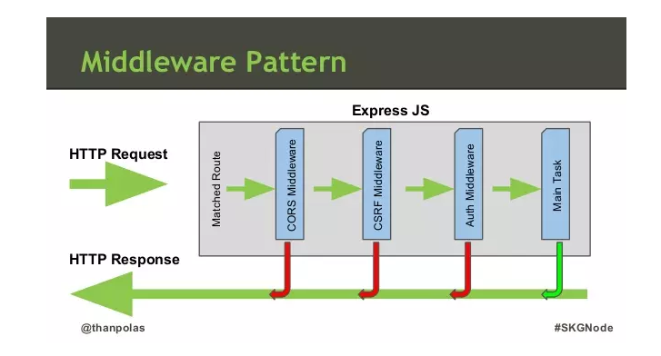
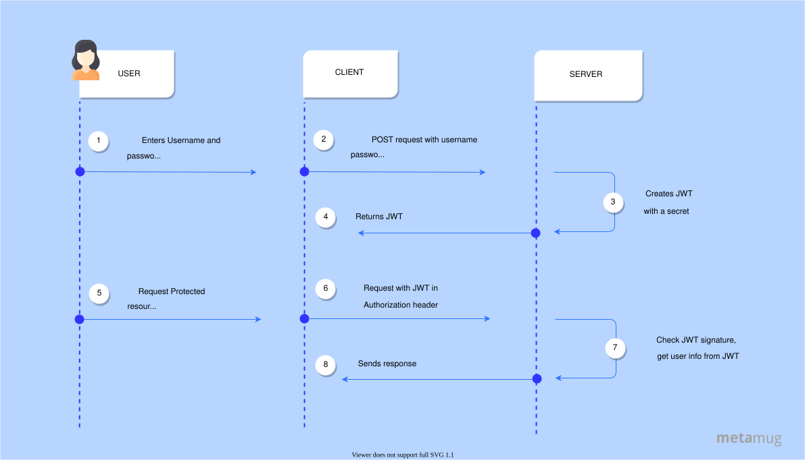

# Middleware and Authentication

## 💛  Tổng quan Middleware

### 🌻  Middleware là gì ?

Trong lấp trình ứng dụng WEB, Middleware sẽ đóng vai trò trung gian giữa request/response (tương tác với người dùng) và các xử lý logic bên trong web server.

Middleware sẽ là các hàm được dùng để tiền xử lý, lọc các request trước khi đưa vào xử lý logic hoặc điều chỉnh các response trước khi gửi về cho người dùng.



Hình trên mô tả 3 middleware có trong ExpressJS. Một request khi gửi đến Express sẽ được xử lý qua 5 bước như sau :

1. Tìm Route tương ứng với request
2. Dùng CORS Middleware để kiểm tra cross-origin Resource sharing của request
3. Dùng CRSF Middleware để xác thực CSRF của request, chống fake request
4. Dùng Auth Middleware để xác thực request có được truy cập hay không
5. Xử lý công việc được yêu cầu bởi request (Main Task)

Bất kỳ bước nào trong các bước 2,3,4 nếu xảy ra lỗi sẽ trả về response thông báo cho người dùng, có thể là lỗi CORS, lỗi CSRF hay lỗi auth tùy thuộc vào request bị dừng ở bước nào.

**Middleware trong ExpressJS** về cơ bản sẽ là một loạt các hàm Middleware được thực hiện liên tiếp nhau. Sau khi đã thiết lập, các request từ phía người dùng khi gửi lên ExpressJS sẽ thực hiện lần lượt qua các hàm Middleware cho đến khi trả về response cho người dùng. Các hàm này sẽ được quyền truy cập đến các đối tượng đại diện cho Request - req, Response - res, hàm Middleware tiếp theo - next, và đối tượng lỗi - err nếu cần thiết.

Một hàm Middleware sau khi hoạt động xong, nếu chưa phải là cuối cùng trong chuỗi các hàm cần thực hiện, sẽ cần gọi lệnh next() để chuyển sang hàm tiếp theo, bằng không xử lý sẽ bị treo tại hàm đó.

Trong Express, có 5 kiểu middleware có thể sử dụng :

- Application-level middleware (middleware cấp ứng dụng)
- Router-level middleware (middlware cấp điều hướng - router)
- Error-handling middleware (middleware xử lý lỗi)
- Built-in middleware (middleware sẵn có)
- Third-party middleware (middleware của bên thứ ba)

## 🌻 Cách để tạo ra một middleware theo nhu cầu

### Định nghĩa middleware

Tại file `app.ts`

Bạn định nghĩa một middleware như sau

```js
/* Middleware function */
function myMiddleware(req, res, next) {
    console.log('Middleware đang chạy...');
    next(); // Chuyển tiếp yêu cầu tới hàm xử lý tiếp theo
}
```

### Cách sử dụng middleware

#### Cách 1: Áp dụng middleware cho route cụ thể

```js
// Áp dụng middleware cho tất cả các route bắt đầu bằng '/my-route'
app.use('/my-route', myMiddleware);

// Route sẽ sử dụng middleware
app.get('/my-route', (req, res) => {
    res.send('Hello từ /my-route');
});

// Route sẽ không sử dụng middleware
app.get('/another-route', (req, res) => {
    res.send('Hello từ /another-route');
});

// Route con cũng sẽ sử dụng middleware
app.get('/my-route/child', (req, res) => {
    res.send('Hello từ /my-route/child');
});
```

Ngoài ra trong với cách 1 này bạn có thể đưa middleware
trực tiếp trên phần định nghĩa route như sau

```js
/* Middleware function */
function myMiddleware(req, res, next) {
    console.log('Middleware đang chạy...');
    next(); // Chuyển tiếp yêu cầu tới hàm xử lý tiếp theo
}

// Route sẽ sử dụng middleware
app.get('/my-route', myMiddleware,  (req, res) => {
    res.send('Hello từ /my-route');
});
```

### Cách 2: Áp dụng middleware cho toàn bộ route

BẠN CÓ THỂ TÁCH middleware ra một file ngoài rồi nhúng ngược lại cho `app.ts`

Tạo thư mục middleware, sau đó tạo một file tên: `middleware/mylogger.middleware.ts`

```js
//Tạo và export luôn
export const myLogger = function (req: Request, res: Response, next: NextFunction) {
  //Logic Here
  console.log('LOGGED', req);

  //End with next() -> chuyển tiếp sang middleware khác nếu có
  next();
};

```

Tại file `app.ts`

```js
import {myLogger} from './middlewares/mylogger.middleware';

/* 
Đặt middleware này trước tất cả phần
khai báo route ==> nó thực thi middleware trước
==> Áp dụng cho tất cả route
*/
app.use(myLogger);
```

### Khái niệm Lớp middleware

Có nghĩa là middleware này xử lý xong thì chuyển sang middleware tiếp theo nếu có. Tạo thành một lớp middleware đa tầng để kiểm soát luồng xử lý.

Tạo thêm 2 ví dụ về middleware nữa để thấy được sự chuyển tiếp giữa các lớp middleware


```js
// Middleware 1: Logging middleware
app.use((req, res, next) => {
  console.log('Middleware 1: Logging request');
  next();
});

// Middleware 2: Authentication check
app.use((req, res, next) => {
  console.log('Middleware 2: Checking authentication');
  // Giả sử người dùng luôn được xác thực
  req.user = { id: 1, name: 'John Doe' };
  next();
});


// Route handler
app.get('/', (req, res) => {
  console.log('Route handler: Sending response');
  res.send(`Hello, ${req.user.name}!`);
});

```

Trong console, bạn sẽ thấy thứ tự các middleware được xử lý khi bạn gửi yêu cầu đến máy chủ:

```txt
Server is running on http://localhost:3000
Middleware 1: Logging request
Middleware 2: Checking authentication
Route handler: Sending response
```

### Kết luận

Middleware xử lý tuần tự trước sau. Request được truyền qua từng lớp middleare để xử lý trước khi đến `route handle` để response cho client.

---

## 💛 Một số Middleware cần thiết

### Compression - Nén request

Đọc thêm: https://expressjs.com/id/resources/middleware/compression.html

### Morgan - Ghi Logs request

Đọc thêm: https://expressjs.com/id/resources/middleware/morgan.html

### Cors - Chống spam API

Đọc thêm: https://expressjs.com/id/resources/middleware/cors.html

### Helmet - Bảo mật Header

Đọc thêm: 

- https://github.com/helmetjs/helmet
- https://expressjs.com/en/advanced/best-practice-security.html

## 💛 Validate Requests

Sau khi bạn nắm được cách xử lý của middleware, chúng ta tìm hiểu cách thức để `Validate Requests` một request. Để đảm bảo dữ liệu đầu vào hợp lệ cho ứng dụng.


- validate Body parameter
- validate Path parameter
- validate Query parameter

**Bước 1:** Chúng ta cần tạo một Middleware để handle validate `src\middlewares\validateSchema.middleware.ts`


> Sử dụng thư viện `joi` để validate xem ở [link sau](./joi.md)
> Sử dụng thư viện `yup` để validate xem ở [link sau](./yup.md)

Trong ví dụ này chúng ta sẽ sử dụng `zod` để validate

```bash
npm install zod
pnpm install zod
```

Code một middleware validateSchema.middleware.ts

```ts
import { z, ZodError, ZodTypeAny } from 'zod';
import { NextFunction, Request, Response } from 'express';

const validateSchema = (schema: ZodTypeAny) => (req: Request, res: Response, next: NextFunction): void => {
 try {
  const result = schema.safeParse({
   body: req.body,
   query: req.query,
   params: req.params,
  });

  if (!result.success) {
   res.status(400).json({
    statusCode: 400,
    message: result.error.issues.map((issue) => issue.message),
    typeError: 'validateSchema',
   });
   return;
  }

  next();
 } catch (err) {
  if (err instanceof ZodError) {
   res.status(400).json({
    statusCode: 400,
    message: err.issues.map((issue) => issue.message),
    typeError: 'validateSchema',
   });
   return;
  }

  res.status(500).json({
   statusCode: 500,
   message: 'validate Zod Error',
   typeError: 'validateSchemaUnknown',
  });
 }
};

export default validateSchema;
```


**Bước 2:** Tạo các Schema Validation

Tạo folder `src/validations`

Trong folder này tạo file `category.validation.ts

```ts
import { z } from 'zod';

const getCategoryById = z.object({
 params: z.object({
  id: z.coerce.number().int().positive(),
 }),
});

export default {
 getCategoryById,
};
```

**Bước 3:** Sử dụng trong Các Routes


```js
import express from "express";
import categoriesController from "../../controllers/categories.controller";
import validateSchemaYup from "../../middlewares/yupValidateSchema.middleware";
import categoriesValidation from "../../validations/categoryYup.validation";

const router   = express.Router();


//Get By ID
//http://localhost:8080/api/v1/categories/:id
router.get('/:id', validateSchemaYup(categoriesValidation.getCategoryById), categoriesController.getCategoryById)


```


---

## 💛 JWT Token

Tìm hiểu [JWT](../Day-15-Advanced/JWT.md)

---

## 💛 Basic Authentication Systems

Trong thực tế khi xây dựng một hệ thống Restull API sẽ có:

- Các routes ở chế độ public tức ai cũng có thể truy cập vào
- Các routes ở chế độ private, chỉ những ai có quyền mới truy cập

Thì chúng ta gọi các vấn đề trên với một khái niệm là `Authentication` (Xác thực danh tính)

Đối với những Staff có quyền truy cập, thì lại có một vấn đề nữa là quyền hạn. Staff này có quyền truy cập đến những tài nguyên nào thì chúng ta gọi nó với một khái niệm là `Authorization`




**Bước 1: Mỗi Staff phải có một token (chìa khóa) để truy cập tới các private endpoint**

Để có được token, Staff phải đăng nhập vào hệ thống, nếu đúng email, password thì hệ thống sẽ sinh ra cho Staff một token.

Staff sẽ mang token này để truy cập tới các private endpoint

Tạo Schema Login `src/validations/auth.validation.ts`

```ts
import Joi from 'joi';

const authLogin = {
  body: Joi.object().keys({
    email: Joi.string().email().required(),
    password: Joi.string().required(),
  }),
};

export default  {
  authLogin,
};
```

Tạo Route Auth Service `src/services/auth.service.ts`

```ts
import createError from 'http-errors';
import jwt  from 'jsonwebtoken';
import Staff from  '../models/staff.model'
import {appConfigs} from '../constants/configs';
import { IStaff,StaffSchema} from '../types/models';

const AuthLogin = async (staffBody: {email: string, password: string}) => {
  console.log('2 ==> ', staffBody);
  //Tìm xem có tồn tại staff có email không
  let staff: StaffSchema | null = await Staff.findOne({
    email: staffBody.email,
  });

  if (!staff) {
    throw createError(401, 'Invalid email or password');
  }

  const invalidPasword = staff.comparePassword(staffBody.password);

  if (!invalidPasword) throw  createError(401, 'Invalid email or password');

  //Tồn tại thì trả lại thông tin staff kèm token
  const token = jwt.sign(
    { _id: staff._id, email: staff.email},
    appConfigs.JWT_SECRET as string
  );

  const refreshToken  = jwt.sign(
    { _id: staff._id, email: staff.email},
    appConfigs.JWT_SECRET as string,
    {
      expiresIn: '365d', // expires in 24 hours (24 x 60 x 60)
    }
  );


  return {
    staff: { id: staff._id, email: staff.email},
    token,
    refreshToken
  };
}


const refreshToken  = async (staff: IStaff) => {
  const refreshToken  = jwt.sign(
    { _id: staff._id, email: staff.email},
    appConfigs.JWT_SECRET as string,
    {
      expiresIn: '365d', // expires in 24 hours (24 x 60 x 60)
    }
  );
  return refreshToken;
}

export default {
  AuthLogin,
  refreshToken
}
```

Tạo Route Auth Controller `src/services/auth.controller.ts`

```ts
import { Request, Response, NextFunction } from "express";
import  authService from '../services/auth.service';
import {sendJsonSuccess} from '../helpers/responseHandler'

const authLogin = async (req: Request, res: Response, next: NextFunction) => {
  console.log('1 ==> auth req', req.body);
  try {
    const staff = await authService.AuthLogin(req.body);
    sendJsonSuccess(res)(staff);
  } catch (err) {
    next(err);
  }
};

const refreshToken = async (req: Request, res: Response, next: NextFunction) => {
  try {
    /**
     * Nhận được req.staff từ auth.middleware forward qua
     */
    const token = await authService.refreshToken(res.locals.staff);
    sendJsonSuccess(res)(token);
  } catch (err) {
    next(err);
  }
};

export default {
  authLogin,
  refreshToken
}
```

Tạo Route Auth `src/routes/auth.route.ts`

```js
import express, { Express } from 'express';
const router: Express = express();
import authController from '../controllers/auth.controller';

//http://localhost:8686/api/v1/auth
router.post('/', authController.authLogin);

export default router;

```

Gắn route Auth vào app.ts

```js
//...
import authRoute from './routes/auth.route';
app.use('/api/v1/auth', authRoute);
```


**Bước 3: Tạo Auth Middleware - Anh gác cổng cho App**

Tạo một file src/middleware/auth.middleware.ts

```js
import jwt, { JwtPayload }  from 'jsonwebtoken'
import Staff from '../models/Staff.model'
import { Request, Response, NextFunction } from "express";
import createError from 'http-errors';
import {appConfigs} from '../constants/configs';

interface decodedJWT extends JwtPayload {
   _id?: string
 }

export const authenticateToken = async (req: Request, res: Response, next: NextFunction) => {
  //Get the jwt token from the head
  const authHeader = req.headers['authorization'];
    const token = authHeader && authHeader.split(' ')[1];

     //If token is not valid, respond with 401 (unauthorized)
    if (!token) {
      return next(createError(401, 'Unauthorized'));
    }

    try {
      const decoded = jwt.verify(token, appConfigs.JWT_SECRET as string) as decodedJWT;
      //try verify staff exits in database
      const staff = await Staff.findById(decoded._id);

      if (!staff) {
        return next(createError(401, 'Unauthorized'));
      }
      //Đăng ký biến staff global trong app
      res.locals = staff;

      next();
    } catch (err) {
      return next(createError(403, 'Forbidden'));
    }
};

export const authorize = (roles: string[] = []) => {
    // roles param can be a single role string (e.g. Role.Staff or 'Staff') 
    // or an array of roles (e.g. [Role.Admin, Role.Staff] or ['Admin', 'Staff'])
    if (typeof roles === 'string') {
        roles = [roles];
    }

    return (req: Request, res: Response, next: NextFunction) => {
      if (roles.length && res.locals.staff.role && !roles.includes(res.locals.staff.role)) {
        return next(createError(403, 'Forbidden'));
      }
        // authentication and authorization successful
        next();
    }
}

```

**Bước 4: Bảo vệ Route với Auth Middleware**

Ví dụ bạn muốn bảo vệ các route có phương thức POST, PUT, DELETE của staffs.route.js

Sửa lại đoạn này

```js
router.put('/staffs/:id', async (req, res, next) => {

})
```

Thành như sau

```js
//Thêm vào trên đầu
const {authenticateToken} = require('../middleware/auth.middleware')
//Thêm middleware vào trước
router.put('/staffs/:id', authenticateToken,, async (req, res, next) => {

})
```


## 💛 Đọc thêm - Hạn chế Spam API


Hạn chế spam API bằng cách sử dụng `X-API-KEY` là một phương pháp phổ biến để đảm bảo rằng chỉ những người dùng hoặc ứng dụng được ủy quyền mới có thể truy cập vào API của bạn. Dưới đây là một hướng dẫn chi tiết về cách triển khai việc này.

### Bước 1: Tạo và Lưu Trữ API Keys

Đầu tiên, bạn cần tạo và lưu trữ các API keys. Điều này thường được thực hiện trong cơ sở dữ liệu của bạn.

#### Ví dụ với MongoDB

```javascript
const mongoose = require('mongoose');
const { Schema } = mongoose;

const apiKeySchema = new Schema({
  key: { type: String, required: true, unique: true },
  usageCount: { type: Number, default: 0 },
  createdAt: { type: Date, default: Date.now },
  lastUsedAt: { type: Date },
  isActive: { type: Boolean, default: true }
});

const ApiKey = mongoose.model('ApiKey', apiKeySchema);

// Tạo một API key mới
async function createApiKey() {
  const apiKey = new ApiKey({ key: 'your-unique-api-key-here' });
  await apiKey.save();
  console.log('API Key created:', apiKey);
}

createApiKey();
```

### Bước 2: Xác Thực API Key

Khi một request đến API của bạn, bạn cần xác thực `X-API-KEY` trong header của request.

#### Middleware để Xác Thực API Key

```javascript
const express = require('express');
const app = express();

app.use(express.json());

const ApiKey = require('./models/ApiKey'); // Đảm bảo rằng bạn đã đúng đường dẫn tới model của bạn

async function apiKeyAuth(req, res, next) {
  const apiKey = req.header('X-API-KEY');
  if (!apiKey) {
    return res.status(401).json({ message: 'API key is missing' });
  }

  try {
    const key = await ApiKey.findOne({ key: apiKey, isActive: true });

    if (!key) {
      return res.status(403).json({ message: 'Invalid or inactive API key' });
    }

    // Cập nhật thông tin sử dụng API key
    key.usageCount += 1;
    key.lastUsedAt = new Date();
    await key.save();

    next();
  } catch (error) {
    console.error('Error in API key authentication:', error);
    res.status(500).json({ message: 'Internal server error' });
  }
}

app.use(apiKeyAuth);
```

### Bước 3: Hạn Chế Tốc Độ (Rate Limiting)

Bạn có thể sử dụng các middleware như `express-rate-limit` để hạn chế tốc độ request, giúp giảm thiểu việc spam.

#### Cài đặt `express-rate-limit`

```sh
npm install express-rate-limit
```

#### Sử dụng `express-rate-limit`

```javascript
const rateLimit = require('express-rate-limit');

const apiLimiter = rateLimit({
  windowMs: 15 * 60 * 1000, // 15 phút
  max: 100, // Giới hạn mỗi IP chỉ được thực hiện 100 requests trong mỗi 15 phút
  handler: function (req, res) {
    res.status(429).json({
      message: 'Too many requests, please try again later.'
    });
  }
});

// Áp dụng rate limiter cho tất cả các routes
app.use(apiLimiter);
```

### Bước 4: Sử Dụng Middleware và Khởi Chạy Server

```javascript
app.get('/api/example', (req, res) => {
  res.json({ message: 'This is an example endpoint' });
});

const PORT = process.env.PORT || 3000;
app.listen(PORT, () => {
  console.log(`Server is running on port ${PORT}`);
});
```
