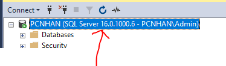
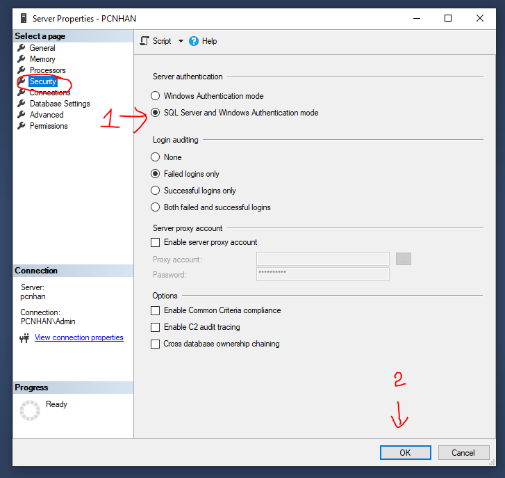
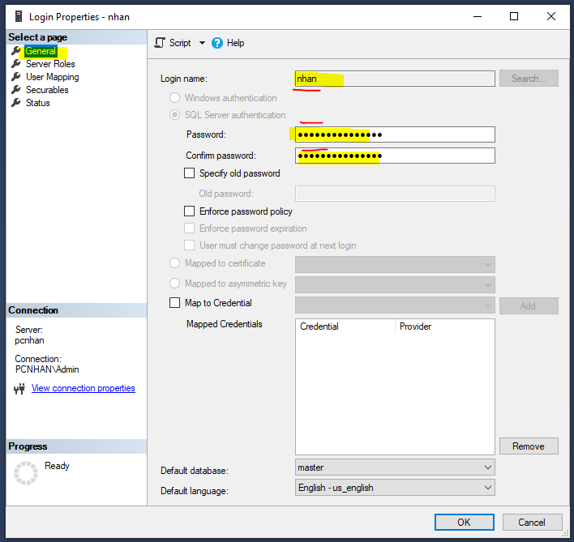

# Express with SQL Server

## 💛 Cấu hình SQL Server

### Bước 1 - Chuyển chế độ đăng nhập

- Đăng nhập với chế độ Windown Authentication
- Sau đó kích phải lên tên Instance kết nối, chọn Properties



- Sau đó chọn Menu Security, rồi thực hiện chọn như hình dưới




### Bước 2 - Tạo Database

- Đăng nhập với chế độ Windown Authentication
- Click phải lên Databases --> chọn New Database
- Đặt tên sau đó nhấn OK

###  Bước 3 - Tạo tài khoản SQL Server - Authentication

- Đăng nhập với chế độ Windown Authentication
- Sau đó xổ Mục Security ra --> Click phải lên mục Login --> chọn New Login


- Tại tab General điền tên user vào ô Login name, điền password, confirm passowrd vào, rồi tick bỏ chọn Enfoce password policy

- Làm như hình dưới



- Tab User Mapping, chọn tên Database bạn muốn add user này vào quản trị
- Sau đó bên dưới bạn chọn db_owner
- Cuối cùng click OK 


###  Bước 4 - Bật  TCP/IP

- Vào Sql Server Configruration Manager
- Tại mục SQL Server Network Configruration --> chọn Protocals for MSSQLSERVER
- Tại cửa sổ bên phải: Click phải lên TCP/IP --> Enable


## 💛 Connecting to SQL Server 

Học cách kết nối với Database để lấy dữ liệu sau đó trả về cho Clients
### 🔶 Kết nối với SQL Server với ORM Tools

#### 🌻 ORM là gì ?

ORM viết tắt của "Object-Relational Mapping", là một mô hình lập trình được sử dụng để ánh xạ dữ liệu giữa hệ quản trị cơ sở dữ liệu (Relational Database Management System - RDBMS) và các đối tượng trong các ngôn ngữ lập trình hướng đối tượng (như Java, Python, C#, TypeScript, và nhiều ngôn ngữ khác). Mục tiêu chính của ORM là giúp đơn giản hóa việc làm việc với cơ sở dữ liệu bằng cách biến đổi dữ liệu được lưu trữ trong các bảng cơ sở dữ liệu thành các đối tượng có thể được truy cập và quản lý bằng mã lập trình.

Có rất nhiều Tools ORM: Sequelize, Prisma, TypeORM ...hỗ trợ javascript và TypeScript

---

## 💛 SQL Server with TypeORM library

TypeORM là một Object-Relational Mapper (ORM) cho TypeScript và JavaScript (ES7, ES6, ES5). Nó giúp bạn tạo ra các đối tượng và cơ sở dữ liệu chung, tạo và thực thi truy vấn.

MSSQL (Microsoft SQL Server) là một hệ thống quản lý cơ sở dữ liệu phổ biến của Microsoft.

Xem bài viết sử dụng TypeORM với Express: https://typeorm.io/example-with-express

### Cài đặt

```bash
yarn add typeorm reflect-metadata mssql 
```

```bash
yarn add -D @types/node
```

**TypeScript configuration**

Sửa file tsconfig.json, thêm vào compilerOptions

```json
"emitDecoratorMetadata": true,
"experimentalDecorators": true,
```

Sữa thuộc tính `strict` thành `false`

```json
"strict": false,
```

### Kết nối Expressjs Với SQL Server sử dụng TypeORM

#### Bước 1 - Tạo file AppDataSource.ts để cấu hình kết nối

```ts
import "reflect-metadata";
import { DataSource } from 'typeorm';

export const AppDataSource = new DataSource({
  type: 'mssql',
  host: 'PCNHAN',
  port: 1433,
  username: 'nhan',
  password: '123456789',
  database: 'AptechTest',
  entities: ['src/entities/**/*.entity{.ts,.js}', 'src/entities/**/*.schema{.ts,.js}'],
  synchronize: true,
  logging: false,
  options: {
    encrypt: false,
  },
});
```

#### Bước 2 - Tạo Các Model - Entities

Trong thư mục src tạo folder `entities` chứa tất cả Entity (Model)

Tạo một file Entity `src/entities/employee.entity.ts`

Chi tiết xem: https://typeorm.io/#create-an-entity

```ts
import { Entity, PrimaryGeneratedColumn, Column } from 'typeorm';

@Entity({ name: 'Employees' }) //đặt tên table
export class Employee {
  @PrimaryGeneratedColumn()
  id: number;

  @Column({ length: 20, type: 'nvarchar', nullable: false })
  firstName: string;

  @Column({ length: 20, type: 'nvarchar', nullable: false })
  lastName: string;

  @Column({ length: 120, nullable: false })
  numberPhone: string;

  @Column({ length: 50, nullable: false })
  email: string;

  @Column({ length: 50, type: 'nvarchar', nullable: true })
  address: string;

  @Column({ type: 'date', nullable: true })
  birthday: Date;

  @Column({ length: 255, nullable: false })
  password: string;
}

```

Sau khi kết nối hệ thống sẽ tự động tạo ra trong Database của bạn một table có tên `employee`

#### Bước 3 - Kết nối AppDataSource vào server Express

bạn sửa code server.ts thành như sau:

```ts
import dotenv from 'dotenv';
import { AppDataSource } from "./AppDataSource";

dotenv.config();

const app = require("./src/app");
const PORT = process.env.PORT || 9000;

AppDataSource.initialize().then(() => {
    console.log("🚀[SQL Server] Data Source has been initialized!");


        const server = app.listen(PORT, () =>
        console.log(`🚀[ExpressJs] Server ready at: http://localhost:${PORT}`),
        )

})
.catch((err) => {
    console.error("Error during Data Source initialization:", err)
})
```

Cho Server SQL khởi động thành công trước, sau đó khởi động server Express

Kết quả Nếu bạn thấy ở log của Terminal là kết nối thành công
Kiểm tra Database của bạn xem, table employee có được tạo không

```bash
🚀[SQL Server] Data Source has been initialized!
🚀[ExpressJs] Server ready at: http://localhost:9000
```

### Sử dụng kết nối trong các Service

Ví dụ bạn tạo file src/services/employeeTypeORM.service.ts

```ts
import { AppDataSource } from '../../AppDataSource';
import { Router, NextFunction, Request, Response } from 'express';
import { Employee } from '../entities/employee.entity';
const repository = AppDataSource.getRepository(Employee);


const getAll = ()=> {
    const employees = await repository.find();
    return employees;
});

const getItemById = async (id: string) => {
    const result = await repository.findOneBy({
        id: parseInt(req.params.id),
    });
    return result;
});

const createItem = async (payload: IEmployee) =>  {
    const employee = await repository.create(payload);
    const result = await repository.save(employee);
    return result;
});

const updateItem = async (id: string, payload: IEmployee)  => {
    
    const employee = await getItemById(id);
    
    if (!employee) {
      throw createError(404, "Employee not found");
    }
    //repository.merge(employee, payload);
    Object.assign(employee, payload);

    const result = await repository.save(employee)
    return result;
});

const deleteItem = async (id: string) => {
    const employee = await getItemById(id);
    
    if (!employee) {
      throw createError(404, "Employee not found");
    }

    const result = await repository.delete({
        id: employee.id
    })
    return result;
});

export default {
  getAllItems,
  getItemById,
  updateItem,
  createItem,
  deleteItem,
};


```

Sau đó bạn tại employeesTypeORMController sử dụng service trên


==> TEST CÁC APIs

## 💛 Entities là gì


Trong TypeORM, một "entity" (thực thể) đại diện cho một đối tượng trong cơ sở dữ liệu. Mỗi entity tương ứng với một bảng trong cơ sở dữ liệu và các trường của entity tương ứng với các cột trong bảng đó. TypeORM sử dụng các đối tượng entity để thực hiện các thao tác thêm, sửa, xóa và truy vấn dữ liệu.

### 🚩 Cách Tạo một Entity

Chi tiết: https://typeorm.io/entities


```ts
import { Entity, PrimaryGeneratedColumn, Column } from "typeorm"

@Entity({name: 'Users'}) //==> Đặt tên table, nếu ko thì nó lấy = tên của Class bên dưới
export class User {
    @PrimaryGeneratedColumn() //Tự tạo ID, từ khóa chính, ID tăng giần
    id: number

    @Column("nvarchar", { length: 20 }) // DataType cho trường fistName
    firstName: string

    @Column("nvarchar", { length: 20 })
    lastName: string

    @Column()
    isActive: boolean
}
```

TypeORM sẽ tự động tạo table `Users` nếu nó chưa tồn tại

```text
+-------------+--------------+----------------------------+
|                          user                           |
+-------------+--------------+----------------------------+
| id          | int(11)      | PRIMARY KEY AUTO_INCREMENT |
| firstName   | varchar(255) |                            |
| lastName    | varchar(255) |                            |
| isActive    | boolean      |                            |
+-------------+--------------+----------------------------+
```

- Cách tạo Trường Khóa chính: https://typeorm.io/entities#primary-columns
- Kiểu dữ liệu cho trường: https://typeorm.io/entities#column-types
- Danh sách các Option cho trường: https://typeorm.io/entities#column-options

### 🚩 Embedded Entities

Trong TypeORM, "Embedded Entities" là một khái niệm cho phép nhúng (embed) một entity vào trong một entity khác. Điều này cho phép bạn tạo ra một mối quan hệ mạnh mẽ giữa các đối tượng và lưu trữ dữ liệu liên quan trong cùng một bảng hoặc cùng một cột trong cơ sở dữ liệu.

```ts
import { Entity, Column, PrimaryGeneratedColumn, Embedded } from 'typeorm';

@Embedded() //Nếu không đặt tên, thì tên = Class
export class Address {
  @Column()
  street: string;

  @Column()
  city: string;

  @Column()
  country: string;
}

@Entity()
export class User {
  @PrimaryGeneratedColumn()
  id: number;

  @Column()
  name: string;

  //Address được lồng vào User
  @Embedded(() => Address)
  address: Address;
}
```

Chi tiết: https://typeorm.io/embedded-entities


### 🚩 Entity Inheritance

Entity Inheritance trong TypeORM cho phép bạn tạo ra mối quan hệ kế thừa giữa các entity

TypeORM cung cấp hai loại kế thừa trong entity: Single Table Inheritance (STI) và Class Table Inheritance (CTI)

Chi tiết: https://typeorm.io/entity-inheritance

### 🚩 Tree Entities

Trong TypeORM, "Tree Entities" là một tính năng cho phép bạn làm việc với các mô hình dữ liệu cây, nơi các đối tượng được tổ chức theo cấu trúc cây hierarchically. Các Tree Entities cho phép bạn thực hiện các thao tác như tạo, đọc, cập nhật và xóa các node trong cây một cách dễ dàng.

Chi tiết: https://typeorm.io/tree-entities

### 🚩 View Entities

Trong TypeORM, "View Entities" là một tính năng cho phép bạn định nghĩa và làm việc với các đối tượng ảo (views) trong cơ sở dữ liệu. Các View Entities trong TypeORM cho phép bạn tạo ra một cái nhìn (view) ảo của dữ liệu từ các bảng hoặc các truy vấn phức tạp khác.

Chi tiết: https://typeorm.io/view-entities

---

IMPORTANT

Ngoài cách bạn định nghĩa Enity với decorators, chúng ta còn có thể định nghĩa với một khái niệm gọi là `entity schemas` trong TypeORM

```ts
import { EntitySchema } from "typeorm"


export const PersonSchema = new EntitySchema({
    name: "person",
    columns: {
        id: {
            primary: true,
            type: "int",
            generated: "increment",
        },
        firstName: {
            type: String,
            length: 30,
        },
        lastName: {
            type: String,
            length: 50,
            nullable: false,
        },
        age: {
            type: Number,
            nullable: false,
        },
    },
    checks: [
        { expression: `"firstName" <> 'John' AND "lastName" <> 'Doe'` },
        { expression: `"age" > 18` },
    ],
    indices: [
        {
            name: "IDX_TEST",
            unique: true,
            columns: ["firstName", "lastName"],
        },
    ],
    uniques: [
        {
            name: "UNIQUE_TEST",
            columns: ["firstName", "lastName"],
        },
    ],
})
```

Giúp bạn cảm thấy dễ chịu và gần gủi hơn như cách đã làm với MongoDB

Sử dụng Schemas để truy vấn, thêm mới data

```ts
// request data
const personRepository = dataSource.getRepository<PersonType>(PersonSchema)
const person = await personRepository.findOneBy({
    id: 1,
}) // person is properly typed!

// insert a new person into the database
const personDTO = {
    // note that the ID is autogenerated; see the schema above
    name: "new person",
}
const newPerson = await personRepository.save(personDTO)
```

Chi tiết: https://typeorm.io/separating-entity-definition

---

## 💛 DataSource API

Các thông số cấu hình kết kết TypeORM vào dự án

Chi tiết: https://typeorm.io/data-source-api


---

## 💛 Relations - Các kiểu quan hệ

Bạn cần nắm được đối với từng kiểu quan hệ thì chúng ta cần cấu hình các entities nhưu thế nào.

### 🔸 One-to-one

Chi tiết: https://typeorm.io/one-to-one-relations


### 🔸 Many-to-one / one-to-many

Chi tiết: https://typeorm.io/many-to-one-one-to-many-relations

Ví dụ:

```ts
import { Column, Entity, PrimaryGeneratedColumn, BaseEntity, OneToMany } from 'typeorm';
import { Product } from './product.entity';

@Entity({ name: 'Categories' })
export class Category extends BaseEntity {
  @PrimaryGeneratedColumn({ name: 'Id' })
  id: number;

  // ----------------------------------------------------------------------------------------------
  // NAME
  // ----------------------------------------------------------------------------------------------
  @Column({ name: 'Name', unique: true, length: 50 })
  name: string;

  // ----------------------------------------------------------------------------------------------
  // DESCRIPTION
  // ----------------------------------------------------------------------------------------------
  @Column({ name: 'Description', length: 500, nullable: true })
  description: string;

  // ----------------------------------------------------------------------------------------------
  // RELATIONS
  // ----------------------------------------------------------------------------------------------
  @OneToMany(() => Product, (p) => p.category)
  products: Product[];
}
```

### 🔸 Many-to-many

Chi tiết: https://typeorm.io/many-to-many-relations


Ví dụ:

```ts
import { Column, Entity, ManyToOne, OneToMany, BaseEntity, PrimaryGeneratedColumn } from 'typeorm';

import { Category } from './category.entity';
import { Supplier } from './supplier.entity';
import { OrderDetail } from './order-details.entity';

@Entity({ name: 'Products' })
export class Product extends BaseEntity {
  @PrimaryGeneratedColumn({ name: 'Id' })
  id: number;

  // ----------------------------------------------------------------------------------------------
  // NAME
  // ----------------------------------------------------------------------------------------------
  @Column({ name: 'Name', type: 'nvarchar', length: 100 })
  name: string;

  // ----------------------------------------------------------------------------------------------
  // PRICE
  // ----------------------------------------------------------------------------------------------
  @Column({ name: 'Price', type: 'decimal', precision: 18, scale: 2 })
  price: number;

  // ----------------------------------------------------------------------------------------------
  // DISCOUNT
  // ----------------------------------------------------------------------------------------------
  @Column({ name: 'Discount', type: 'decimal', precision: 18, scale: 2, default: 0 })
  discount: number;

  // ----------------------------------------------------------------------------------------------
  // STOCK
  // ----------------------------------------------------------------------------------------------
  @Column({ name: 'Stock', type: 'decimal', precision: 18, scale: 2, default: 0 })
  stock: number;

  // ----------------------------------------------------------------------------------------------
  // DESCRIPTION
  // ----------------------------------------------------------------------------------------------
  @Column({ name: 'Description', type: 'nvarchar', length: 'MAX', nullable: true })
  description: string;

  // ----------------------------------------------------------------------------------------------
  // CATEGORY ID
  // ----------------------------------------------------------------------------------------------
  @Column({ type: 'int' })
  categoryId: number;

  // ----------------------------------------------------------------------------------------------
  // SUPPLIER ID
  // ----------------------------------------------------------------------------------------------
  @Column({ type: 'int' })
  supplierId: number;

  // ----------------------------------------------------------------------------------------------
  // RELATIONS
  // ----------------------------------------------------------------------------------------------
  @ManyToOne(() => Category, (c) => c.products)
  category: Category;

  @ManyToOne(() => Supplier, (s) => s.products)
  supplier: Supplier;

  @OneToMany(() => OrderDetail, (od) => od.product)
  orderDetails: OrderDetail[];
}

```


---

## 💛 Entity Manager and Repository

### 🔸 Entity Manager

Bạn có thể : insert, update, delete, load, etc. với Entity Manager

```ts
import { AppDataSource } from "../../data-soucre.ts"
import { User } from "./entities/User"

//manager chính là EntityManager 
const user = await myDataSource.manager.findOneBy(User, {
    id: 1,
});
```


Chi tiết các lệnh với `EntityManager`: https://typeorm.io/entity-manager-api


### 🔸 Repository

Nó giống như Entity Manager nhưng nó bị giới hạn tại một enity cụ thể


```ts
import { AppDataSource } from "../../data-soucre.ts"
import { User } from "./entities/User";

//bị giới hạn tại một enity cụ thể ==> tức là bạn đang thao tác trên enity User đã cấu hình ngay từ đầu.

const userRepository = AppDataSource.getRepository(User)
const user = await userRepository.findOneBy({
    id: 1,
});
```
Chi tiết các lệnh với `Repository`: https://typeorm.io/repository-api


Về cơ bản cả `EntityManager` và `Repository` có cách sử dụng tương đồng nhau

#### 💡 Câu lênh SELECT

```ts
userRepository.find({
    select: {
        firstName: true,
        lastName: true,
    },
})
//SELECT "firstName", "lastName" FROM "user"
```


Lấy tất cả * dựa vào một hoặc nhiều điều kiện

```ts
userRepository.findBy({
    firstName: "Timber",
})
//SELECT * FROM "user" WHERE firstName = 'Timber'
```

Tìm một dựa vào điều kiện


```ts
const timber = await userRepository.findOne({
    where: {
        firstName: "Timber",
    },
})
//SELECT * FROM "user" WHERE firstName = 'Timber' LIMIT 1
```

Tìm kiếm và phân trang


```ts
const [users, totalCount] = await userRepository.findAndCount({
        order: {
            id: "DESC",
        },
        skip: (page - 1) * limit,
        take: limit,
    });
```

**JOIN nhiều table**

```ts
userRepository.find({
    relations: {
        profile: true,
        photos: true,
        videos: true,
    },
})
```
Tương đương

```sql
SELECT * FROM "user"
LEFT JOIN "profile" ON "profile"."id" = "user"."profileId"
LEFT JOIN "photos" ON "photos"."id" = "user"."photoId"
LEFT JOIN "videos" ON "videos"."id" = "user"."videoId"
```

**Một câu lệnh  Select Đầy đủ**

```ts
userRepository.find({
    select: {
        //Danh sách các trường cần lấy
        firstName: true,
        lastName: true,
    },
    relations: {
        //quan hệ với các table khác
        profile: true,
        photos: true,
        videos: true,
    },
    where: {
        //slect với điều kiện WHERE
        firstName: "Timber",
        lastName: "Saw",
        profile: {
            userName: "tshaw",
        },
    },
    //ORDER BY
    order: {
        name: "ASC",
        id: "DESC",
    },
    skip: 5, //offset pagination
    take: 10, //limit pagination
    cache: true, //Cache kết quả lấy được
})
```


#### 💡 SLECT COUNT

```ts
const count = await repository.count({
    where: {
        firstName: "Timber",
    },
})
//hoạc
const count = await repository.countBy({ firstName: "Timber" })
```

#### 💡 Câu lênh INSERT

```ts
//Thêm một record
await repository.insert({
    firstName: "Timber",
    lastName: "Timber",
})
//Thêm nhiều records một lần
await repository.insert([
    {
        firstName: "Foo",
        lastName: "Bar",
    },
    {
        firstName: "Rizz",
        lastName: "Rak",
    },
])
```
#### 💡 Câu lênh UPDATE


```ts
await repository.update({ age: 18 }, { category: "ADULT" })
// executes UPDATE user SET category = ADULT WHERE age = 18

await repository.update(1, { firstName: "Rizzrak" })
// executes UPDATE user SET firstName = Rizzrak WHERE id = 1
```

#### 💡 Câu lênh DELETE


```ts
await repository.delete(1)
await repository.delete([1, 2, 3])
await repository.delete({ firstName: "Timber" })
```


#### 💡 Thực thi một SQL thuần

```ts
const rawData = await userRepository.query(`SELECT * FROM USERS`)
```

#### 💡 Xóa data của mộ table

```ts
await repository.clear()

```

## 💛 Query Builder

Ngoài việc bạn sử dụng DataSource để truy vấn bạn còn có thể sử dụng Query Builder.

QueryBuilder là một trong những tính năng mạnh mẽ nhất của TypeORM - nó cho phép bạn xây dựng các truy vấn SQL bằng cú pháp nhanh gọn và tiện lợi, thực thi chúng và tự động chuyển đổi các đối tượng.

Khi nào dùng ?

- Khi bạn có một câu lệnh truy vấn phức tạp


Chi tiết các lệnh truy vấn:

- SELECT: https://typeorm.io/select-query-builder
- INSERT: https://typeorm.io/insert-query-builder
- UPDATE: https://typeorm.io/update-query-builder
- DELETE: https://typeorm.io/delete-query-builder


---


## 💛 HOMEWORKS - Tạo các Entities với TypeORM

Làm tuần tự lần lượt 

1. Employee
2. Custome
3. Category
4. Supplier
5. Product
6. Order
7. OrderDetails

Cấu trúc các bảng xem tại `Homeworks\Database-Structure`
