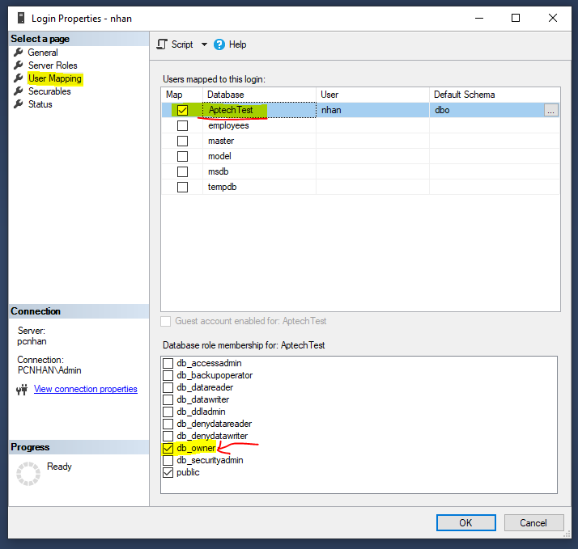
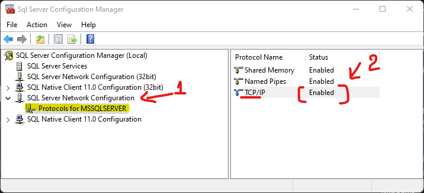

# Express with SQL Server

## 💛 Cấu hình SQL Server

### Bước 1 - Chuyển chế độ đăng nhập

- Đăng nhập với chế độ Windown Authentication
- Sau đó kích phải lên tên Instance kết nối, chọn Properties


- Sau đó chọn Menu Security, rồi thực hiện chọn như hình dưới


### Bước 2 - Tạo Database

- Đăng nhập với chế độ Windown Authentication
- Click phải lên Databases --> chọn New Database
- Đặt tên sau đó nhấn OK

###  Bước 3 - Tạo tài khoản SQL Server - Authentication

- Đăng nhập với chế độ Windown Authentication
- Sau đó xổ Mục Security ra --> Click phải lên mục Login --> chọn New Login


- Tại tab General điền tên user vào ô Login name, điền password, confirm passowrd vào, rồi tick bỏ chọn Enfoce password policy

- Làm như hình dưới


- Tab User Mapping, chọn tên Database bạn muốn add user này vào quản trị
- Sau đó bên dưới bạn chọn db_owner
- Cuối cùng click OK 




###  Bước 4 - Bật  TCP/IP

- Vào Sql Server Configruration Manager



- Tại mục SQL Server Network Configruration --> chọn Protocals for MSSQLSERVER
- Tại cửa sổ bên phải: Click phải lên TCP/IP --> Enable

- Sau đó click phải lên TCP/IP --> Properties


Chọn qua tab IP Address --> Tìm đến dòng cuối cùng mục IPAll --> Sửa TCPT Port thành 1433


## 💛 Connecting to SQL Server 

Học cách kết nối với Database để lấy dữ liệu sau đó trả về cho Clients
### 🔶 Kết nối với SQL Server với ORM Tools

#### 🌻 ORM là gì ?

ORM viết tắt của "Object-Relational Mapping", là một mô hình lập trình được sử dụng để ánh xạ dữ liệu giữa hệ quản trị cơ sở dữ liệu (Relational Database Management System - RDBMS) và các đối tượng trong các ngôn ngữ lập trình hướng đối tượng (như Java, Python, C#, TypeScript, và nhiều ngôn ngữ khác). Mục tiêu chính của ORM là giúp đơn giản hóa việc làm việc với cơ sở dữ liệu bằng cách biến đổi dữ liệu được lưu trữ trong các bảng cơ sở dữ liệu thành các đối tượng có thể được truy cập và quản lý bằng mã lập trình.

Có rất nhiều Tools ORM: Sequelize, Prisma, TypeORM ...hỗ trợ javascript và TypeScript

---

## 💛 SQL Server with TypeORM library

TypeORM là một Object-Relational Mapper (ORM) cho TypeScript và JavaScript (ES7, ES6, ES5). Nó giúp bạn tạo ra các đối tượng và cơ sở dữ liệu chung, tạo và thực thi truy vấn.

MSSQL (Microsoft SQL Server) là một hệ thống quản lý cơ sở dữ liệu phổ biến của Microsoft.

### Cài đặt nhanh:

```bash
npx typeorm init --name express-sqlserver --database mssql --express
```
Công cụ sẽ tạo cho bạn một project với code mẫu.


### Cài đặt thủ công với Express

Xem bài viết: https://typeorm.io/example-with-express

**Bước 1**

Tạo một thư mục dự án mới `express-sqlserver` sau đó bạn mở nó trong Terminal và đánh lệnh

```bash
yarn init -y
```
**Bước 2**

Cài đặt typescript

```bash
yarn add -D typescript ts-node-dev
```

Sau đó tạo file `tsconfig.json` và copy nội dung này vào:

```json
{
    "compilerOptions": {
        "lib": ["es5", "es6", "dom"],
        "target": "es5",
        "module": "commonjs",
        "moduleResolution": "node",
        "emitDecoratorMetadata": true,
        "experimentalDecorators": true
    }
}
```

**Bước 3**

Tạo file `app.ts`

```ts
console.log('Hello Application')
```

**Bước 4**

Cấu hình script tại file `package.json`

```json
 "scripts": {
    "dev": "ts-node-dev app.ts"
  },
```

**Bước 5**

Cài express vào dự án


```bash
yarn add express
yarn add -D @types/express
```

Sau đó thay nội dung cho file `app.ts` thành như sau

```ts
import * as express from "express"
import { Request, Response } from "express"

// create and setup express app
const app = express()
app.use(express.json())

// register routes

app.get("/users", function (req: Request, res: Response) {
    // here we will have logic to return all users
})

app.get("/users/:id", function (req: Request, res: Response) {
    // here we will have logic to return user by id
})

app.post("/users", function (req: Request, res: Response) {
    // here we will have logic to save a user
})

app.put("/users/:id", function (req: Request, res: Response) {
    // here we will have logic to update a user by a given user id
})

app.delete("/users/:id", function (req: Request, res: Response) {
    // here we will have logic to delete a user by a given user id
})

// start express server
app.listen(3000, ()=> {
  console.log('Connect server successful');
})
```


**Bước 6**

Cài TypeORM vào ứng dụng

```bash
yarn add typeorm mssql reflect-metadata
```

**Bước 7**

Tạo file `data-soucre.ts` để cấu hình kết nối

```ts
import "reflect-metadata";
import { DataSource } from 'typeorm';

export const myDataSource = new DataSource({
  type: 'mssql',
  host: 'NHAN2', //Computer Name
  port: 1433,
  username: 'nhan',
  password: '123456789',
  database: 'ExpressSQLServer34', //Tên Database
  entities: ['entities/**/*.entity{.ts,.js}'], //Chỉ rõ thư mục chứa các file entity
  synchronize: true, //Đồng bộ với Database
  logging: false, //ghi log
  options: {
    encrypt: false, //True khi chạy trên production
  },
});
```

Trong đó có thông số `synchronize` =  true, nghĩa là mỗi khi bạn thay đổi `Entity` thì nó đồng bộ thay đổi xuống Database.

Để an toàn hơn nên nghiên cứu thêm tính năng nâng cao của TypeORM đó là `Migration`

Chi tiết tại: https://typeorm.io/migrations

Khi sử dụng `Migration`, mọi thay đổi lưu lại thành file. Đến khi bạn tự chạy lệnh run Migration thì những thay đổi đó mới được đồng bộ xuống database.

Ngoài ra nó còn cho bạn khôi phục lại các thay đổi đã chạy vì một lí do gì đó.


**Bước 8** 

Tạo Các Model - Entities

Trong thư mục src tạo folder `entities` chứa tất cả Entity (Model)

Tạo một file Entity `src/entities/user.entity.ts`

Chi tiết xem: https://typeorm.io/#create-an-entity

```ts
import { Entity, Column, PrimaryGeneratedColumn } from "typeorm"

@Entity()
export class User {
    @PrimaryGeneratedColumn()
    id: number

    @Column()
    firstName: string

    @Column()
    lastName: string
}

```

Sau khi kết nối hệ thống sẽ tự động tạo ra trong Database của bạn một table có tên `user`


**Bước 9** 

 Kết nối myDataSource vào server Express

bạn sửa code app.ts thành như sau:

```ts
import * as express from "express"
import { Request, Response } from "express"
import { User } from "./entities/user.entity"
import { myDataSource } from "./data-source"

// establish database connection
myDataSource
    .initialize()
    .then(() => {
        console.log("Data Source has been initialized!")
    })
    .catch((err) => {
        console.error("Error during Data Source initialization:", err)
    })

// create and setup express app
const app = express()
app.use(express.json())

// register routes
app.get("/users", async function (req: Request, res: Response) {
    const users = await myDataSource.getRepository(User).find()
    res.json(users)
})

app.get("/users/:id", async function (req: Request, res: Response) {
    const results = await myDataSource.getRepository(User).findOneBy({
        id: parseInt(req.params.id),
    })
    return res.send(results)
})

app.post("/users", async function (req: Request, res: Response) {
    const user = await myDataSource.getRepository(User).create(req.body)
    const results = await myDataSource.getRepository(User).save(user)
    return res.send(results)
})

app.put("/users/:id", async function (req: Request, res: Response) {
    const user = await myDataSource.getRepository(User).findOneBy({
        id: parseInt(req.params.id),
    })
    myDataSource.getRepository(User).merge(user, req.body)
    const results = await myDataSource.getRepository(User).save(user)
    return res.send(results)
})

app.delete("/users/:id", async function (req: Request, res: Response) {
    const results = await myDataSource.getRepository(User).delete(req.params.id)
    return res.send(results)
})

// start express server
app.listen(3000, ()=> {
  console.log('Connect server successful');
})
```

**Bước 10**

Chạy thử

```bash
yarn dev
```

Nếu thành công bạn sẽ thấy log 

```bash
Data Source has been initialized!
Connect server successful
```

Nễu lỗi và cách Fix:

- ConnectionError: Failed to connect to XXX:1433 - getaddrinfo ==> Lỗi này do thông số Host bị sai
- Error during Data Source initialization: ConnectionError: Failed to connect to XXX:1433 - self-signed certificate ==> Lỗi này cho đang bật SSL trên localhost

Thêm thông số này vào `data-source.ts`

```ts
options: {
    encrypt: false,
  },
```

- originalError: ConnectionError: Login failed for user 'xxx' ==> Kiểm tra lại user đó có được cấp quyền cho database không? Rà soát lại thông tin user, password...

==> TEST CÁC APIs


## 💛 Entities là gì


Trong TypeORM, một "entity" (thực thể) đại diện cho một đối tượng trong cơ sở dữ liệu. Mỗi entity tương ứng với một bảng trong cơ sở dữ liệu và các trường của entity tương ứng với các cột trong bảng đó. TypeORM sử dụng các đối tượng entity để thực hiện các thao tác thêm, sửa, xóa và truy vấn dữ liệu.

Nói một cách dễ hiểu để tạo được một `table` theo mô hình code-first bạn cần tạo một `Entity`.

Giống như cách bạn đang sử dụng lệnh CREATE TABLE, sau đó liệt kê các trường cần tạo cho table vậy.

### 🚩 Cách Tạo một Entity

Chi tiết: https://typeorm.io/entities


```ts
import { Entity, PrimaryGeneratedColumn, Column } from "typeorm"

@Entity({name: 'Users'}) //==> Đặt tên table, nếu ko thì nó lấy = tên của Class bên dưới
export class User {
    @PrimaryGeneratedColumn() //Tự tạo ID, từ khóa chính, ID tăng giần
    id: number

    @Column("nvarchar", { length: 20 }) // DataType cho trường fistName
    firstName: string

    @Column("nvarchar", { length: 20 })
    lastName: string

    @Column()
    isActive: boolean
}
```

TypeORM sẽ tự động tạo table `Users` nếu nó chưa tồn tại, tương đương với bảng dữ liệu sau:

```text
+-------------+--------------+----------------------------+
|                          user                           |
+-------------+--------------+----------------------------+
| id          | int(11)      | PRIMARY KEY AUTO_INCREMENT |
| firstName   | varchar(255) |                            |
| lastName    | varchar(255) |                            |
| isActive    | boolean      |                            |
+-------------+--------------+----------------------------+
```

Ánh xạ qua các bước để tạo một `table` bạn cần biết thêm:

- Cách tạo khóa chính
- Cách tạo khóa ngoại
- Biết cách dùng kiểu dữ liệu
- Biết cách cấu hình constrains

Khi thao tác với Type ORM


### 🚩 Kiểu dữ liệu SQL Server trong Type ORM

Chi tiết xem:  https://typeorm.io/entities#column-types-for-mssql

Dưới đây là danh sách các kiểu dữ liệu trong SQL Server  trong Type ORM hỗ trợ:

`int`, `bigint`, `bit`, `decimal`, `money`, `numeric`, `smallint`, `smallmoney`, `tinyint`, `float`, `real`, `date`, `datetime2`, `datetime`, `datetimeoffset`, `smalldatetime`, `time`, `char`, `varchar`, `text`, `nchar`, `nvarchar`, `ntext`, `binary`, `image`, `varbinary`, `hierarchyid`, `sql_variant`, `timestamp`, `uniqueidentifier`, `xml`, `geometry`, `geography`, `rowversion`


Cách dùng


```ts
import { Entity, PrimaryGeneratedColumn, Column } from "typeorm"

export type UserRoleType = "admin" | "editor" | "ghost",

@Entity({name: 'EnityName'}) //==> Đặt tên table, nếu ko thì nó lấy = tên của Class bên dưới
export class User {
    //Tự tạo ID, từ khóa chính, ID tăng giần
    @PrimaryGeneratedColumn() 
    id: number
    //id int INDENTITY(1,1) PRIMARY KEY NOT NULL

    @Column({
        name: 'Name', //Đặt tên cho trường
        type: "nvarchar",
        length: 20,
        nullable: false,  // default is false
    }) 
    name: string
    //SQL: firstName navarchar(20) not null

    @Column({ type: "smallint" })
    age: number
   //SQL: age smallint not null

    @Column({type: 'bit'})
    isActive: boolean
    //SQL: isActive boolean not null

    @Column({
        type: "enum",
        enum: ["admin", "editor", "ghost"],
        default: "ghost",
        nullable: false,
    })
    role: UserRoleType
    //SQL: role varchar(10) default 'ghost' not null

    @Column()
    @Generated("uuid")
    uuid: string

    @Column({
        type: "varchar",
        length: 150,
        unique: true,
    })
    email: string;
    //SQL: email varchar(150) unique not null

    @Column({
        type: "ntext",
        nullable: true,
    })
    description: string;
    //SQL: description ntext null

    @Column({
        type: 'decimal', 
        precision: 18, // độ dài 18 digits
        scale: 2, // với 2 số thập phân
        default: 0,
    })
    price: number;
    //SQL: price decimal(18,2) default 0 not null

    @Column({
        type: 'datetime',
        nullable: false,
        default: () => 'CURRENT_TIMESTAMP' 
    })
    createdDate: Date;
    //SQL: createdDate datetime default CURRENT_TIMESTAMP not null

}
```

- Cách tạo Trường Khóa chính: https://typeorm.io/entities#primary-columns
- Danh sách các Option cho trường: https://typeorm.io/entities#column-options

### 🚩 Tính kế thừa của Entities

Vì Entity được tạo bằng Class, do vậy nó có đặc tính kế thừa của Class.

```ts
/**
 * Lớp abstract
 * chứa các Field cơ bản
 */
export abstract class BaseField {
    
    @Column({type: 'bit'})
    isActive: boolean

    @Column({type: 'bit'})
    isDelete: boolean

    @Column({type: 'smallint'})
    sortOrder: number
}
/**
 * Lớp Product
 * kế thừa những fields cơ bản từ BaseField
 * và bổ sung các field của riêng nó
 */
@Entity()
export class Product extends BaseField {
    @Column()
    name: string
}
```

### 🚩 Entity Schema

Ngoài cách bạn định nghĩa Enity với decorators, chúng ta còn có thể định nghĩa với một khái niệm gọi là `entity schemas` trong TypeORM

Chi tiết xem: https://typeorm.io/separating-entity-definition

```ts
import { EntitySchema } from "typeorm"


export const PersonSchema = new EntitySchema({
    name: "person",
    columns: {
        id: {
            primary: true,
            type: "int",
            generated: "increment",
        },
        firstName: {
            type: String,
            length: 30,
        },
        lastName: {
            type: String,
            length: 50,
            nullable: false,
        },
        age: {
            type: Number,
            nullable: false,
        },
    },
    checks: [
        { expression: `"firstName" <> 'John' AND "lastName" <> 'Doe'` },
        { expression: `"age" > 18` },
    ],
    indices: [
        {
            name: "IDX_TEST",
            unique: true,
            columns: ["firstName", "lastName"],
        },
    ],
    uniques: [
        {
            name: "UNIQUE_TEST",
            columns: ["firstName", "lastName"],
        },
    ],
})
```

Giúp bạn cảm thấy dễ chịu và gần gủi hơn như cách đã làm với MongoDB

## 💛 Relations - Các kiểu quan hệ

Xây dựng mối quan hệ giữa các Entities trong TypeORM


### 🔸 One-to-one

Chi tiết: https://typeorm.io/one-to-one-relations


```ts
import {
    Entity,
    PrimaryGeneratedColumn,
    Column,
    OneToOne,
    JoinColumn,
} from "typeorm"

@Entity()
export class Profile {
    @PrimaryGeneratedColumn()
    id: number

    @Column()
    gender: string

    @Column()
    photo: string
}

/**
 * Enity User có quan hệ ONE-to-ONE
 * với Profile
 */
@Entity()
export class User {
    @PrimaryGeneratedColumn()
    id: number

    @Column()
    name: string

    @OneToOne(() => Profile)
    @JoinColumn()
    profile: Profile
}

```

Thông thường với kiểu quan hệ này, bạn sử dụng để mở rộng các trường cho một table, khi table đó quá lớn, không thể tạo thêm trường cho nó. 

Khi đó bạn tạo một bảng mới,  mở rộng thông tin cho bảng cũ theo quan hệ 1-1.

### 🔸 Many-to-one / one-to-many

Chi tiết: https://typeorm.io/many-to-one-one-to-many-relations

Ví dụ:

```ts
import { Column, Entity, PrimaryGeneratedColumn, BaseEntity, OneToMany } from 'typeorm';
import { Product } from './product.entity';

@Entity({ name: 'Categories' })
export class Category extends BaseEntity {
  @PrimaryGeneratedColumn({ name: 'Id' })
  id: number;

  @Column({ name: 'Name', unique: true, length: 50 })
  name: string;

  // ----------------------------------------------------------------------------------------------
  // RELATIONS
  // ----------------------------------------------------------------------------------------------
  @OneToMany(() => Product, (p) => p.category)
  products: Product[];
}
```

Mục đích bạn thiết lập như vậy là để ORM truy vấn thông tin dựa trên mối quan hệ từ vế đang đứng.

### 🔸 Many-to-many

Chi tiết: https://typeorm.io/many-to-many-relations


Ví dụ:

```ts
import { Column, Entity, ManyToOne, OneToMany, BaseEntity, PrimaryGeneratedColumn } from 'typeorm';

import { Category } from './category.entity';
import { Brand } from './brand.entity';
import { OrderDetail } from './order-details.entity';

@Entity({ name: 'Products' })
export class Product extends BaseEntity {
  @PrimaryGeneratedColumn({ name: 'Id' })
  id: number;

  @Column({ name: 'Name', type: 'nvarchar', length: 100 })
  name: string;

  @Column({ name: 'Price', type: 'decimal', precision: 18, scale: 2 })
  price: number;

  // ----------------------------------------------------------------------------------------------
  // RELATIONS
  // ----------------------------------------------------------------------------------------------
  @ManyToOne(() => Category, (c) => c.products)
  category: Category;
  /**
   * Sau khi đồng bộ TypeORM sẽ tạo ra trường khóa ngoại: categoryId
   */

  @ManyToOne(() => Brand, (s) => s.products)
  brand: Brand;
  /**
   * Sau khi đồng bộ TypeORM sẽ tạo ra trường khóa ngoại: brandId
   */

  @OneToMany(() => OrderItems, (od) => od.product)
  orderItems: OrderItems[];
}

```

Mục đích bạn thiết lập như vậy là để ORM truy vấn thông tin dựa trên mối quan hệ từ vế đang đứng.


## 💛 Validation

Tạo sự ràng buộc chặt chẻ dữ liệu hơn với `class-validator`

Cài đặt:

```bash
yarn add class-validator
```

Sử dụng


```ts
import { BeforeInsert, BeforeUpdate, Entity, PrimaryGeneratedColumn, Column } from "typeorm"
import {
    Contains,
    IsInt,
    Length,
    IsEmail,
    IsFQDN,
    IsDate,
    Min,
    Max,
    validateOrReject
} from "class-validator"

@Entity()
export class MyEntity {
    @PrimaryGeneratedColumn()
    id: number

    @Column({
        type: 'nvarchar',
    })
    //Ràng buộc độ dài
    @Length(10, 20)
    title: string


    @Column()
    //Chứa từ 'hello'
    @Contains("hello")
    text: string

    @Column()
    //Kiểu số, giá trị từ 0-19
    @IsInt()
    @Min(0)
    @Max(10)
    rating: number

    @Column()
    //Đúng định dạng email
    @IsEmail()
    email: string

    @Column()
    //Phải là kiểu ngày
    @IsDate()
    createDate: Date

    //validator
    @BeforeInsert() //Truoc khi them moi
    @BeforeUpdate() //truoc khi cap nhat
    async validate() {
        try {
            await validateOrReject(this);
          } catch (errors) {
            console.log('Caught promise rejection (validation failed). Errors: ', errors);
          }
    }
}
```

Xem đầy đủ tại: https://github.com/typestack/class-validator


## 💛 HOMEWORKS - Tạo các Entities với TypeORM

Làm tuần tự lần lượt các Entities, và thiết lập quan hệ cho chúng

1. Staff
2. Customer
3. Category
4. Brand
5. Product
6. Order
7. OrderDetails

Cấu trúc các bảng xem tại `Homeworks\Database-Structure`