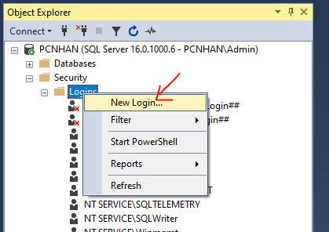

# Using MongoDB and SQL Server

## Cấu hình SQL Server

### Bước 1 - Chuyển chế độ đăng nhập

- Đăng nhập với chế độ Windown Authentication
- Sau đó kích phải lên tên Instance kết nối, chọn Properties


- Sau đó chọn Menu Security, rồi thực hiện chọn như hình dưới


### Bước 2 - Tạo Database

- Đăng nhập với chế độ Windown Authentication
- Click phải lên Databases --> chọn New Database
- Đặt tên sau đó nhấn OK

###  Bước 3 - Tạo tài khoản SQL Server - Authentication

- Đăng nhập với chế độ Windown Authentication
- Sau đó xổ Mục Security ra --> Click phải lên mục Login --> chọn New Login



- Tại tab General điền tên user vào ô Login name, điền password, confirm passowrd vào, rồi tick bỏ chọn Enfoce password policy

- Làm như hình dưới


- Tab User Mapping, chọn tên Database bạn muốn add user này vào quản trị
- Sau đó bên dưới bạn chọn db_owner
- Cuối cùng click OK 


###  Bước 4 - Bật  TCP/IP

- Vào Sql Server Configruration Manager
- Tại mục SQL Server Network Configruration --> chọn Protocals for MSSQLSERVER
- Tại cửa sổ bên phải: Click phải lên TCP/IP --> Enable


## 💛 Connecting to SQL Server 

Học cách kết nối với Database để lấy dữ liệu sau đó trả về cho Clients

### 🔶 Kết nối với SQL Server thuần

Doc: <https://github.com/tediousjs/node-mssql>
#### 🌻Cài đặt

Thư viện SQL Server cho NodeJS

```bash
yarn add mssql
```

#### 🌻Tạo một Database trong SQL Server

Tạo table Employees

```SQL
CREATE DATABASE AptechTEST;
GO
USE AptechTEST;
GO
CREATE TABLE employees (
  EmployeeID int NOT NULL,
  LastName nvarchar(255) DEFAULT NULL,
  FirstName nvarchar(255) DEFAULT NULL,
  BirthDate date DEFAULT NULL,
  Photo nvarchar(255) DEFAULT NULL,
  Notes nvarchar(max),
  NumberPhone NVARCHAR(120) NOT NULL,
  Email NVARCHAR(50) NOT NULL,
  Password NVARCHAR(255) NOT NULL
) ;
GO

INSERT INTO employees (EmployeeID, LastName, FirstName, BirthDate, Photo, Notes, NumberPhone, Email, Password) VALUES
(1, 'Davolio', 'Nancy', '1968-12-08', 'EmpID1.pic', 'Education includes a BA in psychology from Colorado State University. She also completed (The Art of the Cold Call). Nancy is a member of ''Toastmasters International''.', '123456789', 'nancy@example.com', 'password123'),
(2, 'Fuller', 'Andrew', '1952-02-19', 'EmpID2.pic', 'Andrew received his BTS commercial and a Ph.D. in international marketing from the University of Dallas. He is fluent in French and Italian and reads German. He joined the company as a sales representative, was promoted to sales manager and was then named vice president of sales. Andrew is a member of the Sales Management Roundtable, the Seattle Chamber of Commerce, and the Pacific Rim Importers Association.', '987654321', 'andrew@example.com', 'password456'),
(3, 'Leverling', 'Janet', '1963-08-30', 'EmpID3.pic', 'Janet has a BS degree in chemistry from Boston College). She has also completed a certificate program in food retailing management. Janet was hired as a sales associate and was promoted to sales representative.', '555555555', 'janet@example.com', 'password789'),
(4, 'Peacock', 'Margaret', '1958-09-19', 'EmpID4.pic', 'Margaret holds a BA in English literature from Concordia College and an MA from the American Institute of Culinary Arts. She was temporarily assigned to the London office before returning to her permanent post in Seattle.', '111111111', 'margaret@example.com', 'passwordabc'),
(5, 'Buchanan', 'Steven', '1955-03-04', 'EmpID5.pic', 'Steven Buchanan graduated from St. Andrews University, Scotland, with a BSC degree. Upon joining the company as a sales representative, he spent 6 months in an orientation program at the Seattle office and then returned to his permanent post in London, where he was promoted to sales manager. Mr. Buchanan has completed the courses ''Successful Telemarketing'' and ''International Sales Management''. He is fluent in French.', '999999999', 'steven@example.com', 'passworddef'),
(6, 'Suyama', 'Michael', '1963-07-02', 'EmpID6.pic', 'Michael is a graduate of Sussex University (MA, economics) and the University of California at Los Angeles (MBA, marketing). He has also taken the courses ''Multi-Cultural Selling'' and ''Time Management for the Sales Professional''. He is fluent in Japanese and can read and write French, Portuguese, and Spanish.', '777777777', 'michael@example.com', 'passwordxyz'),
(7, 'King', 'Robert', '1960-05-29', 'EmpID7.pic', 'Robert King served in the Peace Corps and traveled extensively before completing his degree in English at the University of Michigan and then joining the company. After completing a course entitled ''Selling in Europe'', he was transferred to the London office.', '222222222', 'robert@example.com', 'password1234'),
(8, 'Callahan', 'Laura', '1958-01-09', 'EmpID8.pic', 'Laura received a BA in psychology from the University of Washington. She has also completed a course in business French. She reads and writes French.', '888888888', 'laura@example.com', 'password5678'),
(9, 'Dodsworth', 'Anne', '1969-07-02', 'EmpID9.pic', 'Anne has a BA degree in English from St. Lawrence College. She is fluent in French and German.', '333333333', 'anne@example.com', 'passwordabcd'),
(10, 'West', 'Adam', '1928-09-19', 'EmpID10.pic', 'An old chum.', '444444444', 'adam@example.com', 'passwordefgh');

GO
```

#### 🌻 Setup kết nối

Trong folder config tạo file dbPool.js tạo kết nối và tái sử dụng kết nối rãnh

```js
const sql = require('mssql');

// Cấu hình kết nối
const dbConfig = {
  user: 'nhan',
  password: '123456789',
  server: 'NHAN2', // Thay thế bằng địa chỉ server của bạn
  database: 'AptechTEST',
  options: {
    encrypt: false, // Tùy chọn bảo mật (tuỳ theo cấu hình của SQL Server)
  },
  pool: {
    max: 10, // Số lượng kết nối tối đa trong pool
    min: 0, // Số lượng kết nối tối thiểu trong pool
    idleTimeoutMillis: 30000, // Thời gian tối đa để kết nối trong pool ở trạng thái chờ
  },
};

// Tạo global pool
const pool = new sql.ConnectionPool(dbConfig);
const poolConnect = pool.connect();

// Xử lý lỗi kết nối
poolConnect.catch(err => {
  console.error('Error connecting to SQL Server:', err);
});

// Đảm bảo rằng pool đã kết nối trước khi xuất module
poolConnect.then(() => {
  console.log('Connected to SQL Server');
}).catch(err => {
  console.error('Error connecting to SQL Server:', err);
});

module.exports = {
    pool,
    sql
};

```

#### 🌻 Sử dụng kết nối

Trong các routes bạn dùng nó như sau:

```js
const {pool,sql} = require('../configs/dbPool');

// Get all users
// localhost:8686/api/v1/users
router.get('/users', async (req, res,next) => {
  try {
    /**
     * Sử dụng cú pháp SQL server thuần tùy ở đây
     */
    const result = await pool.request().query('SELECT * FROM users');
    
    res.status(200).json({
      codeStatus: 200,
      message: 'Success',
      data: result.recordset
    });
    
  } catch (err) {
    next(err);
  }

});
```


Tạo đầy đủ CURD API với Users/Employees với SQL Server

- GET : api/v1/users
- GET : api/v1/users/:id
- POST : api/v1/users/:id
- PUT : api/v1/users/:id
- DELETE: api/v1/users/:id


####  🌻 Data Types

Xem: https://github.com/tediousjs/node-mssql#data-types


### 🔶 Kết nối với SQL Server với ORM Tools

#### 🌻 ORM là gì ?

ORM viết tắt của "Object-Relational Mapping", là một mô hình lập trình được sử dụng để ánh xạ dữ liệu giữa hệ quản trị cơ sở dữ liệu (Relational Database Management System - RDBMS) và các đối tượng trong các ngôn ngữ lập trình hướng đối tượng (như Java, Python, C#, TypeScript, và nhiều ngôn ngữ khác). Mục tiêu chính của ORM là giúp đơn giản hóa việc làm việc với cơ sở dữ liệu bằng cách biến đổi dữ liệu được lưu trữ trong các bảng cơ sở dữ liệu thành các đối tượng có thể được truy cập và quản lý bằng mã lập trình.

Có rất nhiều Tools ORM: Sequelize, Prisma, TypeORM ...hỗ trợ javascript và TypeScript

---

## 💛 SQL Server with TypeORM library

### Cài đặt

```bash
yarn add typeorm reflect-metadata mssql 
```

```bash
yarn add -D @types/node
```

**TypeScript configuration**

Sửa file tsconfig.json, thêm vào compilerOptions

```json
"emitDecoratorMetadata": true,
"experimentalDecorators": true,
```

### Kết nối Expressjs Với SQL Server sử dụng TypeORM

#### Bước 1 - Tạo file AppDataSource.ts để cấu hình kết nối

```ts

import { DataSource } from 'typeorm';

export const AppDataSource = new DataSource({
  type: 'mssql',
  host: 'PCNHAN',
  port: 1433,
  username: 'nhan',
  password: '123456789',
  database: 'AptechTest',
  entities: ['src/entities/**/*.entity{.ts,.js}', 'src/entities/**/*.schema{.ts,.js}'],
  synchronize: true,
  logging: false,
  options: {
    encrypt: false,
  },
});
```

#### Bước 2 - Tạo Các Model

Trong thư mục src tạo folder `entities` chứa tất cả Entity (Model)

Tạo một file Entity `employee.entity.ts`

Chi tiết xem: https://typeorm.io/#create-an-entity

```ts
import { Entity, PrimaryGeneratedColumn, Column } from 'typeorm';

@Entity()
export class Employee {
  @PrimaryGeneratedColumn()
  id: number;

  @Column({ length: 20, nullable: false })
  firstName: string;

  @Column({ length: 20, nullable: false })
  lastName: string;

  @Column({ length: 120, nullable: false })
  numberPhone: string;

  @Column({ length: 50, nullable: false })
  email: string;

  @Column({ length: 50, nullable: true })
  address: string;

  @Column({ type: 'date', nullable: true })
  birthday: Date;

  @Column({ length: 255, nullable: false })
  password: string;
}

```

Sau khi kết nối hệ thống sẽ tự động tạo ra trong Database của bạn một table có tên `employee`

#### Bước 3 - Kết nối AppDataSource vào server Express

bạn sửa code server.ts thành như sau:

```ts
require('dotenv').config();
import 'reflect-metadata';
import { AppDataSource } from "./AppDataSource";

const app = require("./src/app");
const PORT = process.env.PORT || 9000;

AppDataSource.initialize().then(() => {
    console.log("🚀[SQL Server] Data Source has been initialized!");


        const server = app.listen(PORT, () =>
        console.log(`🚀[ExpressJs] Server ready at: http://localhost:${PORT}`),
        )

})
.catch((err) => {
    console.error("Error during Data Source initialization:", err)
})
```

Cho Server SQL khởi động thành công trước, sau đó khởi động server Express

Kết quả Nếu bạn thấy ở log của Terminal là kết nối thành công
Kiểm tra Database của bạn xem, table employee có được tạo không

```bash
🚀[SQL Server] Data Source has been initialized!
🚀[ExpressJs] Server ready at: http://localhost:9000
```

### Sử dụng kết nối trong các Routes

Ví dụ bạn tạo file src/routes/employee.route.ts

```ts
import { AppDataSource } from '../../AppDataSource';
import { Router, NextFunction, Request, Response } from 'express';
import { Employee } from '../entities/employee.entity';
const router = Router();// register routes
const repository = AppDataSource.getRepository(Employee);


router.get("/", async function (req: Request, res: Response, next: NextFunction) {
    try {
        const employees = await repository.find()
        res.json(employees)
    }
    catch(err){
        next(err)
    }
   
})

router.get("/:id", async function (req: Request, res: Response, next: NextFunction) {
    try {
        const results = await repository.findOneBy({
            id: parseInt(req.params.id),
        })
        res.json(results)
    }
    catch(err){
        next(err)
    }
})

router.post("/", async function (req: Request, res: Response, next: NextFunction) {
    try {
        const employee = await repository.create(req.body)
        const results = await repository.save(employee)
        res.json(results)
    }
    catch(err){
        next(err)
    }
})

router.put("/:id", async function (req: Request, res: Response, next: NextFunction) {
    try {
        const employee = await repository.findOneBy({
            id: parseInt(req.params.id),
        })
        repository.merge(employee, req.body)
        const results = await repository.save(employee)
        res.json(results)
    }
    catch(err){
        next(err)
    }
})

router.delete("/:id", async function (req: Request, res: Response, next: NextFunction) {
    try {
    const results = await repository.delete(req.params.id)
    res.json(results)
    }
    catch(err){
        next(err)
    }
})

export default router;

```

Sau đó gắn nó vào app.ts

```ts
import employeeRoutes from "./routes/employee.route"
//...
app.use('/api/v1/employees', employeeRoutes);
```

---

## 💛 Entities là gì

Chi tiết: https://typeorm.io/entities


## 💛 DataSource API

Chi tiết: https://typeorm.io/data-source-api

## 💛 Relations - Các kiểu quan hệ

### One-to-one

Chi tiết: https://typeorm.io/one-to-one-relations


### Many-to-one / one-to-many

Chi tiết: https://typeorm.io/many-to-one-one-to-many-relations


### Many-to-many

Chi tiết: https://typeorm.io/many-to-many-relations


---

## 💛 Entity Manager and Repository

### Entity Manager

Bạn có thể : insert, update, delete, load, etc. với Entity Manager

Chi tiết: https://typeorm.io/working-with-entity-manager

### Repository

Nó giống như Entity Manager nhưng nó bị giới hạn tại một enity cụ thể

Chi tiết: https://typeorm.io/working-with-entity-manager


## 💛 Query Builder

Ngoài việc bạn sử dụng DataSource để truy vấn bạn còn có thể sử dụng Query Builder

- SELECT: https://typeorm.io/select-query-builder
- INSERT: https://typeorm.io/insert-query-builder
- UPDATE: https://typeorm.io/update-query-builder
- DELETE: https://typeorm.io/delete-query-builder


---

## 💛 PUT and PATH

Trong RESTful API, PUT và PATCH là hai phương thức HTTP khác nhau được sử dụng để cập nhật tài nguyên. 

Có rất nhiều tranh luận nên dùng PUT hay PATH

|                    | PUT | PATCH |
|--------------------|-----|-------|
| Partial Updates    | ❌   | ✔️     |
| Bandwidth          | ⬆️   | ⬇️     |
| Creates a resource | ✔️   | ❌     |
| Idempotent         | ✔️   | ❌     |
| Safe               | ❌   | ❌     |

Tham khảo: <https://josipmisko.com/posts/patch-vs-put-rest-api>


Dưới đây là sự khác biệt giữa PUT và PATCH:

1. PUT (Cập nhật toàn bộ tài nguyên):
   - Phương thức PUT được sử dụng để cập nhật toàn bộ tài nguyên hoặc tạo mới nếu tài nguyên chưa tồn tại.
   - Khi sử dụng PUT, bạn gửi một yêu cầu cập nhật hoàn toàn và ghi đè lên tài nguyên hiện có. Điều này có nghĩa là tất cả các trường dữ liệu của tài nguyên sẽ được thay thế bằng dữ liệu mới được gửi.
   - Nếu bạn chỉ gửi một phần của tài nguyên trong yêu cầu PUT, những phần không được gửi sẽ bị xóa hoặc trở thành giá trị mặc định (nếu có) tuỳ thuộc vào ứng dụng.

Ví dụ có một record với thông tin sau:

```json

{
    "id": 1,
    "name": "John Smith",
    "age": 25,
    "skill": "Java, PHP"
}

```
Bây giờ muốn bổ sung thêm skill cho id : 1

Request: PUT /users/1

Request payload:

```json
"skill": "Java, PHP, Python, JavaScript"
```

Bây giờ mình kiểm tra lại xem thông tin John đã được cập nhật chưa.

Request: GET /user/1
Response:

```json
"skill": "Java, PHP, Python, JavaScript"
```

Cập nhật rồi, nhưng trường name, và age đã biến mất

2. PATCH (Cập nhật một phần tài nguyên):
   - Phương thức PATCH được sử dụng để cập nhật một phần của tài nguyên.
   - Khi sử dụng PATCH, bạn chỉ cần gửi các trường dữ liệu cần cập nhật trong yêu cầu. Các trường dữ liệu khác của tài nguyên sẽ không bị thay đổi.
   - Phương thức PATCH cho phép bạn thực hiện các thay đổi nhỏ mà không cần gửi lại toàn bộ tài nguyên. Điều này hữu ích khi bạn chỉ muốn cập nhật một số trường dữ liệu mà không ảnh hưởng đến các trường khác.


Cũng với ví dụ trên thực hiện với PATH thì sau khi cập nhật bạn nhật được response

```json

{
    "id": 1,
    "name": "John Smith",
    "age": 25,
    "skill": "Java, PHP, Python, JavaScript"
}

```

==> PATCH chỉ cập nhật những field được yêu cầu thay vì cập nhật toàn bộ.

