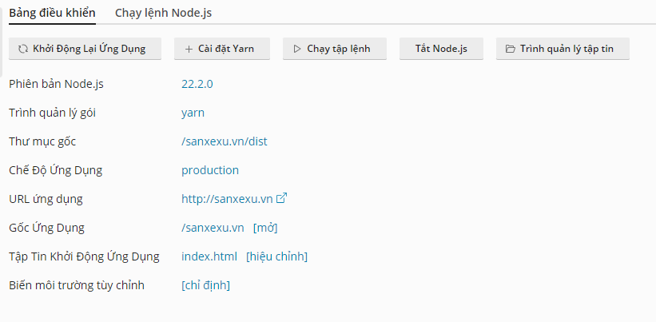
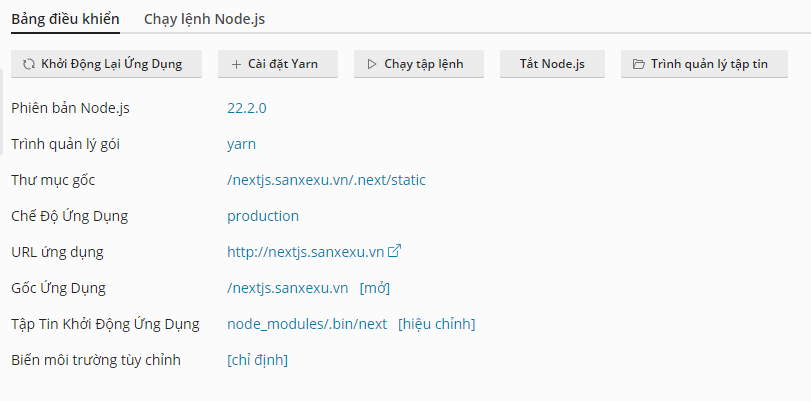
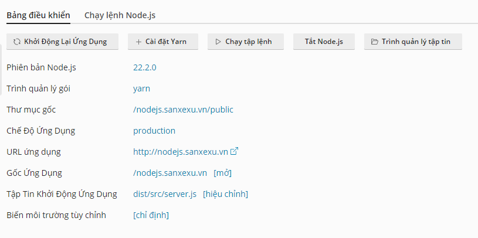

# Deploy

## React

- Upload Source lên, hoặc liên kết với Git
- Build app

```bash
yarn 
yarn build
```

- Cấu hình khởi chạy




## NextJs

- Upload Source lên, hoặc liên kết với Git
- Build app

```bash
yarn 
yarn build
```

- Cấu hình khởi chạy



## Nodejs

- Upload Source lên, hoặc liên kết với Git
- Build app

```bash
yarn 
yarn build
```

- Cấu hình khởi chạy

