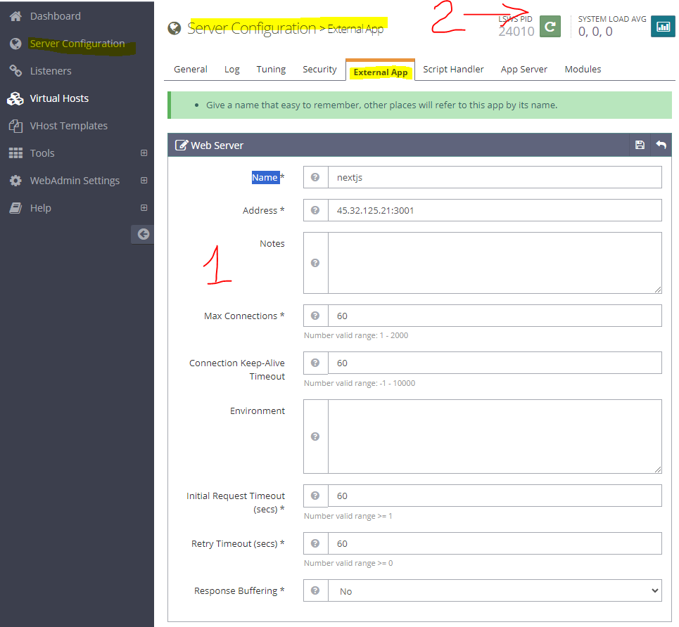

# Deploy


## NextJs

### Cài môi trường

- cài nodejs qua nvm
- cài pm2, yarn
- cài git

### NextJs

- Upload Source lên, hoặc liên kết với Git đổ code vào public_html
- Build app

```bash
npm install 
npm run build
pm2 start ecosystem.config.js
```

Code `ecosystem.config.js`

```js
module.exports = {
  apps: [
    {
      name: 'nextjs-app', // Tên của ứng dụng
      script: 'npm', // Sử dụng npm để chạy ứng dụng
      args: 'start', // Lệnh start cho ứng dụng Next.js
      instances: 'max', // Tự động scale ứng dụng dựa trên số lượng CPU
      exec_mode: 'cluster', // Chế độ cluster cho phép PM2 scale ứng dụng
      watch: false, // Tắt watch mode (nên tắt trong môi trường production)
      env: {
        NODE_ENV: 'production', // Thiết lập môi trường production
        PORT: 3001, // Cổng mà ứng dụng sẽ chạy
      },
    },
  ],
};

```

Lưu ý: Nhớ mở Port 3001 cho App

### Revert proxy

- Login OpenLiteSpeed: https://45.32.125.21:7080, cùng acc với CyberPanel
- Server Configuration --> tab  External App



- Điền xong như mục 1, Sau đó khởi động lại OpenLiteSpeed là mục 2.

### Rewrite

```shell
RewriteEngine On
# là name ở bên OpenLiteSpeed đã đặt
RewriteRule ^(.*) http://nextjs/$1 [P]
```