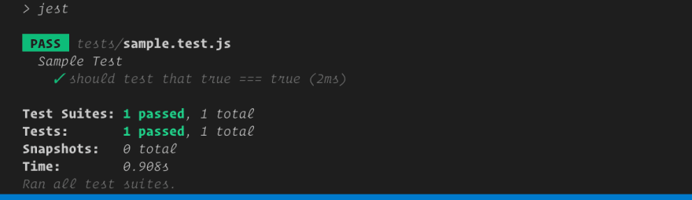

# Unit Test

Unit test là một phương pháp kiểm thử phần mềm tập trung vào việc kiểm tra tính đúng đắn của các đơn vị (units) nhỏ nhất của mã nguồn, chẳng hạn như hàm, phương thức hoặc lớp. Mục tiêu của unit test là xác định xem các đơn vị này hoạt động như mong đợi hay không, dựa trên các trường hợp kiểm thử đã được định nghĩa trước.

Unit test giúp đảm bảo tính ổn định và chính xác của các đơn vị phần mềm. Bằng cách tách riêng các đơn vị và kiểm tra chúng độc lập, unit test giúp phát hiện và sửa lỗi một cách nhanh chóng và dễ dàng. Nó cũng giúp duy trì tính nhất quán trong mã nguồn khi thay đổi hay cải thiện code.

Một unit test thường bao gồm các bước như chuẩn bị dữ liệu, gọi hàm hoặc phương thức cần kiểm thử, so sánh kết quả trả về với kết quả mong đợi và kiểm tra tính chính xác của đơn vị đang được kiểm thử.


=========================

Chúng ta cùng tìm hiểu về

**Test Express APIs với Jest và Supertest**

=========================


## 💛 Cài đặt môi trường TEST

### Step 1 - Cài đặt Jest and supertest

```bash
yarn add -D jest supertest
```

Với typeScript bạn cài thêm

```bash
yarn add -D @types/jest  @types/supertest ts-jest
```

### Step 2 - Cấu hình Jest

Mở file `package.json` và thêm đoạn này vào cuối

đánh lệnh `npx jest --init` để tạo ra file jest.config.ts


Sau đó bạn sửa lại thành như sau cho gọn:

```ts
import type {Config} from 'jest';

const config: Config = {
    testEnvironment: 'node',
    coveragePathIgnorePatterns: [ '/node_modules/' ],
    moduleFileExtensions: [ 'ts', 'tsx', 'js' ],
    transform: { '^.+\\.(ts|tsx)$': 'ts-jest' },
    testMatch: [ '**/tests/*.+(ts|tsx|js)' ]
};

export default config;

```


Thêm dòng sau vào thuộc tính `script`

```json
"test": "jest"
```

Tạo một thư mục `src/tests`, sau đó tạo một file `sample.test.ts` với đoạn code sau:

```js
import * as request from 'supertest'

describe('Sample Test', () => {
  it('should test that true === true', () => {
    expect(true).toBe(true)
  })
})
```

Bây giờ bạn mở project ở terminal và nhập lệnh

```bash
yarn test
```
Bạn sẽ nhận được kết quả như dưới đây là thành công việc cài đặt




## 💛 Testing các API Endpoints

Sau khi bạn code xong các API Endpoints và báo lên cho Team TESTter biết làm bạn làm xong. Tester có nhiệm vụ đi test Từng API này.

Hoặc bạn phải tự làm với chính mình để cải thiện Bug

Cài thêm thư viện

```bash
yarn add -D cross-env
```

Sau đó sửa file package.json tại mục script như say

```json
"scripts": {
    "start": "server.ts",
    "dev": "nodemon server.ts",
    "test": "cross-env NODE_ENV=test jest --testTimeout=10000"
  }
```

Thư viện này set môi trường Node sang chế độ test

**Cuối cùng TEST các routes/endpoints**

Ví dụ bạn có một endpoints `/v1/users/112`

Bạn mong muốn nhận lại một response

Nếu thành công: 

```json
{
    "statusCode": 200,
    "message": "Success"
    "data": {
        "userId": 123,
        "name": "John"
    }
}
```

Nếu thành lỗi: 


```json
{
    "statusCode": 404,
    "errorType": "HttpError",
    "message": "User not found"
}
```

Bạn tạo một file test với cấu trúc `src/tests/users/getById.test.ts`

```js
const request = require('supertest');

/**
 * Lấy cấu hình của APP qua test
 * Để chạy được API cần khởi động
 * express và moongoose như dưới đây
 * 
 */
const app = require('../../app');
const { connectDB, disconnectDB } = require('../../helpers/mongooseDB');
const configs = require('../../constants/configs');

/* Sử dụng agent để bắt request dùng port của server */
const agent = request.agent(app);
let server;

//sử dụng startServer và stopServer để khởi động và dừng server trước và sau khi tất cả các tests chạy
beforeAll(async () => {
  await connectDB()
  .then(() => {
    // Đảm bảo rằng kết nối MongoDB đã thành công trước khi lắng nghe ứng dụng
     server =  app.listen(configs.PORT, () => {
      console.log(`Server started on port ${configs.PORT}`);
    });
  })
  .catch((err) => {
    console.error('Failed to connect to MongoDB', err);
  });
});

/** Sau khi test xong thì tắt */
afterAll(async () => {
  await disconnectDB();
  await server.close();
});


describe('GET /api/v1/users/:id', () => {
  
  test('should return 400 if ID non-Objectid', async () => {
      const response = await agent.get('/api/v1/users/123');
  
      //So sánh status với kết quả đúng
      expect(response.status).toBe(400);
      //So sánh với kết quả đúng
      expect(response.body).toEqual(
          {
              message: "123 non-Objectid",
              statusCode: 400,
              errorType: "validateSchema"
          }
      );
  });

  //test Validate request
  test('should return 404 if Objectid not exist', async () => {
      const response = await agent.get('/api/v1/users/647db7937640fa84b0580e24');
      //So sánh status với kết quả đúng
      // console.log('<<=== 🚀 response ===>>',response);
      expect(response.status).toBe(404);
      //So sánh với kết quả đúng
      expect(response.body).toEqual(
          {
            statusCode: 404,
            errorType: "HttpError",
            message: "User not found"
          }
      );
  });
  

});
```

Sau đó bạn nhập lệnh để test như sau

```bash
yarn test
```