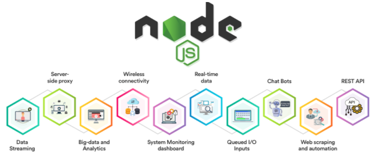

# Giới thiệu NodeJS

## 💛 NodeJS là gì

Node.js là một nền tảng phát triển ứng dụng được xây dựng trên JavaScript, được phát triển bởi Ryan Dahl và được phát hành lần đầu tiên vào năm 2009. Node.js được xây dựng dựa trên nền tảng Chrome V8 JavaScript engine của Google và được thiết kế để xử lý các ứng dụng web theo cách không đồng bộ (asynchronous) và đồng thời có thể thực thi trên máy chủ.



Node.js đã trở thành một trong những công nghệ nổi bật nhất trong lĩnh vực phát triển web và được sử dụng rộng rãi để xây dựng các ứng dụng web như các trang web động (dynamic web pages), các ứng dụng real-time và các ứng dụng web theo mô hình client-server.

Sau khi được phát hành lần đầu tiên vào năm 2009, Node.js nhanh chóng thu hút sự quan tâm và phát triển đáng kể. Các cập nhật liên tục đã được phát hành, bao gồm việc thêm các tính năng mới và cải tiến hiệu suất. Hiện nay, Node.js được sử dụng rộng rãi trên toàn cầu và là một trong những công nghệ phổ biến nhất trong lĩnh vực phát triển web.

## 💛 Node.js hoạt động như thế nào?

Ý tưởng chính của Node js là sử dụng non-blocking, hướng sự vào ra dữ liệu thông qua các tác vụ thời gian thực một cách nhanh chóng. Bởi vì, Node js có khả năng mở rộng nhanh chóng, khả năng xử lý một số lượng lớn các kết nối đồng thời bằng thông lượng cao. 

Nếu như các ứng dụng web truyền thống, các request tạo ra một luồng xử lý yêu cầu mới và chiếm RAM của hệ thống thì việc tài nguyên của hệ thống sẽ được sử dụng không hiệu quả. Chính vì lẽ đó giải pháp mà Node js đưa ra là sử dụng luồng đơn (Single-Threaded), kết hợp với non-blocking I/O để thực thi các request, cho phép hỗ trợ hàng chục ngàn kết nối đồng thời.


## 💛 Giới thiệu về Event Loop

Event loop trong Node.js là một thành phần quan trọng trong kiến trúc single-threaded (đơn luồng) của nó. Nó cho phép Node.js xử lý nhiều yêu cầu đồng thời mà không cần tạo ra các luồng bổ sung.

Trong Node.js, mã JavaScript chạy trong một luồng duy nhất, còn được gọi là luồng chính (main thread). Tuy nhiên, để xử lý các yêu cầu I/O không đồng bộ, như đọc và ghi vào tệp, gọi API mạng hoặc truy vấn cơ sở dữ liệu, Node.js sử dụng mô hình sự kiện và non-blocking I/O.


Client gửi các REQUEST đến SERVER để tương tác với ứng dụng web. Các REQUESTs này có thể là Blocking hoặc Non-Blocking

- Truy vấn dữ liệu
- Xóa dữ liệu
- Cập nhật dữ liệu

Node.JS tiếp nhận các Request gửi đến và thêm chúng vào hàng đợi Event Queue

Sau đó các yêu cầu (Request) này được xử lý lần lượt thông qua Event Loop.

Event loop là một vòng lặp vô tận để kiểm tra các sự kiện và thực hiện các callback tương ứng. Nó cũng điều khiển việc thực hiện các tác vụ khác trong chương trình Node.js, như đọc và ghi từ các I/O, gửi và nhận dữ liệu từ mạng, v.v.

Có hai loại sự kiện mà event loop xử lý: sự kiện đồng bộ và sự kiện bất đồng bộ

- Sự kiện đồng bộ được xử lý ngay lập tức trong vòng lặp event loop
- Sự kiện bất đồng bộ được đưa vào một hàng đợi và xử lý sau khi các sự kiện đồng bộ đã được xử lý xong


## 💛 Những ứng dụng nên viết bằng Node.JS ?

NodeJS được sử dụng để xây dựng rất nhiều loại ứng dụng khác nhau, trong đó phổ biến nhất gồm có:

- Ứng dụng trò chuyện trong thời gian thực: Nhờ vào cấu trúc không đồng bộ đơn luồng, Node.JS rất thích hợp cho mục đích xử lý giao tiếp trong thời gian thực. Nền tảng này có thể dễ dàng mở rộng quy mô và thường dùng để tạo ra các chatbot. Bên cạnh đó, các tính năng liên quan đến ứng dụng trò chuyện như: chat nhiều người, thông báo đẩy,… cũng có thể dễ dàng được bổ sung nhờ NodeJS.

- Internet of Things (IoT): Các ứng dụng IoT thường bao gồm nhiều bộ cảm biến phức tạp để gửi những phần dữ liệu nhỏ. Node.JS là một lựa chọn lý tưởng để xử lý các yêu cầu đồng thời này với tốc độ cực nhanh.

- Truyền dữ liệu: Netflix là một trong số những công ty lớn trên thế giới chuyên sử dụng Node.JS cho mục đích truyền dữ liệu. Sở dĩ vì đây là một nền tảng nhẹ và cực nhanh, đồng thời còn cung cấp một API chuyên dùng để stream.

- Các SPA (Single-page application) phức tạp: Trong SPA, toàn bộ ứng dụng được load vào trong một trang duy nhất, do đó sẽ có một số request được thực hiện trong nền. Vòng lặp sự kiện (event loop) của Node.JS cho phép xử lý các request theo hướng non-blocking.

- Các ứng dụng REST dựa trên API: JavaScript được sử dụng trong cả frontend lẫn backend của trang. Do đó một server có thể dễ dàng giao tiếp với frontend qua REST API bằng Node.js. Bên cạnh đó, Node.JS còn cung cấp nhiều package như Express.js hay Koa để việc xây dựng ứng dụng web trở nên dễ dàng hơn bao giờ hết.

## Ưu điểm NodeJS

- IO hướng sự kiện không đồng bộ, cho phép xử lý nhiều yêu cầu đồng thời.
- Sử dụng JavaScript – một ngôn ngữ lập trình dễ học.
- Chia sẻ cùng code ở cả phía client và server.
- NPM(Node Package Manager) và module Node đang ngày càng phát triển mạnh mẽ.
- Cộng đồng hỗ trợ tích cực.
- Cho phép stream các file có kích thước lớn.

## Nhược điểm NodeJS

- Không có khả năng mở rộng, vì vậy không thể tận dụng lợi thế mô hình đa lõi trong các phần cứng cấp server hiện nay.
- Khó thao tác với cơ sử dữ liệu quan hệ.
- Mỗi callback sẽ đi kèm với rất nhiều callback lồng nhau khác.
- Cần có kiến thức tốt về JavaScript.
- Không phù hợp với các tác vụ đòi hỏi nhiều CPU.

## Một số lý do nên sử dụng NodeJS là gì?

Node.JS là một trong những nền tảng phổ biến nhất hiện nay cho mục đích phát triển ứng dụng mạng phía server. Vậy lý do nên sử dụng NodeJS là gì? Hãy cùng tìm hiểu những đặc điểm khiến Node.JS là lựa chọn hàng đầu cho các developer hiện nay:

- Tốc độ cực nhanh: Được xây dựng dựa trên engine JavaScript V8 của Google Chrome, do đó các thư viện của nó có khả năng thực thi code chỉ rất nhanh.
- NPM: Với hơn 50,000 package khác nhau, các developer có thể dễ dàng lựa chọn bất kỳ tính năng nào để xây dựng cho ứng dụng của mình.
- Lập trình không đồng bộ: Mọi API của Node.JS đều có tính không đồng bộ (non-blocking), do đó một server dựa trên Node.JS không cần phải đợi API trả về dữ liệu.
- Không có buffering: Node.JS giúp tiết kiệm thời gian xử lý file khi cần upload âm thanh hoặc video vì các ứng dụng này không bao giờ buffer dữ liệu mà chỉ xuất dữ liệu theo từng phần (chunk).
- Đơn luồng: Node.JS sử dụng mô hình đơn luồng với vòng lặp sự kiện. Do đó các ứng dụng có thể xử lý số lượng request lớn hơn rất nhiều so với các server truyền thống như Apache HTTP Server.

## Những công ty lớn nào đang sử dụng NodeJS

NodeJS hiện đang được sử dụng bởi rất nhiều gã khổng lồ trên khắp thế giới, nhanh chóng vượt ngưỡng 1 tỉ lượt download từ năm 2018 và hỗ trợ đến khoảng 1.2% tổng số website trên Internet, tương đương với 20 triệu trang.

Một số công ty lớn sử dụng nền tảng này gồm có:

- Netflix: Netflix là một trong những nền tảng giải trí trực tuyến lớn nhất thế giới với hơn 167 triệu người dùng. Nhờ vào khả năng mở rộng và cho phép xây dựng các ứng dụng có yêu cầu sử dụng dữ liệu cao, NodeJS luôn là lựa chọn hàng đầu cho nền tảng này.
- Walmart: Đây là công ty có doanh thu lớn nhất thế giới với tổng 559 tỷ USD vào năm 2020 (theo Forbest). Walmart lựa chọn NodeJS bởi tính năng I/O không đồng bộ và khả năng xử lý nhiều request đồng thời.
- Uber: Là một công ty đặt xe có quy mô đa quốc gia, Uber lựa chọn NodeJS làm nền tảng xây dựng ứng dụng bởi I/O không đồng bộ và cộng đồng lớn mạnh.
- NASA: Đây là một cơ quan độc lập của Chính phủ Liên bang Hoa Kỳ, chịu trách nhiệm về chương trình không gian dân sự và nghiên cứu hàng không, vũ trụ. NASA lựa chọn nền tảng này để hạn chế thời gian truy cập và xử lý các tác vụ có yêu cầu dữ liệu cao để giữ cho server hoạt động 24/7.
- Paypal: Với thời gian xây dựng cực nhanh và khả năng xử lý dữ liệu lớn, NodeJS là một nền tảng lý tưởng cho một hệ thống thanh toán trực tuyến toàn cầu như PayPal.
- Medium: Medium là một nền tảng xuất bản trực tuyến vô cùng phổ biến, đồng thời cũng lựa chọn NodeJS để xây dựng ứng dụng hướng dữ liệu và đơn giản hoá quá trình bảo trì server.
  Ngoài ra còn rất nhiều nền tảng lớn khác như: Twitter, Spotify, eBay, Reddit, Linkedin,…


## 💛 Cài đặt

Getting Started: <https://nodejs.org/en/>

Installing Node on Linux / MacOS: <https://nodejs.org/en/download/>

Installing Node on Windows: <https://nodejs.org/en/download/>

## 💛 Run With Node

```bash
node <filename>
#example
node main.js
```

Tạo một server trên môi trường Node

```js
// 1 Tạo một tệp có tên "app.js" và thêm đoạn mã sau:
const http = require('http');

const hostname = '127.0.0.1';
const port = 3000;

const server = http.createServer((req, res) => {
  res.statusCode = 200;
  res.setHeader('Content-Type', 'text/plain');
  res.end('Hello World\n');
});

server.listen(port, hostname, () => {
  console.log(`Server running at http://${hostname}:${port}/`);
});

// 2. Lưu tệp "app.js".
// 3. Mở Terminal hoặc Command Prompt và di chuyển đến thư mục chứa tệp "app.js".
// 4. Chạy lệnh sau để khởi động máy chủ web: node app.js
// 5. Mở trình duyệt web và truy cập vào địa chỉ "http://localhost:3000".
```

Khi truy cập vào địa chỉ "<http://localhost:3000>", trang web sẽ hiển thị "Hello World". Đây chỉ là một ví dụ đơn giản về Node.js, nhưng nó cho thấy cách mà Node.js có thể được sử dụng để tạo các ứng dụng web và các dịch vụ máy chủ.

## 💛 Node Modules

### **Built-in modules (Các modules sẵn có)**

- assert: Provides a set of assertion tests
- buffer: To handle binary data
- child_process: To run a child process
- cluster: To split a single Node process into multiple processes
- crypto: To handle OpenSSL cryptographic functions
- dns: To do DNS lookups and name resolution functions
- events: To handle events ❤️
- fs: To handle the file system ❤️
- http: To make Node.js act as an HTTP server ❤️
- https: To make Node.js act as an HTTPS server ❤️
- net: To create servers and clients
- os: Provides information about the operation system
- path: To handle file paths ❤️
- querystring: To handle URL query strings ❤️
- readline: To handle readable streams one line at the time
- stream: To handle streaming data
- string_decoder: To decode buffer objects into strings
- timers: To execute a function after a given number of milliseconds
- url: To parse URL strings ❤️
- util: To access utility functions
- zlib To compress or decompress files

Chủ yếu đi tìm hiểu các Module có đánh dấu ❤️

### Create package.json file

```bash
npm init
```

### Install a module with --save option

```bash
npm install <Module Name> --save
```

### Uninstall a module

```bash
npm uninstall <Module Name>
```

### Update a module

```bash
npm update express
```

### \*\*Include / Import a module\*\*

```js
//require ES6
const http = require('http');
```

## 💛 Sharing functions between files

Create and export a module

```js
function hello() {
  console.log('Hello Nodejs');
  return 'Hello Nodejs';
}

module.exports = hello;
```

Include / Import a module

```js
//require ES6
const hello = require('./first-module');
hello();
```

Other methods: Create and export a module

```js
const add = (a, b) => {
  return a + b;
};

const subtract = (a, b) => {
  return a - b;
};

module.exports = {
  add,
  subtract,
};

module.exports.add = (a, b) => {
  return a + b;
};

module.exports.subtract = (a, b) => {
  return a - b;
};

// Method 1
const math = require('./math');

// Method 2
const { add, subtract } = require('./math');
```


## 💛 Tìm hiểu các Module thường sử dụng

### ❤️ Events

Trong NodeJS, sự kiện (event) là một cơ chế quan trọng để xử lý các hoạt động bất đồng bộ (asynchronous) như đọc tệp, kết nối mạng hoặc xử lý HTTP request. Cơ chế sự kiện của NodeJS dựa trên mô hình ngắn đường (event-driven) và lặp lại sự kiện (event loop) để xử lý các sự kiện và đưa ra các phản hồi (response).

Để xử lý các sự kiện trong NodeJS, bạn có thể sử dụng module events. Module này cung cấp một lớp cơ sở để tạo ra các đối tượng có thể phát ra sự kiện (event emitter), nhận sự kiện (event listener) và xử lý sự kiện (event handler).

```js
const fs = require('fs');
const rs = fs.createReadStream('./demofile.txt');

// Event
rs.on('open', function () {
  console.log('The file is open');
});

// Function
fs.readFile('./demofile.txt', 'utf-8', (error, data) => {
  if (error) {
    console.error(error);
    return;
  }
  console.log(data);
});
```

### Events Module

Khởi tạo đối tượng EventEmitter:

```js
const EventEmitter = require('events');
const myEmitter = new EventEmitter();
```

Đăng ký các sự kiện:

```js
myEmitter.on('myEvent', () => {
  console.log('My event was triggered');
});
```

Kích hoạt sự kiện:

```js
myEmitter.emit('myEvent');
```

Xử lý sự kiện:

```js
myEmitter.on('myEvent', (data) => {
  console.log('My event was triggered with data:', data);
});

myEmitter.emit('myEvent', 'Hello World');
```

Trong ví dụ trên, khi sự kiện myEvent được kích hoạt bằng cách sử dụng phương thức emit(), đoạn mã xử lý được kích hoạt và in ra màn hình. Ngoài ra, bạn có thể truyền các đối số cho sự kiện bằng cách chuyển chúng vào phương thức emit().

Ngoài module events, NodeJS cũng cung cấp các module khác để xử lý sự kiện như stream và http. Các module này cung cấp các sự kiện để xử lý các hoạt động liên quan đến luồng dữ liệu và giao thức HTTP.

> Xem thêm ở file events.md

### ❤️ File Module

[Xem chi tiết](fs.md)

### ❤️ URL Module

[Xem chi tiết](url.md)

### ❤️ Http Module

[Xem chi tiết](http.md)

### ❤️ Path Module

[Xem chi tiết](path.md)
