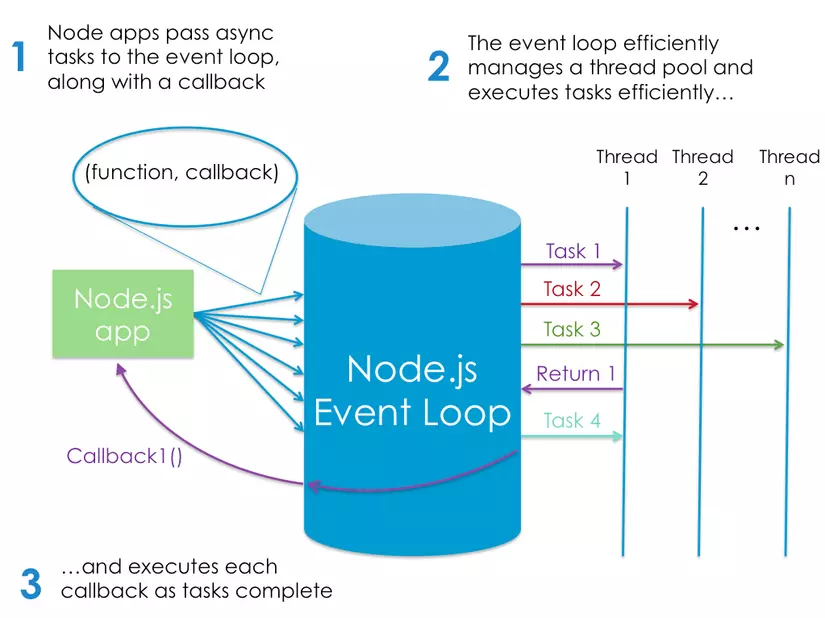

# Basic of Nodejs

## 💛 Giới thiệu

Node.js là một nền tảng phát triển ứng dụng được xây dựng trên JavaScript, được phát triển bởi Ryan Dahl và được phát hành lần đầu tiên vào năm 2009. Node.js được xây dựng dựa trên nền tảng Chrome V8 JavaScript engine của Google và được thiết kế để xử lý các ứng dụng web theo cách không đồng bộ (asynchronous) và đồng thời có thể thực thi trên máy chủ.

Node.js đã trở thành một trong những công nghệ nổi bật nhất trong lĩnh vực phát triển web và được sử dụng rộng rãi để xây dựng các ứng dụng web như các trang web động (dynamic web pages), các ứng dụng real-time và các ứng dụng web theo mô hình client-server.

Sau khi được phát hành lần đầu tiên vào năm 2009, Node.js nhanh chóng thu hút sự quan tâm và phát triển đáng kể. Các cập nhật liên tục đã được phát hành, bao gồm việc thêm các tính năng mới và cải tiến hiệu suất. Hiện nay, Node.js được sử dụng rộng rãi trên toàn cầu và là một trong những công nghệ phổ biến nhất trong lĩnh vực phát triển web.

## 💛 Node.js hoạt động như thế nào?

Ý tưởng chính của Node js là sử dụng non-blocking, hướng sự vào ra dữ liệu thông qua các tác vụ thời gian thực một cách nhanh chóng. Bởi vì, Node js có khả năng mở rộng nhanh chóng, khả năng xử lý một số lượng lớn các kết nối đồng thời bằng thông lượng cao.

Nếu như các ứng dụng web truyền thống, các request tạo ra một luồng xử lý yêu cầu mới và chiếm RAM của hệ thống thì việc tài nguyên của hệ thống sẽ được sử dụng không hiệu quả. Chính vì lẽ đó giải pháp mà Node js đưa ra là sử dụng luồng đơn (Single-Threaded), kết hợp với non-blocking I/O để thực thi các request, cho phép hỗ trợ hàng chục ngàn kết nối đồng thời.



## 💛 Node.js có thể làm gì ?

## 💛 Cài đặt

Getting Started: https://nodejs.org/en/

Installing Node on Linux / MacOS: https://nodejs.org/en/download/

Installing Node on Windows: https://nodejs.org/en/download/

## 💛 Run With Node

```bash
node <filename>
#example
node main.js
```

Tạo một server trên môi trường Node

```js
// 1 Tạo một tệp có tên "app.js" và thêm đoạn mã sau:
const http = require('http');

const hostname = '127.0.0.1';
const port = 3000;

const server = http.createServer((req, res) => {
  res.statusCode = 200;
  res.setHeader('Content-Type', 'text/plain');
  res.end('Hello World\n');
});

server.listen(port, hostname, () => {
  console.log(`Server running at http://${hostname}:${port}/`);
});

// 2. Lưu tệp "app.js".
// 3. Mở Terminal hoặc Command Prompt và di chuyển đến thư mục chứa tệp "app.js".
// 4. Chạy lệnh sau để khởi động máy chủ web: node app.js
// 5. Mở trình duyệt web và truy cập vào địa chỉ "http://localhost:3000".
```

Khi truy cập vào địa chỉ "http://localhost:3000", trang web sẽ hiển thị "Hello World". Đây chỉ là một ví dụ đơn giản về Node.js, nhưng nó cho thấy cách mà Node.js có thể được sử dụng để tạo các ứng dụng web và các dịch vụ máy chủ.

## 💛 Node Modules

### **Built-in modules (Các modules sẵn có)**

- assert: Provides a set of assertion tests
- buffer: To handle binary data
- child_process: To run a child process
- cluster: To split a single Node process into multiple processes
- crypto: To handle OpenSSL cryptographic functions
- dns: To do DNS lookups and name resolution functions
- events: To handle events ❤️
- fs: To handle the file system ❤️
- http: To make Node.js act as an HTTP server ❤️
- https: To make Node.js act as an HTTPS server ❤️
- net: To create servers and clients
- os: Provides information about the operation system
- path: To handle file paths ❤️
- querystring: To handle URL query strings ❤️
- readline: To handle readable streams one line at the time
- stream: To handle streaming data
- string_decoder: To decode buffer objects into strings
- timers: To execute a function after a given number of milliseconds
- url: To parse URL strings ❤️
- util: To access utility functions
- zlib To compress or decompress files

Chủ yếu đi tìm hiểu các Module có đánh dấu ❤️

### Create package.json file

```bash
npm init
```

### Install a module with --save option

```bash
npm install <Module Name> --save
```

### Uninstall a module

```bash
npm uninstall <Module Name>
```

### Update a module

```bash
npm update express
```

### \*\*Include / Import a module\*\*

```js
const http = require('http');
```

## 💛 Sharing functions between files

Create and export a module

```js
function hello() {
  console.log('Hello Nodejs');
  return 'Hello Nodejs';
}

module.exports = hello;
```

Include / Import a module

```js
const hello = require('./first-module');
hello();
```

Other methods: Create and export a module

```js
const add = (a, b) => {
  return a + b;
};

const subtract = (a, b) => {
  return a - b;
};

module.exports = {
  add,
  subtract,
};

module.exports.add = (a, b) => {
  return a + b;
};

module.exports.subtract = (a, b) => {
  return a - b;
};

// Method 1
const math = require('./math');

// Method 2
const { add, subtract } = require('./math');
```

## 💛 Tìm hiểu các Module thường sử dụng

### ❤️ Events

Trong NodeJS, sự kiện (event) là một cơ chế quan trọng để xử lý các hoạt động bất đồng bộ (asynchronous) như đọc tệp, kết nối mạng hoặc xử lý HTTP request. Cơ chế sự kiện của NodeJS dựa trên mô hình ngắn đường (event-driven) và lặp lại sự kiện (event loop) để xử lý các sự kiện và đưa ra các phản hồi (response).

Để xử lý các sự kiện trong NodeJS, bạn có thể sử dụng module events. Module này cung cấp một lớp cơ sở để tạo ra các đối tượng có thể phát ra sự kiện (event emitter), nhận sự kiện (event listener) và xử lý sự kiện (event handler).

```js
const fs = require('fs');
const rs = fs.createReadStream('./demofile.txt');

// Event
rs.on('open', function () {
  console.log('The file is open');
});

// Function
fs.readFile('./demofile.txt', 'utf-8', (error, data) => {
  if (error) {
    console.error(error);
    return;
  }
  console.log(data);
});
```

### Events Module

Khởi tạo đối tượng EventEmitter:

```js
const EventEmitter = require('events');
const myEmitter = new EventEmitter();
```

Đăng ký các sự kiện:

```js
myEmitter.on('myEvent', () => {
  console.log('My event was triggered');
});
```

Kích hoạt sự kiện:

```js
myEmitter.emit('myEvent');
```

Xử lý sự kiện:

```js
myEmitter.on('myEvent', (data) => {
  console.log('My event was triggered with data:', data);
});

myEmitter.emit('myEvent', 'Hello World');
```

Trong ví dụ trên, khi sự kiện myEvent được kích hoạt bằng cách sử dụng phương thức emit(), đoạn mã xử lý được kích hoạt và in ra màn hình. Ngoài ra, bạn có thể truyền các đối số cho sự kiện bằng cách chuyển chúng vào phương thức emit().

Ngoài module events, NodeJS cũng cung cấp các module khác để xử lý sự kiện như stream và http. Các module này cung cấp các sự kiện để xử lý các hoạt động liên quan đến luồng dữ liệu và giao thức HTTP.

> Xem thêm ở file events.md

### ❤️ File Module

[Xem chi tiết](fs.md)

### ❤️ URL Module

[Xem chi tiết](url.md)

### ❤️ Http Module

[Xem chi tiết](http.md)

### ❤️ Path Module

[Xem chi tiết](path.md)
