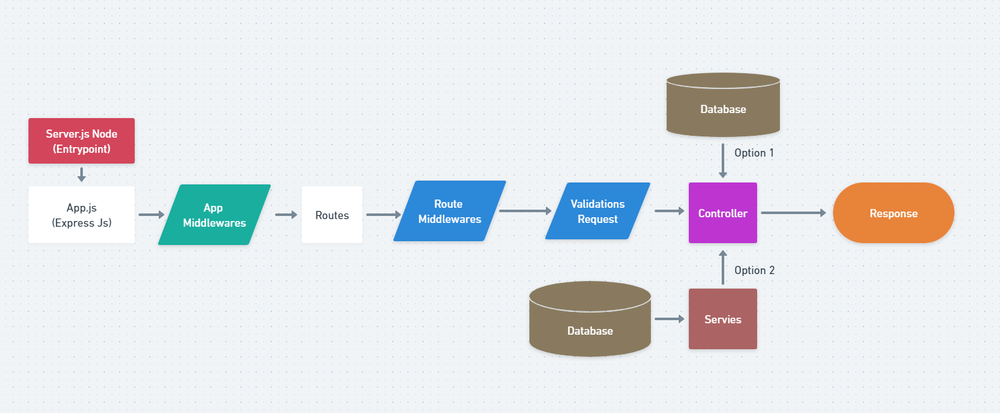

# Project structure Express and Node.Js

Xây dựng cấu trúc dự án RESTFul-APIs với Node.Js và Express CHUẨN đi làm

Tạo một thư mục dự án ví dụ: my-app

Khởi tạo dự án

```bash
npm init
```

## 💛 Xây dựng cấu trúc thư mục

Không có một quy chuẩn nào để tạo ra một cấu trúc dự án chuẩn nhất, dưới đây là 2 mô hình từ Basic tới Master

### Mô hình Basic (Mới học)

```code
my-app/
├─ node_modules/
├─ public/
├─ src/
│  ├─ controllers/
│  ├─ middleware/
│  ├─ models/
│  ├─ services/
│  ├─ utils/
│  ├─ validations/
│  ├─ configs/
│  ├─ routes/
│  │  ├─ v1/
│  │  ├─ v2/
│  ├─ app.js
├─ .env
├─ server.js
├─ .gitignore
├─ package.json
├─ README.md

```

### Mô hình giúp bạn maintenance, mở rộng nhiều phiển bản APIs

```code
my-app/
├─ node_modules/
├─ src/
│  ├─ v1/
│  ├─ v2/
│  ├─ app.js
├─ .env
├─ server.js
├─ .gitignore
├─ package.json
├─ README.md

```

**/Controllers** - Thư mục này sẽ chứa tất cả các chức năng dể viết các API của bạn. Cách đặt tên: xxxxx.controller.js trong đó xxx là nhiệm vụ thôi, ví dụ: login.controller.js

**/Routes** - Thư mục này sẽ chứa tất cả các tuyến đường mà bạn đã tạo bằng cách sử dụng Express Router và kết hợp với Controllers. Cách đặt tên cũng như trên xxxxx.routes.js

**/Models** - Thư mục này sẽ chứa tất cả các files như schema của bạn và và các chức năng cần thiết cho schema cũng sẽ nằm ở đây. Đặt tên xxxxx.model.js

**/Middleware** - Thư mục này sẽ chứa tất cả phần mềm trung gian mà bạn đã tạo, ví dụ như là xác thực chẳng hạn... Cách đặt tên: xxxxx.middleware.js /

**Utils** - Các chức năng phổ biến mà bạn sẽ yêu cầu nhiều lần trong suốt mã của mình ví dụ như check missing params trước khi xử lý dữ liệu chẳng hạn. Rất cần thiết.

**/Configs** - File này dùng cấu hình cho các API / dịch vụ của bên thứ ba như passport / S3, v.v. Những thông số như keyAPI các kiểu.

Đó là những folders rất quan trọng, có thể nói là không thể thiếu. Ngoài ra còn những files trong root như là:

**server.js** - Tập tin khởi chạy ứng dụng Express

**app.js** - Tệp này về cơ bản sẽ là khai báo của ứng dụng Express

**package.json** - File này chứa tất cả các chi tiết npm của dự án, các lệnh chạy như scripts và các phần dependencies

**.gitignore** - Những file mà bạn không muốn đẩy sang git

## 💛 Follow cách hoạt động của mô hình cấu trúc dự án

Từng bước xây dựng dự án theo mô hình



### 1: Khởi tạo dự án

```bash
npm init -y
```

- Tạo biến môi trường
- Tạo thư mục dự án
- Tạo server Express src/app.js
- Tạo file server.js là entry point dự án
- Cấu hình lại package.json

### 🔶 2: Tạo Route đầu tiên

- "/": xem phiên bản API hiện tại
- "api/v1/users": xem danh sách Users

### 🔶 3: Tự Tạo ra một Middleware

#### 🌻 3.0 Middleware là gì ?

Trong lấp trình ứng dụng WEB, Middleware sẽ đóng vai trò trung gian giữa request/response (tương tác với người dùng) và các xử lý logic bên trong web server.

Middleware sẽ là các hàm được dùng để tiền xử lý, lọc các request trước khi đưa vào xử lý logic hoặc điều chỉnh các response trước khi gửi về cho người dùng.


Hình trên mô tả 3 middleware có trong ExpressJS. Một request khi gửi đến Express sẽ được xử lý qua 5 bước như sau :

1. Tìm Route tương ứng với request
2. Dùng CORS Middleware để kiểm tra cross-origin Resource sharing của request
3. Dùng CRSF Middleware để xác thực CSRF của request, chống fake request
4. Dùng Auth Middleware để xác thực request có được truy cập hay không
5. Xử lý công việc được yêu cầu bởi request (Main Task)

Bất kỳ bước nào trong các bước 2,3,4 nếu xảy ra lỗi sẽ trả về response thông báo cho người dùng, có thể là lỗi CORS, lỗi CSRF hay lỗi auth tùy thuộc vào request bị dừng ở bước nào.

**Middleware trong ExpressJS** về cơ bản sẽ là một loạt các hàm Middleware được thực hiện liên tiếp nhau. Sau khi đã thiết lập, các request từ phía người dùng khi gửi lên ExpressJS sẽ thực hiện lần lượt qua các hàm Middleware cho đến khi trả về response cho người dùng. Các hàm này sẽ được quyền truy cập đến các đối tượng đại diện cho Request - req, Response - res, hàm Middleware tiếp theo - next, và đối tượng lỗi - err nếu cần thiết.

Một hàm Middleware sau khi hoạt động xong, nếu chưa phải là cuối cùng trong chuỗi các hàm cần thực hiện, sẽ cần gọi lệnh next() để chuyển sang hàm tiếp theo, bằng không xử lý sẽ bị treo tại hàm đó.

Trong Express, có 5 kiểu middleware có thể sử dụng :

- Application-level middleware (middleware cấp ứng dụng)
- Router-level middleware (middlware cấp điều hướng - router)
- Error-handling middleware (middleware xử lý lỗi)
- Built-in middleware (middleware sẵn có)
- Third-party middleware (middleware của bên thứ ba)

#### 🌻 3.1 Cách để tạo ra một middleware theo nhu cầu

Tại thư mục middleware, tạo một file tên: mylogger.middleware.js

```js
//Tạo và export luôn
module.exports = function (req, res, next) {
  //Logic Here
  console.log('LOGGED', req);

  //Có thể gắn Thêm vào request một biến
  req.aptech = { name: 'Softech', add: '38 yen bai' };

  //End with next() -> chuyển tiếp sang middleware khác nếu có
  next();
};
```

#### 🌻 3.2 Gắn middleware vào Application

Tại express app

```js
const myLogger require('./middleware/mylogger.middleware');

//Gắn middleware vào app
app.use(myLogger);
```

#### 🌻 3.3 Lớp middleware

Tại thêm 2 ví dụ về middleware nữa để thấy được sự chuyển tiếp giữa các lớp middleware

### 🔶 4: Handle Server Express

Sử dụng các thư viện phổ biến để làm middleware cho src/app.js

Tham khảo: <https://expressjs.com/en/resources/middleware.html>

- compression
- cors
- xss-clean
- helmet
- body-parser
- ...

### 🔶5: Errors Handling

- Lỗi 40x
- Lỗi 50x

Sử dụng thư viện:

- errorhandler
- http-errors

### 🔶 6: Validation Configurations

- Validate các biến môi trường, biến config đúng chuẩn.
- Sử dụng joi, yup

### 🔶 7: Logging Requests

- Ghi log lại mỗi requests gửi lên server express
- morgan / winston
